# Project 10

## Load Balancer Solution With Nginx and SSL/TLS
In this project, we are utilizing the servers implemented in [Project 7](../project_7_files/project_7.md) and including a load balancer solution using Nginx

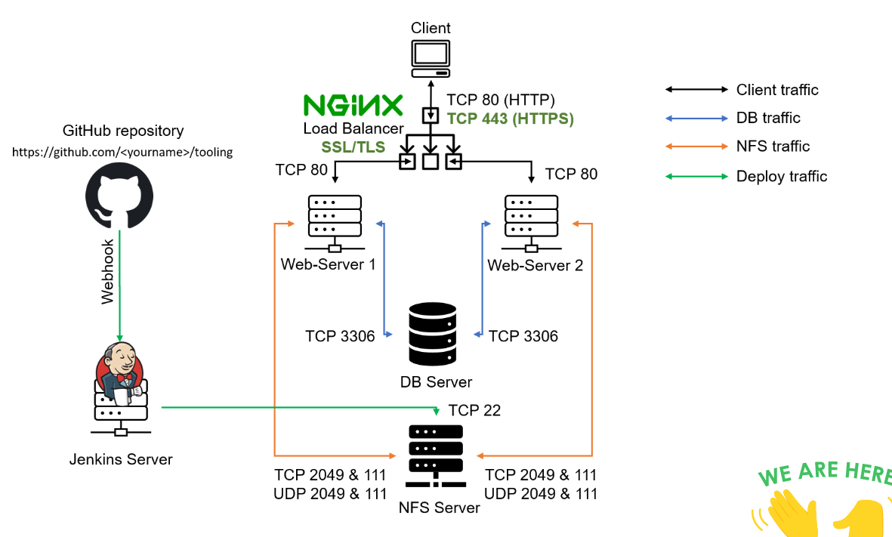

### Step 1 - Launch the Nginx server
```
sudo hostnamectl set-hostname nginx_lb
bash
```

Update the hosts file with the Webservers IP address
```
sudo bash -c 'echo "172.31.44.47 Web1" >> /etc/hosts'
sudo bash -c 'echo "172.31.39.171 Web2" >> /etc/hosts'
sudo bash -c 'echo "172.31.36.240 Web3" >> /etc/hosts'
```

Install Nginx
```
sudo apt update 
sudo apt install nginx -y
```

Associate Elastic IP to the Nginx server

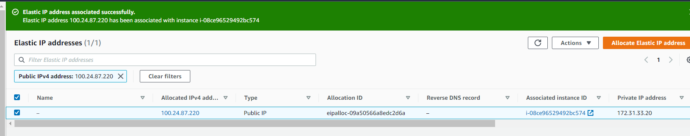

### Step 2 - Purchase and Configure a Domain

Purchase the domain
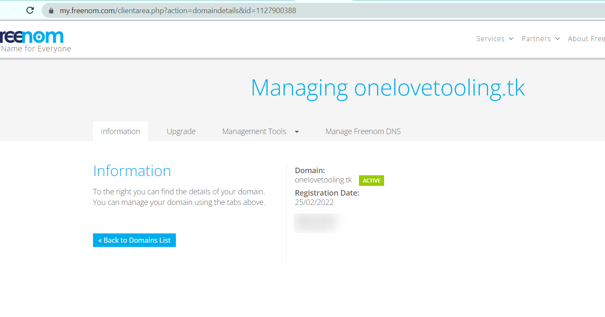

Point Domain's A record to the Elastic IP address of the Nginx server 
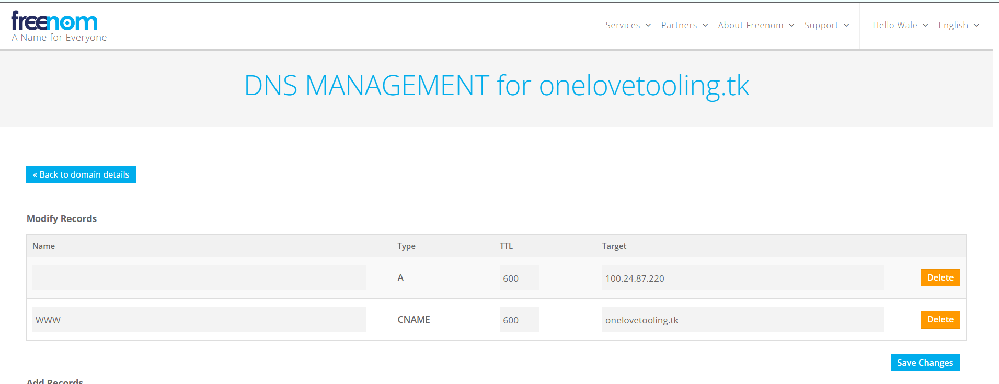

Verify that DNS is propagated
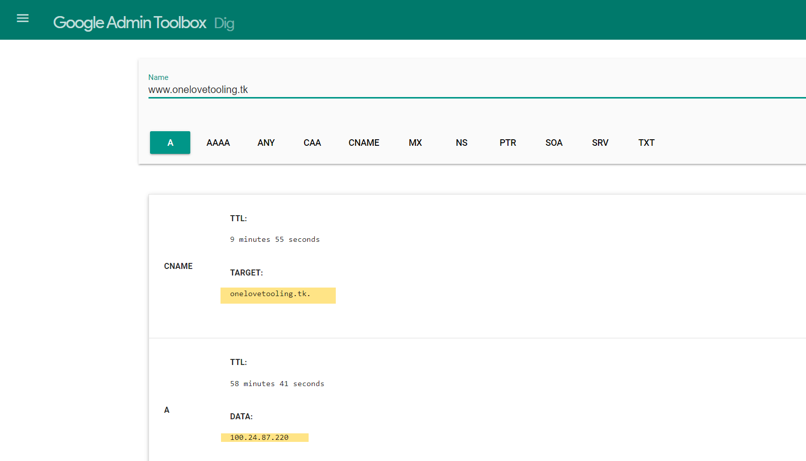

Update the nginx conf file with the Webservers hostname and domain name

```
 upstream myproject {
    server Web1 weight=5;
    server Web2 weight=5;
    server Web3 weight=5;
  }

server {
    listen 80;
    server_name www.onelovetooling.tk;
    location / {
      proxy_pass http://myproject;
    }
  }
```
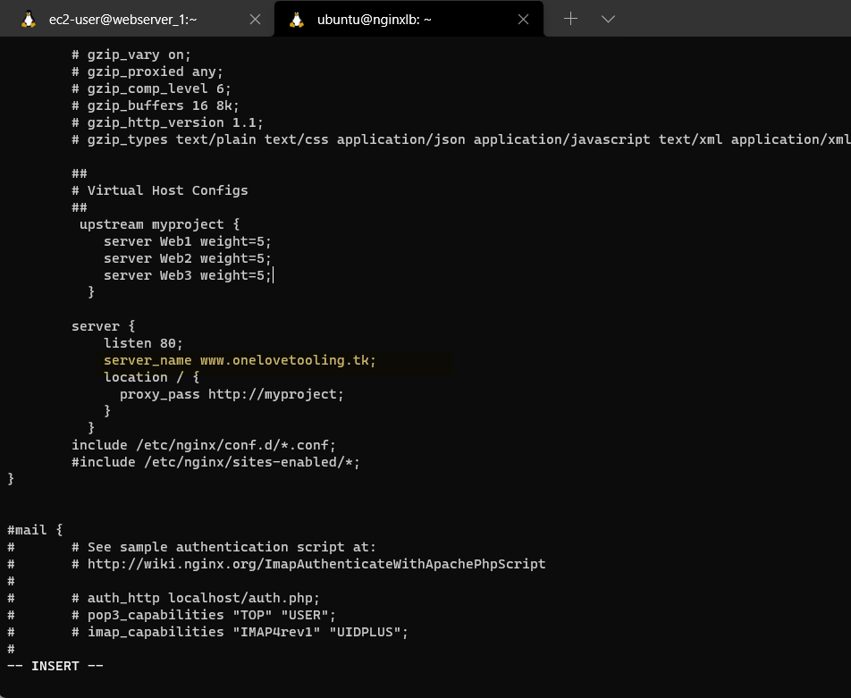

Verify that site is reachable with the Domain name
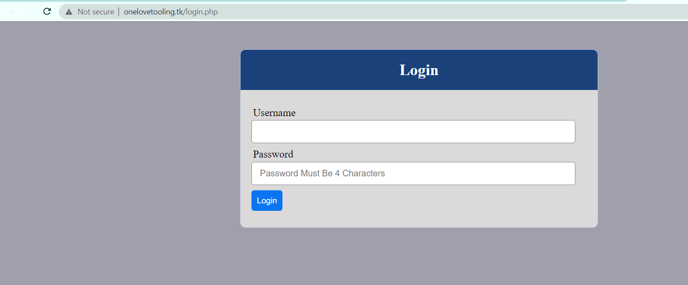


### Step 3 - Setup SSL/TLS on the domain via Certbot

Install Certbot
```
sudo systemctl status snapd
sudo ln -s /snap/bin/certbot /usr/bin/certbot
```

Initiate certbot and select the domain to be configured for ssl
```
sudo certbot --nginx
```
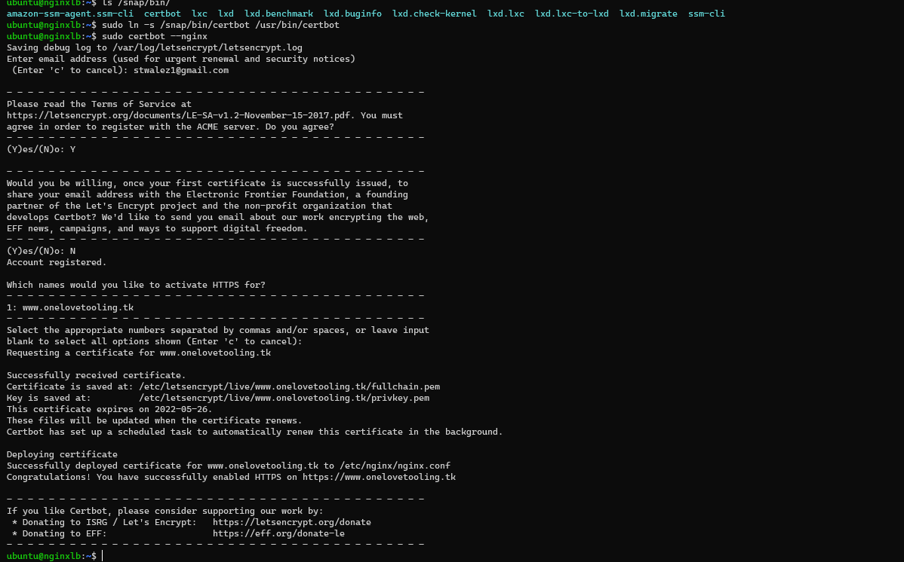

Verify that the ssl certificate files were added to the nginx conf file
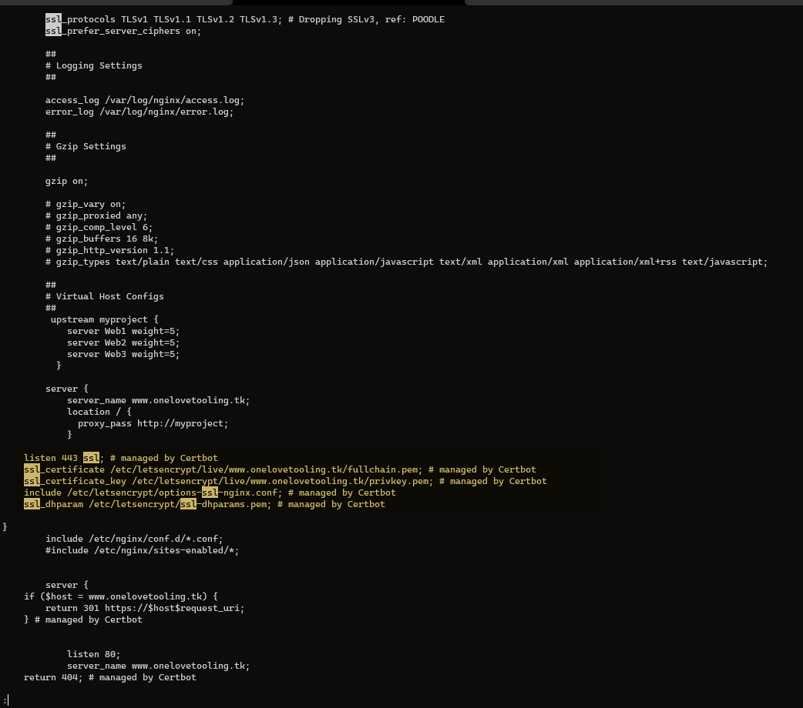

Verify site is accessible on https
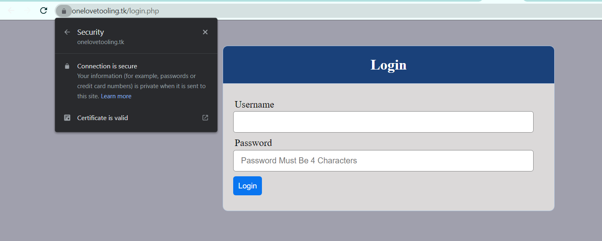


### Step 4 - Set up a Job scheduler to renew the certbot

Set a cron job scheduler to renew the certbot on 12 hours basis
```
crontab -e
* */12 * * *   root /usr/bin/certbot renew > /dev/null 2>&1
```

Verify the crontab setting
```
crontab -l
```
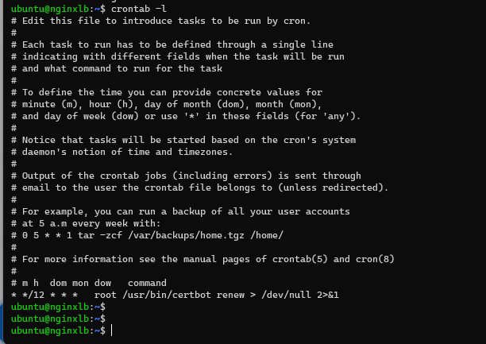
