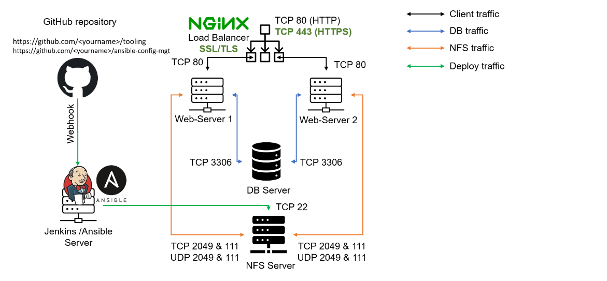
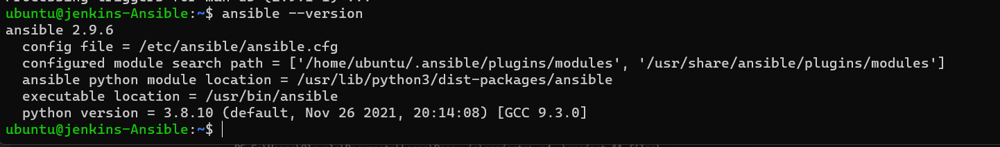
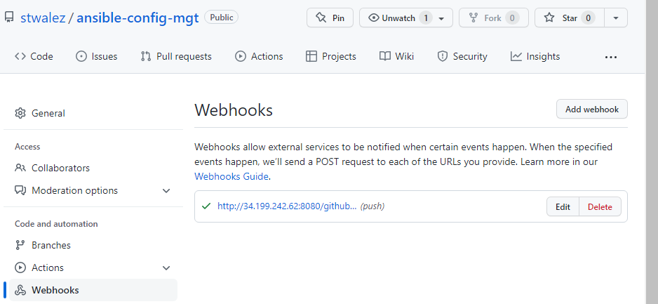
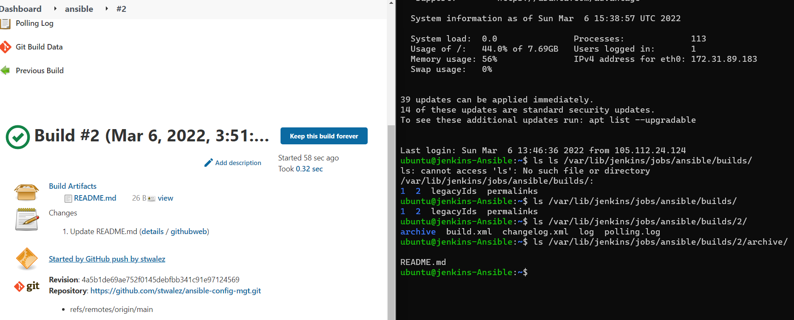
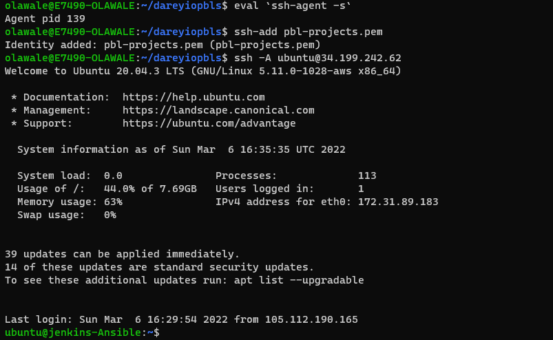
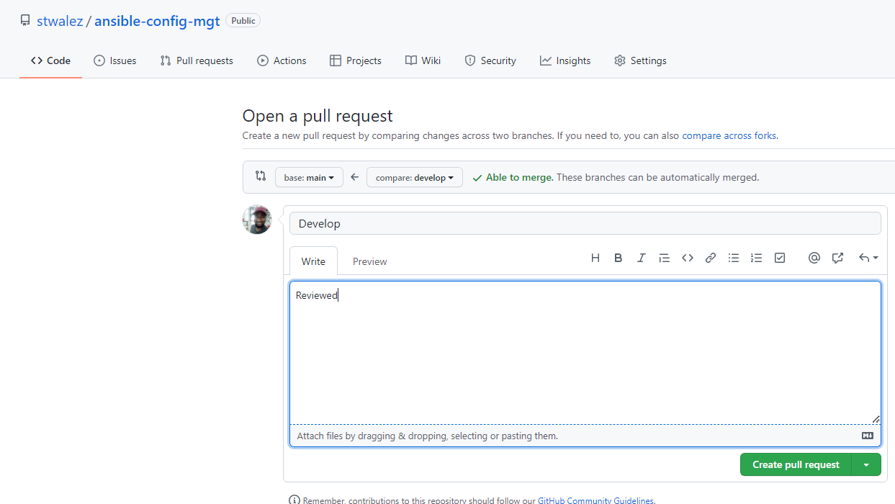
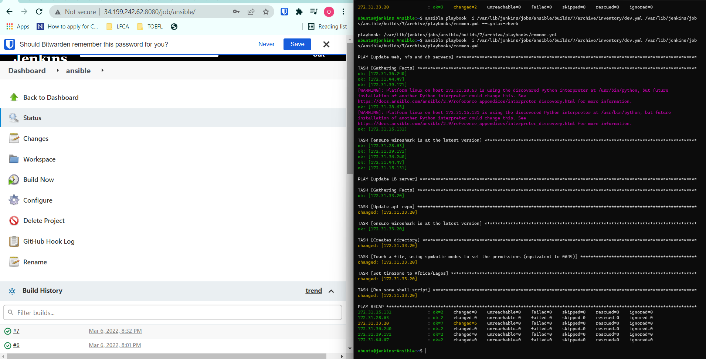
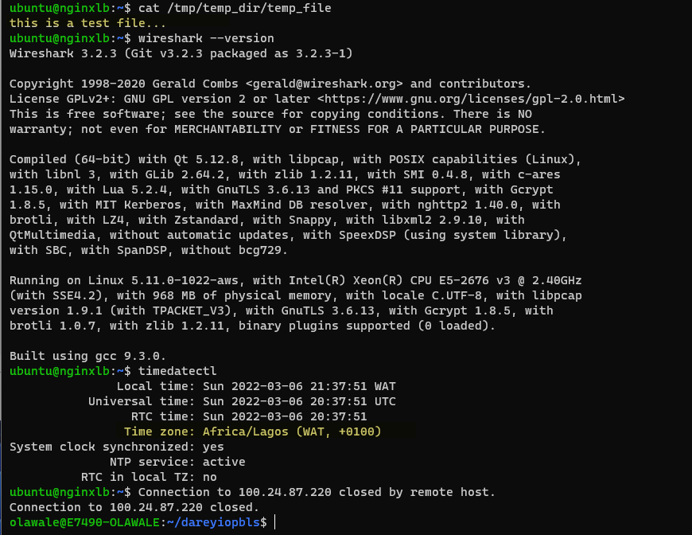

# Project 11

## Ansible – Automate Project 7 to 10
In this project, we are utilizing the Jenkins server implemented in [Project 9](../project_9_files/project_9.md) and configuring an Ansible Playbook to deploy to the target servers.



### Install Ansible on the EC2 instance

Install Ansible
```
sudo hostnamectl set-hostname jenkins-Ansible  
bash                                           
sudo apt update
sudo apt install ansible -y

ansible --version
```


### Setup the Git repository
Create the git repository

Set the webhook


Clone the git repo and push some codes
```
git clone https://github.com/stwalez/ansible-config-mgt.git
git checkout -b develop
```


Create the directories and files
```
mkdir playbook
mkdir inventory

touch playbooks/common.yml
touch inventory/{dev,staging,uat,prod}.yml
```

Push the codes 
```
git commit -m "commit message"
git push --set-upstream origin develop

```

Verify webhook works

```
ls /var/lib/jenkins/jobs/ansible/builds/<build_number>/archive/

```



### Begin Ansible Development
Copy the ssh private key of the targets to the Jenkins-Ansible server
```
scp -i .\pbl-projects.pem .\pbl-projects.pem ubuntu@34.199.242.62:~/
```

Set up ssh agent oto connect to Jenkins-Ansible server without the identity file option. 
Do the same for the Jenkins Ansible to connect to the target servers.
```
eval `ssh-agent -s`
 ssh-add pbl-projects.pem
```


Update inventory/dev.yml file:

```
[nfs]
172.31.28.63 ansible_ssh_user='ec2-user'

[webservers]
172.31.44.47 ansible_ssh_user='ec2-user'
172.31.39.171 ansible_ssh_user='ec2-user'
172.31.36.240 ansible_ssh_user='ec2-user'

[db]
172.31.15.131 ansible_ssh_user='ec2-user' 

[lb]
172.31.33.20 ansible_ssh_user='ubuntu'
```


Update the playbook yaml file, common.yml file:

The playbook yaml includes extra tasks
- Create a directory and a file inside it
- Change timezone on the LB server
- Run some shell script to insert new line to the file

Ensure indentation is set to spaces and not tabs
```
---
- name: update web, nfs and db servers
  hosts: webservers, nfs, db
  remote_user: ec2-user
  become: yes
  become_user: root
  tasks:
    - name: ensure wireshark is at the latest version
      yum:
        name: wireshark
        state: latest

- name: update LB server
  hosts: lb
  remote_user: ubuntu
  become: yes
  become_user: root
  tasks:
    - name: Update apt repo
      apt:
        update_cache: yes

    - name: ensure wireshark is at the latest version
      apt:
        name: wireshark
        state: latest

    - name: Creates directory
      file:
        path: /tmp/temp_dir
        state: directory

    - name: Touch a file, using symbolic modes to set the permissions (equivalent to 0644)
      file:
        path: /tmp/temp_dir/temp_file
        state: touch
        mode: u=rw,g=r,o=r

    - name: Set timezone to Africa/Lagos
      timezone:
        name: Africa/Lagos

    - name: Run some shell script
      shell: echo "this is a test file..." > /tmp/temp_dir/temp_file
```

Sync to Github
```
git commit -m "commit message"
git push --set-upstream origin develop
```

Create a Pull Request from the second branch to main branch


Once this is done, verify that file has been built by Jenkins by checking the last build

### Run the Ansible Playbook

Navigate to the Jenkins-Ansible server

Ensure all host check has been verified before running the ansible playbook command:

```
ssh-keyscan -t rsa -H <IP ADDRESS> >> ~/.ssh/known_hosts 2>&1
```

or Disable Host Key Checks for Ansible via ANSIBLE Environment variable. See [here](https://stackoverflow.com/questions/46929624/failed-to-connect-to-the-host-via-ssh-host-key-verification-failed-r-n)

```
export ANSIBLE_HOST_KEY_CHECKING=False
```

Verify that the syntax on the playbook yaml is correct using ```--syntax-check```

Once the syntax has been verified, run the andible playbook command

```
ansible-playbook -i /var/lib/jenkins/jobs/ansible/builds/7/archive/inventory/dev.yml /var/lib/jenkins/jobs/ansible/builds/7/archive/playbooks/common.yml 
```


If "Gathering Facts" Task get stuck while Ansible is running. Run the command below to remove the cp directory

```
rm -r ~/.ansible/cp
```


Verify that the tasks were deployed:

