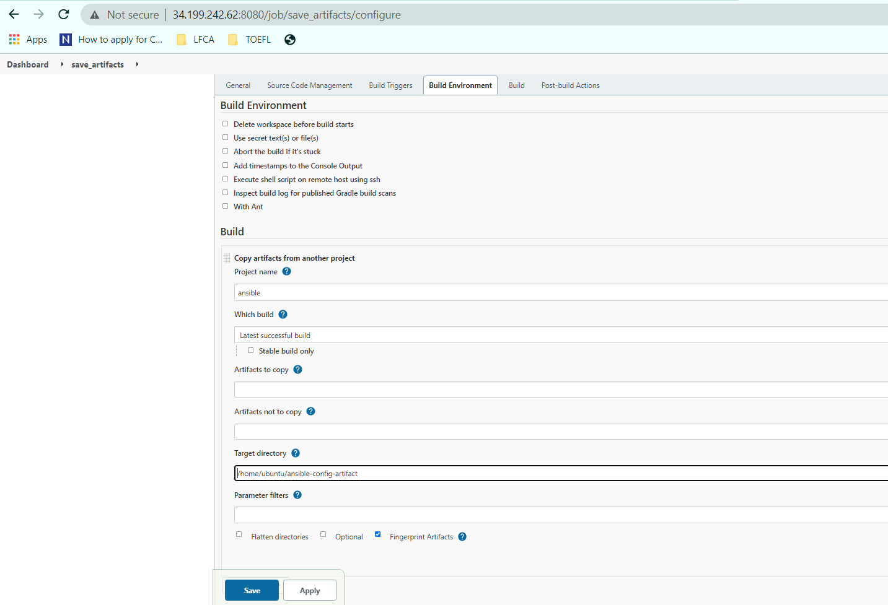

# Project 12

## Ansible refactoring and static assignments (imports and roles)


### Step 1 – Jenkins job enhancement

Create a new directory and set appropriate permissions:

```
sudo sudo mkdir /home/ubuntu/ansible-config-artifact
sudo chmod -R 0777 /home/ubuntu/ansible-config-artifact
```
Install Copy Artifacts Plugin


Create a new Freestyle Project and configure its job to run after the ansible jenkins job is done:


The new project will be configured to copy artifacts from the ansible jenkins utilized in [project 9](../project_9_files/project_9.md) to the created directory:



Make a change the Github repo and verify that the new job runs:


### Step 2 – Refactor Ansible code by importing other playbooks into site.yml

Create the static assignments directory and move the common.yml file to the new directory
mkdir static-assignments
```
mv playbooks/common.yml static-assignments/
```
Create site.yml in the playbooks directory and import the common.yml file

```
touch playbooks/site.yml
cat << EOF > playbooks/site.yml
---
- hosts: all
- import_playbook: ../static-assignments/common.yml
EOF
```

Create another playbook to remove previously installed wireshark
```
vi static-assinments/common-del.yml
```

Include the script below in common-del.yml
```
---
- name: update web, nfs and db servers
  hosts: webservers, nfs, db
  remote_user: ec2-user
  become: yes
  become_user: root
  tasks:
  - name: delete wireshark
    yum:
      name: wireshark
      state: removed

- name: update LB server
  hosts: lb
  remote_user: ubuntu
  become: yes
  become_user: root
  tasks:
  - name: delete wireshark
    apt:
      name: wireshark-qt
      state: absent
      autoremove: yes
      purge: yes
      autoclean: yes
```

Edit site yml to point to the common-del.yml file
```
sed -i 's/common/common-del/g' playbooks/site.yml
```

Update code on Github and merge the pull request

```
git add .
git -m "commit message"
git push origin refactor
```

Access the Jenkins-Ansible server and run the ssh-agent service
```
eval `ssh-agent -s`
 ssh-add pbl-projects.pem
```

Run the ansible command using the site.yml

```
export ANSIBLE_HOST_KEY_CHECKING=False
ansible-playbook -i /home/ubuntu/ansible-config-artifact/inventory/dev.yml /home/ubuntu/ansible-config-artifact/playbooks/site.yml
```


Verify that wireshark was removed:


### Step 3 Configure UAT Webservers with a role 'Webserver'

Launch 2 fresh EC2 instances 


Create a directory called roles from the Jenkins Ansible server/ansible-config-artifact directory:

```
mkdir roles
cd roles
```

Use the ansible-galaxy to create the webserver role
```
ansible-galaxy init webserver
```

Navigate to the webserver directory created by ansible-galaxy and remove the unneeded folders

```
cd webserver/
rm -rf tests files vars
```

Copy the pruned webserver directory to the cloned repo on your local system 
```
scp -r -i "pbl-projects.pem" ubuntu@ec2-34-199-242-62.compute-1.amazonaws.com:~/ansible-config-artifact/roles/webserver repos/ansible-config-mgt/
```

Update your inventory ansible-config-mgt/inventory/uat.yml file with IP addresses of your 2 UAT Web servers
```
[uat-webservers]
172.31.41.74 ansible_ssh_user='ec2-user'
172.31.46.146 ansible_ssh_user='ec2-user'
```

In Jenkins-Ansible server, configure the roles_path in ansible global config to the role directory created earlier:

```
sudo sed -i 's@#roles_path    = /etc/ansible/roles@roles_p
ath    = /home/ubuntu/ansible-config-artifact/roles@g' /etc/ansible/ansible.cfg
```

Add some logic to the tasks/main.yml on local system file to deploy httpd and clone the tooling repo on the newly launched EC2 instances

```
vi tasks/main.yml

---
- name: install apache
  become: true
  ansible.builtin.yum:
    name: "httpd"
    state: present

- name: install git
  become: true
  ansible.builtin.yum:
    name: "git"
    state: present

- name: clone a repo
  become: true
  ansible.builtin.git:
    repo: https://github.com/<your-name>/tooling.git
    dest: /var/www/html
    force: yes

- name: copy html content to one level up
  become: true
  command: cp -r /var/www/html/html/ /var/www/

- name: Start service httpd, if not started
  become: true
  ansible.builtin.service:
    name: httpd
    state: started

- name: recursively remove /var/www/html/html/ directory
  become: true
  ansible.builtin.file:
    path: /var/www/html/html
    state: absent

```

Push the code to Github and merge pull requests to trigger the Jenkins build:
```
git add .
git -m "commit message"
git push origin refactor

```

Run the Ansible code to deploy the scripts to the UAT web servers:

```
ansible-playbook -i /home/ubuntu/ansible-config-artifact/inventory/uat.yml /home/ubuntu/ansible-config-artifact/playbooks/site.yml
```

Navigate to the webserver Public IP and confirm that it shows the tooling page:


