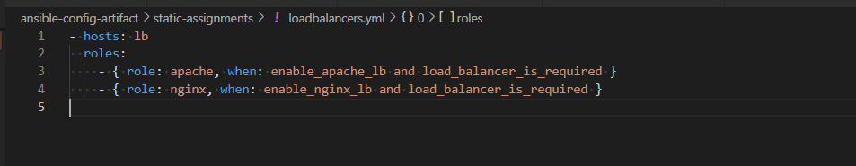

# Project 13

## Ansible Dynamic Assignments (include) and Community roles
In this project, Ansible dynamic assignments (include) was utilised to deploy to servers.

When the import module is used, all statements are pre-processed at the time playbooks are parsed. Meaning, when a playbook is executed, Ansible will process all the playbooks referenced during the time it is parsing the statements. This also means that, during actual execution, if any statement changes, such statements will not be considered. Hence, it is static.


When include module is used, all statements are processed only during execution of the playbook. Meaning, after the statements are parsed, any changes to the statements encountered during execution will be used.
```
import = Static
include = Dynamic
```

Take note that in most cases it is recommended to use static assignments for playbooks, because it is more reliable. With dynamic ones, it is hard to debug playbook problems due to its dynamic nature. However, you can use dynamic assignments for environment specific variables as we will be introducing in this project.


### Step 1 - Introducing Dynamic Assignments into our structure

Create a new folder, name it dynamic-assignments. Then inside this folder, create env-vars.yml file
```
git checkout -b dynamic-assignments
mkdir dynamic-assignments
touch dynamic-assignments/env-vars.yml
```

Since we will be using the same Ansible to configure multiple environments, and each of these environments will have certain unique attributes, such as servername, ip-address etc., we will need a way to set values to variables per specific environment.

For this reason, we will now create a folder to keep each environment’s variables file. Therefore, create a new folder env-vars, then for each environment, create new YAML files which we will use to set variables.

```
mkdir env-vars
touch env-vars/{dev,stage,uat,prod}.yml
```

Update the env-vars.yml with the code below:

```
cat << EOF > dynamic-assignments/env-vars.yml
---
- name: looping through list of available files
  include_vars: "{{ item }}"
  with_first_found:
    - files:
        - '{{ inventory_file | basename }}'
        - dev.yml
        - stage.yml
        - prod.yml
        - uat.yml
      paths:
        - "{{ playbook_dir }}/../env-vars"
  tags:
    - always
EOF
```
The code was updated to ensure it is a task file and not a play file, i.e it doesn't have a "hosts" option.
The code does the following:
- it loops around the file contents in the env-vars directory created above based on the order set and picks the first found file (using the ```with_first_found```)
- it first checks the inventory_file that was passed to the ansible deployment and returns its basename(without the file path). 
- for instance, if the inventory file to be used with the ansible deployment command i.e ansible -i inventory_file, is /home/ubuntu/ansible-config-artifact/inventory/uat.yml, uat.yml becomes the basename. This makes the env-vars.yml dynamic in choosing the required inventory file depending on the enviroments.(```'{{ inventory_file | basename }}'```)
- it then checks the content of the file and retrieves the variables set in them (``` include_vars: "{{ item }}" ```)


Also update the site.yml file to make use of the dynamic assignment using include_tasks:

```
- import_playbook: ../static-assignments/common.yml   

- name: Include dynamic variables
  hosts: all
  tasks:
    - include_tasks: ../dynamic-assignments/env-vars.yml
  tags:
    - always

- name: Webserver assignment
  import_playbook: ../static-assignments/uat-webservers.yml
```
Note: import_playbook can only be used as top level play and cannot be in a tasks option

The tree structure should look the screenshot below:


Push to Github and Merge to the main branch
Disable Github Webhook to stop Jenkins builds


### Step 2 - Connect to Jenkins-Ansible
As there is no need to use Jenkins build for the project, Git would be installed on the Jenkins Ansible server to easily fetch our code from the Github repo and deploy to the servers.

Navigate to the ansible artifact directory where the jenkins build are copied into and pull the git directly from github
```
cd ansible-config-artifacts
git init
git pull https://github.com/stwalez/ansible-config-mgt.git
git remote add origin https://github.com/stwalez/ansible-config-mgt.git
git commit -m "added roles-feature branch"
```

Configure the github personal details
```
git config --global user.name "Ola"
git config --global user.email "email address"
```

Switch to a new branch
```
git branch roles-feature
git switch roles-feature
```

### Step 3 - Utilizing Community Roles - MySQL

Download existing ansible roles

Here we would install the ansible role for mysql
```
chmod -R 777 roles
cd roles
ansible-galaxy install geerlingguy.mysql
```
Rename the ansible role
```
sudo mv geerlingguy.mysql mysql
```
Update the mysql > defaults > main.yml file and  edit roles configuration to use correct credentials for MySQL required for the tooling website.


Upload changes into Github and merge to main branch

```
cd ..
git add .
git commit -m "Commit new role files into GitHub"
git push --set-upstream origin roles-feature
```

### Step 3 Load Balancer Roles

Here, we will try to create a dynamic assignment such that we would be able to select a load balancer type to deploy to the server i.e nginx or apache:

Install the Nginx and Apache roles:

```
cd roles

ansible-galaxy install geerlingguy.nginx 
mv geerlingguy.nginx/ nginx


ansible-galaxy install geerlingguy.apache 
mv geerlingguy.apache/ apache


```

We will make use of variables as a condition to enable the preferred load balancer role:

Name each variables enable_nginx_lb and enable_apache_lb respectively. Set their values to false
```
echo "enable_nginx_lb: false" >> nginx/defaults/main.yml 
echo "load_balancer_is_required: false" >> nginx/defaults/main.yml 

echo "enable_apache_lb: false" >> apache/defaults/main.yml
echo "load_balancer_is_required: false" >> apache/defaults/main.yml 
```

Create and update loadbalancers.yml in the static-assignments with the conditions
Here the required role is only used if the variables are both true

```
cd ..
cat << EOT > static-assignments/loadbalancers.yml
- hosts: lb
  roles:
    - { role: nginx, when: enable_nginx_lb and load_balancer_is_required }
    - { role: apache, when: enable_apache_lb and load_balancer_is_required }
EOT
```



Update the site.yml file to import the loadbalancers.yml file on the condition when load_balancer_is_required is true

```
cat << EOF >> playbooks/site.yml
- name: Loadbalancers assignment
  import_playbook: ../static-assignments/loadbalancers.yml
  when: load_balancer_is_required
EOF
```

playbooks/site.yml should have the following content:
```
- name: Include dynamic variables
  hosts: all
  tasks:
    - include_tasks: ../dynamic-assignments/env-vars.yml
  tags:
    - always

- name: Webserver assignment
  import_playbook: ../static-assignments/uat-webservers.yml

- name: Loadbalancers assignment
  import_playbook: ../static-assignments/loadbalancers.yml
  when: load_balancer_is_required
```


To activate load balancer, and enable nginx by setting these in the respective environment’s env-vars file.
```
cat << EOF > env-vars\uat.yml
enable_nginx_lb: true
load_balancer_is_required: true

EOF
```


### Updates

To successfully run the nginx and apache roles in the ansible playbook, some privilege escalation is required:
```become: true``` was used for plays while ```ansible_become: yes``` variable was used for tasks. [See here for the bug.](https://stackoverflow.com/questions/56558841/include-tasks-does-not-work-with-become-after-upgrade-to-ansible-2-8)

roles > apache > tasks > main.yml


roles > nginx > tasks > main.yml


Amazon linux does not have its [own nginx package](https://nginx.org/packages). To accomodate amazon linux OS in nginx role, the ansible_distribution_major_version variable was set to use centos 7.
Check [here for the issue.](https://github.com/geerlingguy/ansible-role-nginx/issues/191)


### Deployment
Run the ansible playbook command:

```
ansible-playbook -i /home/ubuntu/ansible-config-artifact/inventory/uat.yml /home/ubuntu/ansible-config-artifact/playbooks/site.yml
```


Observe that the apache roles was skipped but nginx was installed


