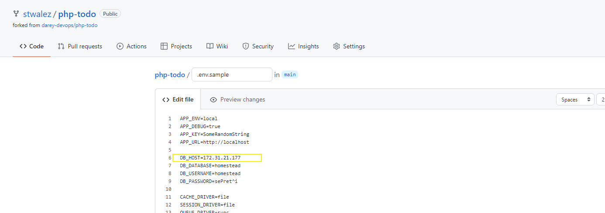
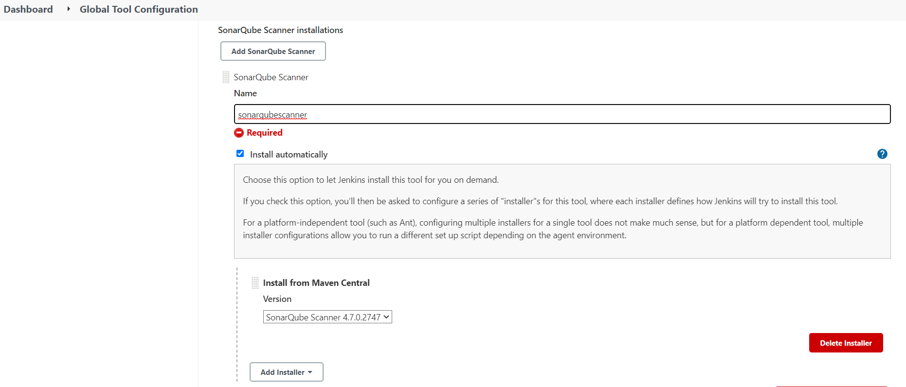

# Project 14

## Experience Continuous Integration With Jenkins | Ansible | Artifactory | Sonarqube | PHP

### Step 1: Simulating a typical CI/CD Pipeline for a PHP Based application

Set Up

---

Ansible inventory should look like this:

```
touch inventory/{pentest,pre-prod,sit,ci}.yml

├── ci
├── dev
├── pentest
├── preprod
├── prod
├── sit
└── uat


```


ci inventory

```
[jenkins]
<Jenkins-Private-IP-Address>

[nginx]
<Nginx-Private-IP-Address>

[sonarqube]
<SonarQube-Private-IP-Address>

[artifact_repository]
<Artifact_repository-Private-IP-Address>
```

dev

```
[tooling]
<Tooling-Web-Server-Private-IP-Address>

[todo]
<Todo-Web-Server-Private-IP-Address>

[nginx]
<Nginx-Private-IP-Address>

[db:vars]
ansible_user=ec2-user
ansible_python_interpreter=/usr/bin/python

[db]
<DB-Server-Private-IP-Address>
```


pentest

```
[pentest:children]
pentest-todo
pentest-tooling

[pentest-todo]
<Pentest-for-Todo-Private-IP-Address>

[pentest-tooling]
<Pentest-for-Tooling-Private-IP-Address>
```

Add two more roles to your Ansible playbook
Sonarqube: Sonarqube is an open-source platform developed by SonarSource for continuous inspection of code quality to perform automatic reviews with static analysis of code to detect bugs, code smells, and security vulnerabilities (source: https://en.wikipedia.org/wiki/SonarQube)

Artifactory: JFrog Artifactory is a universal DevOps solution providing end-to-end automation and management of binaries and artifacts through the application delivery process that improves productivity across your development ecosystem. (source: https://www.jfrog.com/confluence/display/JFROG/JFrog+Artifactory)


Configure Ansible for Jenkins development

---

In previous projects, you have been launching Ansible commands manually from a CLI. Now, with Jenkins, we will start running Ansible from Jenkins UI.

- Navigate to Jenkins UI and install Blue Ocean plugin
- Click Open Blue Ocean from the left pane
- Once you're in the Blue Ocean UI, click Create Pipeline
- Select GitHub
- On the Connect to GitHub step, click 'Create an access token here' to create your access token
- Type in the token name of your choice, leave everything as in and click Generate token
- Copy the generated token and paste in the field provided in Blue Ocean and click connect
- Select your organization (typically your GitHub name)
- Select the repo to create the pipeline from (ansible-config-mgt)
- Blue Ocean would take you to where to create a pipeline, since we are not doing this now, click Administration from the top bar to exit Blue Ocean.
- Create Jenkinsfile
  - Inside the Ansible project, create a deploy folder
  - In the deploy folder, create a file named **Jenkinsfile** (no extension)
    ```
    mkdir deploy
    touch deploy/JenkinsFile
    ```
  
  - Add the following snippet
    ```
    pipeline {
    agent any
        stages {
            stage('Build') {
                steps {
                    script {
                        sh 'echo "Building Stage"'
                    }
                }
            }
        }
    }
    ```
    The above pipeline job has only one stage (Build) and the stage contains only one step which runs a shell script to echo "Building stage"
- Go back to Ansible project in Jenkins and click Configure
- Scroll down to Build Configuration and for script path, enter the path to the Jenkinsfile (deploy/Jenkinsfile in our case)
- Go back to the pipeline and click Build Now
- Open Blue Ocean again to see the build in action
- You could trigger the build again by clicking the play button against the branch, then click the branch.
  
  Since our pipeline is multibranch, we could build all the branches in the repo independently. To see this in action, 
  - Create a new git branch and name it features/jenkinspipeline-stages
  - Add a new build stage "Test"
    ```
    pipeline {
    agent any
      stages {
        stage('Build') {
          steps {
            script {
              sh 'echo "Building Stage"'
            }
          }
        }

        stage('Test') {
          steps {
            script {
              sh 'echo "Testing Stage"'
            }
          }
        }
        }
    }
    ```

  - To make the new branch show in Jenkins UI, click Administration to exit Blue Ocean, click the project and click Scan Repository Now from the left pane
  - Refresh the page and you should see the new branch.


  - Open Blue Ocean and you should see the new branch building (or has finished building)


    ```
    Quick task:
    1. Create a pull request to merge the latest code into the `main branch`
    2. After merging the `PR`, go back into your terminal and switch into the `main` branch.
    3. Pull the latest change.
    4. Create a new branch, add more stages into the Jenkins file to simulate below phases. (Just add an `echo` command like we have in `build` and `test` stages)
       1. Package 
       2. Deploy 
       3. Clean up
    5. Verify in Blue Ocean that all the stages are working, then merge your feature branch to the main branch
    6. Eventually, your main branch should have a successful pipeline like this in blue ocean
    ```
    Your final pipeline should look like this:
    


Running Ansible Playbook from Jenkins

---

- Install Ansible on your Jenkins server
  ```
  sudo apt install ansible -y
  ```
- Install Ansible plugin in Jenkins UI
  - Go to Manage Jenkins
  - Click Manage Plugins
  - Click Available tab and in the search bar, enter Ansible and click the check box next to the plugin
  - Scroll down and click 'Install without restart'

  - Navigate to Global Tools Configuration and ensure the path to ansible executables is set.
    

- Create Jenkinsfile from scratch (delete all the current stages in the file)
  - Create the ansible.cfg file and add the following to it:
  
    ```
    vi deploy/ansible.cfg
    [defaults]
    debug = False
    gathering = smart
    host_key_checking = False
    gather_subset = !hardware
    roles_path = ../roles
    ```
    - ```debug``` to set ansible debug in case one needs to troubleshoot (optional)
    - ```gathering``` to set ansible gathering facts method (optional)
    - ``` host_key_checking``` to disable strict host checks of servers (optional)
    - ``` gather_subset ``` to limit facts that ansible gathers (optional)
    - ``` roles_path ``` to set the roles_path

  - Pass its path as an environment variable to JENKINS. The name ANSIBLE_CONFIG is recognized by ansible for declaring the path to the required ansible.cfg
    ```
    environment {
        ANSIBLE_CONFIG = "${WORKSPACE}/deploy/ansible.cfg"
      }
    ```
    Blocker: Jenkins requires a password to run the script as sudo, to circumvent this, I added jenkins user to the sudoers file with permissions to use the sudo command without password.
    ```
    Run `sudo visudo` and add the following line
    jenkins ALL=(ALL) NOPASSWD: ALL
    ```
    
  - Add the next stage, to run the playbook
    ```
    stage('Deploy') {
        options {
          timeout(time: 5, unit: 'MINUTES')
        }
        steps {
          script {
            sh 'echo "Deploy Stage"'
            ansiblePlaybook credentialsId: 'private_key', disableHostKeyChecking: true, installation: 'ansible', inventory: 'inventory/${inventory}', playbook: 'playbooks/site.yml'
          }

        }
      }
    ```
   This build stage requires a credentials file (private-key) which can be created by following these steps:
    - Click Manage Jenkins and scroll down a bit to Manage Credentials
    - Under Stores scoped to Jenkins on the right, click on Jenkins
    - Under System, click the Global credentials (unrestricted)
    - Click Add Credentials on the left
    - For credentials kind, choose SSH username with private key
    - Enter the ID as private-key
    - Enter the username Jenkins would use (ubuntu/ec2-user, don't worry about this, since we specify appropriate users in our Ansible inventory files)
    - Enter the secret key (the contents of your <\private-key>.pem file from AWS)
    - Click OK to save

 - You could add a stage that cleans your workspace after every build
    ```
    stage('Clean Up') {
      steps {
        script {
          sh 'echo "Clean Up Stage"'
          sh 'rm -rf ~/.ansible/cp'
        }
        cleanWs(deleteDirs: true)
    
    ```

  - Jenkinsfile should now look like this:
    ```
    pipeline {
      agent any

      environment {
        ANSIBLE_CONFIG="${WORKSPACE}/deploy/ansible.cfg"
      }

      stages {
        stage('Build') {
          steps {
            script {
              sh 'echo "Building Stage"'
            }

          }
        }

        stage('Test') {
          steps {
            script {
              sh 'echo "Testing Stage"'
            }

          }
        }

        stage('Package') {
          steps {
            script {
              sh 'echo "Package Stage"'
            }

          }
        }

        stage('Deploy') {
          options {
            timeout(time: 5, unit: 'MINUTES')
          }
          steps {
            script {
              sh 'echo "Deploy Stage"'
              ansiblePlaybook credentialsId: 'private_key', disableHostKeyChecking: true, installation: 'ansible', inventory: 'inventory/uat.yml', playbook: 'playbooks/site.yml'
            }

          }
        }

        stage('Clean Up') {
          steps {
            script {
              sh 'echo "Clean Up Stage"'
            }

          }
        }

      }
    }
    ```
- Commit and push your changes
  - Go to Blue Ocean and trigger a build against the branch. If everything is configured properly, you should see something like this:
    


Parameterizing Jenkinsfile for Ansible Development

---
To deploy to other environments, we have to use parameters
- Update Jenkinsfile to add parameters
  ```
  pipeline {
    agent any

    parameters {
      string(name: 'inventory', defaultValue: 'dev',  description: 'This is the inventory file for the environment to deploy configuration')
    }
  ```

  The above snippet adds a parameter 'inventory' with a default value 'dev' and a description for the parameter. We can use parameters in the Ansible stage by changing the **inventory/dev** to **inventory/${inventory}**
  

- Add a new parameter to run specific parts of the Ansible playbook using tags
  ```
  string(name: 'tag', defaultValue: 'webservers',  description: 'Specify the tag to limit the ansible execution')
  ```
  The parameters and the Deploy sections of the Jenkinsfile should look like this:

  ```
  parameters {
      string(name: 'inventory', defaultValue: 'dev',  description: 'This is the inventory file for the environment to deploy configuration')
      string(name: 'tags', defaultValue: 'webservers',  description: 'Specify the tag to limit the ansible execution')
    }

    ansiblePlaybook credentialsId: 'private_key', disableHostKeyChecking: true, installation: 'ansible', inventory: 'inventory/${inventory}.yml', playbook: 'playbooks/site.yml', tags: '${tags}'
  ```
  Here, a tag named webservers has been included in the static-assignments/common.yml script to test the tag's functionality:
  

- Running the Job should trigger the parameters:
  
  


### Step 2: CI/CD Pipeline for a TODO Application


Configure Artifactory

---

- Create an [Ansible role](https://github.com/stwalez/ansible-config-mgt/tree/main/roles/artifactory) to install Artifactory and update the ansible playbook with the new role.

  ```
  ansible-galaxy collection install jfrog.platform
  cd /home/ubuntu/.ansible/collections/ansible_collections/jfrog/platform
  cp -r artifactory ~/<project_directory>/roles/artifactory
  
  static-assignments/artifactory.yml
    ---
    - hosts: artifact_repository
      ignore_unreachable: yes
      become: yes
      roles:
        - artifactory
      tags: ci_configuration

  playbooks/site.yml
    - name: Install Artifactory
      import_playbook: ../static-assignments/artifactory.yml

  ```

- Run the role against the Artifactory server. 
  
**Blocker:**
To effectively install and start the artifactory server, ensure the server has a size of 4GB RAM or use a swapfile as the artifactory service tends to run out of memory.
 

Prepare Jenkins

---

- Fork the php-todo repository (https://github.com/darey-devops/php-todo.git)
- Install the php packages and Composer on the jenkins server [using ansible](https://github.com/stwalez/ansible-config-mgt/blob/main/dynamic-assignments/ci-server.yml) 
  ```
    ---
  - name: Install PHP
    become: yes
    apt:
      name:
        - zip
        - libapache2-mod-php
        - phploc
        - php-{{ item }}
      state: present
      update_cache: yes
    loop:
      - xml
      - bcmath
      - bz2
      - intl
      - gd
      - mbstring
      - mysql
      - zip
      - xdebug

  - name: Check if composer exists
    stat:
      path: '/tmp/composer-setup.php'
    register: composer_setup_file

  - name: Download Composer if not composer not found
    shell: 'curl -sS https://getcomposer.org/installer -o /tmp/composer-setup.php'
    when: not composer_setup_file.stat.exists
    register: composer_download

  - name: Install Composer, ignore if path already exists
    shell: 'sudo php /tmp/composer-setup.php --install-dir=/usr/local/bin --filename=composer'
    when: composer_download is succeeded
  ```

- Install Jenkins plugins
  - Plot plugin: to display tests reports and code coverage information
  - Artifactory plugin: to easily deploy artifacts to Artifactory server
  
- Configure Artifactory in Jenkins UI
  - Click Manage Jenkins, click Configure System
  - Scroll down to JFrog, click Add Artifactory Server
  - Enter the Server ID
  - Enter the URL as:
    ```
    http://<artifactory-server-ip>:8082/
    ```
    


Integrate Artifactory repository with Jenkins

---
- Create a dummy Jenkinsfile in the root of the php-todo repo
- In Blue Ocean, create multibranch pipeline
- Create a database and user on the database server [using ansible roles](https://github.com/stwalez/ansible-config-mgt/tree/main/roles/mysql)
  ```
  CREATE DATABASE homestead;
  CREATE USER 'homestead'@'%' IDENTIFIED BY 'sePret^i';
  GRANT ALL PRIVILEGES ON * . * TO 'homestead'@'%';
  ```
  

- Update the .env.sample file with your db connectivity details
  

- Update Jenkinsfile with proper configuration
  ```
  pipeline {
    agent any

    stages {

     stage("Initial cleanup") {
          steps {
            dir("${WORKSPACE}") {
              deleteDir()
            }
          }
        }
  
    stage('Checkout SCM') {
      steps {
            git branch: 'main', url: 'https://github.com/stwalez/php-todo.git'
      }
    }

    stage('Prepare Dependencies') {
      steps {
             sh 'mv .env.sample .env'
             sh 'composer install'
             sh 'php artisan migrate'
             sh 'php artisan db:seed'
             sh 'php artisan key:generate'
          }
        }
      }
    }
    ```
- After successful run of this step, login to the database, run show tables and you will see the tables being created for you)
  
  

- Update Jenkinsfile to include unit tests
  ```
  stage('Execute Unit Tests') {
      steps {
             sh './vendor/bin/phpunit'
      }
  ```
Code Quality Analysis

---
Most commonly used tool for php code quality analysis is **phploc**
- Add the code analysis step in Jenkinsfile
  ```
      stage('Code Analysis') {
      steps {
            sh 'phploc app/ --log-csv build/logs/phploc.csv'

      }
    }
  ```

- Plot the data using Jenkins Plot plugin
  ```
      stage('Plot Code Coverage Report') {
      steps {

            plot csvFileName: 'plot-396c4a6b-b573-41e5-85d8-73613b2ffffb.csv', csvSeries: [[displayTableFlag: false, exclusionValues: 'Lines of Code (LOC),Comment Lines of Code (CLOC),Non-Comment Lines of Code (NCLOC),Logical Lines of Code (LLOC)                          ', file: 'build/logs/phploc.csv', inclusionFlag: 'INCLUDE_BY_STRING', url: '']], group: 'phploc', numBuilds: '100', style: 'line', title: 'A - Lines of code', yaxis: 'Lines of Code'
            plot csvFileName: 'plot-396c4a6b-b573-41e5-85d8-73613b2ffffb.csv', csvSeries: [[displayTableFlag: false, exclusionValues: 'Directories,Files,Namespaces', file: 'build/logs/phploc.csv', inclusionFlag: 'INCLUDE_BY_STRING', url: '']], group: 'phploc', numBuilds: '100', style: 'line', title: 'B - Structures Containers', yaxis: 'Count'
            plot csvFileName: 'plot-396c4a6b-b573-41e5-85d8-73613b2ffffb.csv', csvSeries: [[displayTableFlag: false, exclusionValues: 'Average Class Length (LLOC),Average Method Length (LLOC),Average Function Length (LLOC)', file: 'build/logs/phploc.csv', inclusionFlag: 'INCLUDE_BY_STRING', url: '']], group: 'phploc', numBuilds: '100', style: 'line', title: 'C - Average Length', yaxis: 'Average Lines of Code'
            plot csvFileName: 'plot-396c4a6b-b573-41e5-85d8-73613b2ffffb.csv', csvSeries: [[displayTableFlag: false, exclusionValues: 'Cyclomatic Complexity / Lines of Code,Cyclomatic Complexity / Number of Methods ', file: 'build/logs/phploc.csv', inclusionFlag: 'INCLUDE_BY_STRING', url: '']], group: 'phploc', numBuilds: '100', style: 'line', title: 'D - Relative Cyclomatic Complexity', yaxis: 'Cyclomatic Complexity by Structure'      
            plot csvFileName: 'plot-396c4a6b-b573-41e5-85d8-73613b2ffffb.csv', csvSeries: [[displayTableFlag: false, exclusionValues: 'Classes,Abstract Classes,Concrete Classes', file: 'build/logs/phploc.csv', inclusionFlag: 'INCLUDE_BY_STRING', url: '']], group: 'phploc', numBuilds: '100', style: 'line', title: 'E - Types of Classes', yaxis: 'Count'
            plot csvFileName: 'plot-396c4a6b-b573-41e5-85d8-73613b2ffffb.csv', csvSeries: [[displayTableFlag: false, exclusionValues: 'Methods,Non-Static Methods,Static Methods,Public Methods,Non-Public Methods', file: 'build/logs/phploc.csv', inclusionFlag: 'INCLUDE_BY_STRING', url: '']], group: 'phploc', numBuilds: '100', style: 'line', title: 'F - Types of Methods', yaxis: 'Count'
            plot csvFileName: 'plot-396c4a6b-b573-41e5-85d8-73613b2ffffb.csv', csvSeries: [[displayTableFlag: false, exclusionValues: 'Constants,Global Constants,Class Constants', file: 'build/logs/phploc.csv', inclusionFlag: 'INCLUDE_BY_STRING', url: '']], group: 'phploc', numBuilds: '100', style: 'line', title: 'G - Types of Constants', yaxis: 'Count'
            plot csvFileName: 'plot-396c4a6b-b573-41e5-85d8-73613b2ffffb.csv', csvSeries: [[displayTableFlag: false, exclusionValues: 'Test Classes,Test Methods', file: 'build/logs/phploc.csv', inclusionFlag: 'INCLUDE_BY_STRING', url: '']], group: 'phploc', numBuilds: '100', style: 'line', title: 'I - Testing', yaxis: 'Count'
            plot csvFileName: 'plot-396c4a6b-b573-41e5-85d8-73613b2ffffb.csv', csvSeries: [[displayTableFlag: false, exclusionValues: 'Logical Lines of Code (LLOC),Classes Length (LLOC),Functions Length (LLOC),LLOC outside functions or classes ', file: 'build/logs/phploc.csv', inclusionFlag: 'INCLUDE_BY_STRING', url: '']], group: 'phploc', numBuilds: '100', style: 'line', title: 'AB - Code Structure by Logical Lines of Code', yaxis: 'Logical Lines of Code'
            plot csvFileName: 'plot-396c4a6b-b573-41e5-85d8-73613b2ffffb.csv', csvSeries: [[displayTableFlag: false, exclusionValues: 'Functions,Named Functions,Anonymous Functions', file: 'build/logs/phploc.csv', inclusionFlag: 'INCLUDE_BY_STRING', url: '']], group: 'phploc', numBuilds: '100', style: 'line', title: 'H - Types of Functions', yaxis: 'Count'
            plot csvFileName: 'plot-396c4a6b-b573-41e5-85d8-73613b2ffffb.csv', csvSeries: [[displayTableFlag: false, exclusionValues: 'Interfaces,Traits,Classes,Methods,Functions,Constants', file: 'build/logs/phploc.csv', inclusionFlag: 'INCLUDE_BY_STRING', url: '']], group: 'phploc', numBuilds: '100', style: 'line', title: 'BB - Structure Objects', yaxis: 'Count'
          }
        }
  ```
  CLick on the Plots button on the left pane. If everything was configured properly, you should see something like this:
  

- Package the artifacts 
  ```
  stage ('Package Artifact') {
    steps {
            sh 'zip -qr ${WORKSPACE}/php-todo.zip ${WORKSPACE}/*'
    }
  ```

- Publish packaged artifact into Artifactory
  ```
  stage ('Upload Artifact to Artifactory') {
      steps {
        script { 
              def server = Artifactory.server 'artifactory-server'                 
              def uploadSpec = """{
                "files": [
                  {
                    "pattern": "php-todo.zip",
                    "target": "PBL/php-todo",
                    "props": "type=zip;status=ready"
                    }
                ]
              }""" 
              server.upload spec: uploadSpec
        }
      }
    }
  ```
  **Blocker:** For this to work, you have to create a local repository on your Artifactory with package type as Generic and Repository Key as the name of the repo (PBL in this case)
  

- Deploy application to dev environment by launching the Ansible pipeline 
  ```
  stage ('Deploy to Dev Environment') {
    steps {
    build job: 'ansible-config-mgt/main', parameters: [[$class: 'StringParameterValue', name: 'env', value: 'dev']], propagate: false, wait: true
    }
  }
  ```
  This build job tells Jenkins to trigger a job in the ansible-config-mgt pipeline. Since the ansible-config-mgt pipeline requires some parameters, we pass them using the 'parameters' value.

  Push the code and trigger a build, the final result should resemble this:
  

### Step 3: Configure SonarQube

Software Quality - The degree to which a software component, system or process meets specified requirements based on user needs and expectations.

Software Quality Gates - Quality gates are basically acceptance criteria which are usually presented as a set of predefined quality criteria that a software development project must meet in order to proceed from one stage of its lifecycle to the next one.

In this section, [sonarqube role](https://github.com/stwalez/ansible-config-mgt/tree/main/roles/sonarqube) was utilized to install Java prerequisite, sonarqube and fine tune the requirements on the sonarqube server. 

```
ansible-galaxy install lrk.sonarqube
cd roles/
mv lrk.sonarqube sonarqube
```

<a name="sonarqube_playbook">SonarQube Playbook</a>


The following steps were already configured in the [roles](https://github.com/stwalez/ansible-config-mgt/tree/main/roles/) to minimize manual installation. However, it is documented here for informational purposes:
  - Tune Linux Kernel
  - Update system packages and Install Java and other required packages
  - Install and Setup PostgreSQL 10 Database for SonarQube
  - Install and configure SonarQube


Tune Linux Kernel

---  
**Note that this step is already covered in the [sonarqube playbook](#sonarqube_playbook)**
  ```
  sudo sysctl -w vm.max_map_count=262144
  sudo sysctl -w fs.file-max=65536
  ulimit -n 65536
  ulimit -u 4096

  ##This changes do not persist after system reboot
  ```
  To enable persistence after reboot, open the /etc/security/limits.conf file and append the following.
  ```
  sonarqube   -   nofile   65536
  sonarqube   -   nproc    4096
  ```
The fine tuned settings can be found in the tasks section of the role


Update system packages and Install Java and other required packages

---
**Note that this step is already covered in the [sonarqube playbook](#sonarqube_playbook)**
- Update and upgrade packages
  ```
  sudo apt-get update
  sudo apt-get upgrade
  ```
- Install wget and unzip packages
  ```
  sudo apt-get install wget unzip -y
  ```
- Install OpenJDK and Java Runtime Environment (JRE)
  ```
  sudo apt-get install openjdk-11-jdk -y
  sudo apt-get install openjdk-11-jre -y
  ```
  - To set default JDK or switch to OpenJDK, run the command,
    ```
    sudo update-alternatives --config java
    ```
  - Verify JAVA is installed by running:
    ```
    java -version
    ```

Install and Setup PostgreSQL 10 Database for SonarQube

---
**Note that this step is already covered in the [sonarqube playbook](#sonarqube_playbook)**
- Add PostgreSQL to repo list
  ```
  sudo sh -c 'echo "deb http://apt.postgresql.org/pub/repos/apt/ `lsb_release -cs`-pgdg main" >> /etc/apt/sources.list.d/pgdg.list'
  ```
- Add repo key
  ```
  wget -q https://www.postgresql.org/media/keys/ACCC4CF8.asc -O - | sudo apt-key add -
  ```
- Install PostgreSQL
  ```
  sudo apt-get -y install postgresql postgresql-contrib
  ```
- Start and enable PostgreSQL Database service
  ```
  sudo systemctl start postgresql
  sudo systemctl enable postgresql
  ```
- Change the default password for postgres user (to whatever password you can easily remember)
  ```
  sudo passwd postgres
  ```
  Then switch to postgres user
  ```
  su - postgres
  ```
- Create a new user for SonarQube
  ```
  createuser sonar
  ```
- Create Sonar DB and user
  - Switch to PostgreSQL shell
    ```
    psql
    ```
  - Set up encrypted password for newly created user
    ```
    ALTER USER sonar WITH ENCRYPTED password 'sonar';
    ```
  - Create a DB for SonarQube
    ```
    CREATE DATABASE sonarqube OWNER sonar;
    ```
  - Grant required privileges
    ```
    grant all privileges on DATABASE sonarqube to sonar;
    ```
  - Exit the shell
    ```
    \q
    ```
- Switch back to initial user
  ```
  exit
  ```

Install and configure SonarQube

---
**Note that this step is already covered in the [sonarqube playbook](#sonarqube_playbook)**

- Download temporary files to /tmp folder
  ```
  cd /tmp && sudo wget https://binaries.sonarsource.com/Distribution/sonarqube/sonarqube-7.9.3.zip
  ```
- Unzip archive to the /opt directory and move to /opt/sonarqube
  ```
  sudo unzip sonarqube-7.9.3.zip -d /opt
  sudo mv /opt/sonarqube-7.9.3 /opt/sonarqube
  ```
- Configure SonarQube
  Since Sonarqube cannot be run as root user, we have to create a **sonar** user to start the service with.
  - Create a group sonar
    ```
    sudo groupadd sonar
    ```
  - Add a **sonar** user with control over /opt/sonarqube
    ```
    sudo useradd -c "user to run SonarQube" -d /opt/sonarqube -g sonar sonar 
    sudo chown sonar:sonar /opt/sonarqube -R
    ```
  - Open and edit SonarQube configuration file. Find and edit the following lines
    ```
    sonar.jdbc.username=sonar
    sonar.jdbc.password=sonar
    ```
    Append this line
    ```
    sonar.jdbc.url=jdbc:postgresql://localhost:5432/sonarqube
    ```
  - Edit sonar script and set RUN_AS_USER=sonar
  - Add sonar user to sudoers file
    - First set the user's password to something you can easily remember
      ```
      sudo passwd sonar
      ```
    - Run the following command and add the following line
      ```
      sudo visudo
      ```
      ```
      sonar ALL=(ALL) NOPASSWD: ALL
      ```
  - Switch to the sonar user, switch to script directory and start the script
    ```
    su - sonar
    cd /opt/sonarqube/bin/linux-x86-64/
    ./sonar.sh start
    ```
    Output:
    ```
    Starting SonarQube...

    Started SonarQube
    ```
  - Check SonarQube logs
    ```
    tail /opt/sonarqube/logs/sonar.log
    ```
  - Configure systemd to manage SonarQube service
    - Stop the sonar service
      ```
      cd /opt/sonarqube/bin/linux-x86-64/
      ./sonar.sh stop
      ```
    - Create systemd service file
      ```
      sudo vim /etc/systemd/system/sonar.service
      ```
      Paste in the following lines:
      ```
      [Unit]
      Description=SonarQube service
      After=syslog.target network.target

      [Service]
      Type=forking

      ExecStart=/opt/sonarqube/bin/linux-x86-64/sonar.sh start
      ExecStop=/opt/sonarqube/bin/linux-x86-64/sonar.sh stop

      User=sonar
      Group=sonar
      Restart=always

      LimitNOFILE=65536
      LimitNPROC=4096

      [Install]
      WantedBy=multi-user.target
      ```
      Save and exit
    - Use systemd to manage the service
      ```
      sudo systemctl start sonar
      sudo systemctl enable sonar
      sudo systemctl status sonar
      ```

Access Sonarqube

---
- Access the SonarQube by going to http://\<sonar-qube-ip>/9000, use **admin** as your username and password


- If you are having a timeout error, ensure the security group attached to the Sonarqube instance has incoming port 9000 set.

Configure SonarQube and Jenkins for Quality Gate

---
- Install SonarQube plugin in Jenkins UI

- Navigate to Manage Jenkins > Configure System and add a SonarQube server
  - In the name field, enter **sonarqube**
  - For server URL, enter the IP of your SonarQube instance
- Generate authentication tokens to use in the Jenkins UI
  - In SonarQube UI, navigate to User > My Account > Security > Generate tokens
  - Type in the name of the token and click Generate
  

- Configure SonarQube webhook for Jenkins
  -  Navigate to Administration > Configuration > Webhooks > Create
  - Enter the name
  - Enter URL as http://\<jenkins-server-ip>:8080/sonar-webhook/
  

- Setup SonarScanner for Jenkins
  - In Jenkins UI, go to Manage Jenkins > Global Tool Configuration
  - Look for SonarQube Scanner
  - Click 'Add SonarQube Scanner' and enter the scanner name as 'SonarQubeScanner'
  - Check the 'Install automatically' box
  - Select 'Install from Maven Central'
  

- Add the following build stage for Quality Gate
  ```
  stage('SonarQube Quality Gate') {
      environment {
            scannerHome = tool 'SonarQubeScanner'
        }
        steps {
            withSonarQubeEnv('sonarqube') {
                sh "${scannerHome}/bin/sonar-scanner"
            }

        }
    }
  ```
  Save and run the pipeline to install the scanner (you might get an error initially)

- Edit sonar-scanner.properties file
  ```
  sudo vim /var/lib/jenkins/tools/hudson.plugins.sonar.SonarRunnerInstallation/SonarQubeScanner/conf/sonar-scanner.properties
  ```
  Paste in the following lines:
  ```
  sonar.host.url=http://<SonarQube-Server-IP-address>:9000
  sonar.projectKey=php-todo
  sonar.sources=.
  #----- Default source code encoding
  sonar.sourceEncoding=UTF-8
  sonar.exclusions=**/vendor/**
  sonar.php.coverage.reportPaths=build/logs/phploc.csv
  sonar.php.tests.reportPath=reports/unitreport.xml
  ```
  
  **Blocker:** the sonar.php.exclusions was modified to sonar.exclusions as sonar.php.exlusions doesn't seem to exclude the vendors file.
                sonar.sources=. was included due to errors thrown while building the source codes.

- Navigate to your php-todo dashboard on SonarQube UI 

Conditionally Deploy to Higher Environments
---
- Include a **when** condition to execute the Quality Gate stage only when the running branch is develop, hotfix, release, main or master
  ```
  when { branch pattern: "^develop*|^hotfix*|^release*|^main*", comparator: "REGEXP"}
  ```
- Add a timeout step to abort to Quality Gate stage after 1 minute (or any time you like)
  ```
      timeout(time: 1, unit: 'MINUTES') {
        waitForQualityGate abortPipeline: true
    }
  ```
  Quality Gate stage snippet should look like this:
  ```
  stage('SonarQube Quality Gate') {
      when { branch pattern: "^develop*|^hotfix*|^release*|^main*", comparator: "REGEXP"}
        environment {
            scannerHome = tool 'SonarQubeScanner'
        }
        steps {
            withSonarQubeEnv('sonarqube') {
                sh "${scannerHome}/bin/sonar-scanner -Dproject.settings=sonar-project.properties"
            }
            timeout(time: 1, unit: 'MINUTES') {
                waitForQualityGate abortPipeline: true
            }
        }
    }
  ```
  You should get the following when you run the pipeline:
  
  
  Quality gate does not execute for specific branches based on the when condition ('new-features' branch):
  


### Additional setups

Configure Jenkins slave servers

---
- Spin up two new EC2 Instance. Ubuntu OS was used in this case:
  
  
  - Install Java and Ansible using ansible roles
  

  On the main Jenkins server
  - Navigate to Manage Jenkins > Manage Nodes
  - Click New Node
  - Enter name of the node and click the 'Permanent Agent' button and click the OK button
  - Ensure a credential was created for the ubuntu servers
  - Ensure that a label was set in the configuration above. This would help in random assignments to the agents.
  - Set 'Host' value as the IP of the slave node
  - For Launch Method, select Launch Agents via SSH
  - Add  SSH with username and private key credentials with username as jenkins and private key as the private key you copied from the node
  - For Host Key Verification Strategy, select Manually trusted key validation strategy
  - Click Save
    
  To add additional nodes/agents
   - Navigate to Manage Jenkins > Manage Nodes
   - Click New Node
   - Select "Copy from existing nodes to add a node with duplicated configs from the previous agent 
     

  To trigger a build, update the JenkinsFile from 
  
  ```
  agent any
  ```
  to
  ```
  agent { label '<label name>' }
  e.g.   agent { label 'ansible-configured-agents' }
  ```
  

Configure GitHub WebHook for Automatic Build of Pushed Code


---
[Video Submission](https://drive.google.com/file/d/1fMIP6RyA_yRFvaaotrMu6JOGrs71RVWh/view?usp=sharing)


[Back to top](#)