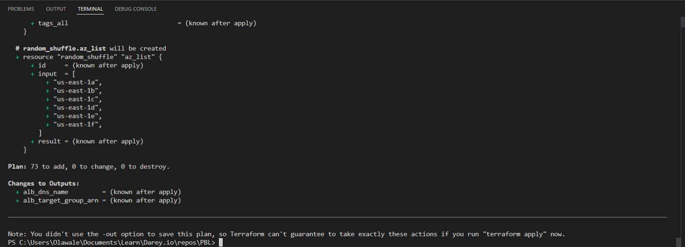

# Project 17

## Automate Infrastructure With Iac Using Terraform Part 2

This is a continuation of [Project 16](../project_16_files/project_16.md).

## Networking
### Private subnets and best practices

- Create 4 private subnets
  ```
  resource "aws_subnet" "private" {
    count                   = var.preferred_number_of_private_subnets == null ? length(data.aws_availability_zones.available.names) : var.preferred_number_of_private_subnets
    vpc_id                  = aws_vpc.main.id
    cidr_block              = cidrsubnet(var.vpc_cidr, 4, count.index+2)
    map_public_ip_on_launch = true
    availability_zone       = data.aws_availability_zones.available.names[count.index]
    tags = merge(
        var.tags,
        {
        Name = format("PrivateSubnet-%s", count.index)
        } 
    )
  }
  ```
To allocate cidr block for the private subnet using the cidrsubnet() function, increment the count.index variable by 2 (as seen above), this way, public subnet values do not conflict with private subnet

### Internet Gateways
- Create an *internet_gateway.tf* file and paste in the following:
  ```
  resource "aws_internet_gateway" "ig" {
    vpc_id = aws_vpc.main.id

    tags = merge(
      var.tags,
      {
        Name = format("%s-%s!", aws_vpc.main.id,"IG")
      } 
    )
  }
  ```
  The format function replaces the %s value with the values given after the comma.

### NAT Gateways
- Create one NAT Gateway and one Elastic IP to attach to the gateway in *natgateway.tf*
  ```
  resource "aws_eip" "nat_eip" {
    vpc        = true
    depends_on = [aws_internet_gateway.ig]

    tags = merge(
      var.tags,
      {
        Name = format("%s-EIP", var.name)
      },
    )
  }

  resource "aws_nat_gateway" "nat" {
    allocation_id = aws_eip.nat_eip.id
    subnet_id     = element(aws_subnet.public.*.id, 0)
    depends_on    = [aws_internet_gateway.ig]

    tags = merge(
      var.tags,
      {
        Name = format("%s-Nat", var.name)
      },
    )
  }
  ```
  The *depends_on* attribute tells Terraform to create the Internet gateway before create the NAT gateway, as the NAT gateway depends on it.

### AWS Routes
- Create public and private route tables for the public and private subnets respectiely in *route-table.tf*, and ensure they are properly tagged.
  ```
  resource "aws_route_table" "private-rtb" {
  vpc_id = aws_vpc.main.id

  tags = merge(
    var.tags,
    {
      Name = format("%s-Private-Route-Table", var.name)
    },
  )
}

- Associate all private subnets to the private route table
  ```
  resource "aws_route_table_association" "private-subnets-assoc" {
    count          = length(aws_subnet.private[*].id)
    subnet_id      = element(aws_subnet.private[*].id, count.index)
    route_table_id = aws_route_table.private-rtb.id
  }
  ```

- create route table for the public subnets
  ```
  resource "aws_route_table" "public-rtb" {
    vpc_id = aws_vpc.main.id

    tags = merge(
      var.tags,
      {
        Name = format("%s-Public-Route-Table", var.name)
      },
    )
  }
  ```

- create route for the public route table and attach the internet gateway
  ```
  resource "aws_route" "public-rtb-route" {
    route_table_id         = aws_route_table.public-rtb.id
    destination_cidr_block = "0.0.0.0/0"
    gateway_id             = aws_internet_gateway.ig.id
  }
  ```

- associate all public subnets to the public route table
  ```
  resource "aws_route_table_association" "public-subnets-assoc" {
    count          = length(aws_subnet.public[*].id)
    subnet_id      = element(aws_subnet.public[*].id, count.index)
    route_table_id = aws_route_table.public-rtb.id
  }
  ```
  At this point, running **terraform apply** should create a VPC, two public subnets, four private subnets, one internet gateway, one EIP, one NAT gateway and one two route tables.
- Add the following entries to your default_tags in terraform.tfvars block:
  ```
  Environment = "dev"
  Billing Account = "<Insert_Billing AWS Account>"
  Owner Email = "<Insert_email>"
  ```
  To associate multiple subnets to a route table using a single *aws_route_table_association* resource block, add a count argument that returns the length of the aws_subnet resource created earlier and use the *element* function to pick each at a time.

### Security Groups
- Create the Security for all resources  with the file *security.tf*
  ```
  # security group for alb, to allow acess from anywhere on port 80 & 443.
  resource "aws_security_group" "ext-alb-sg" {
    name        = "ext-alb-sg"
    description = "Allow TLS inbound traffic"
    vpc_id      = aws_vpc.main.id

    ingress {
      description = "HTTPS"
      from_port   = 443
      to_port     = 443
      protocol    = "tcp"
      cidr_blocks = ["0.0.0.0/0"]
    }

    ingress {
      description = "HTTP"
      from_port   = 80
      to_port     = 80
      protocol    = "tcp"
      cidr_blocks = ["0.0.0.0/0"]
    }

    egress {
      from_port   = 0
      to_port     = 0
      protocol    = "-1"
      cidr_blocks = ["0.0.0.0/0"]
    }

    tags = {
      Name = "ext-alb-sg"
    }
  }


  # Security group for bastion to allow access into the bastion host from your IP
  resource "aws_security_group" "bastion_sg" {
    name        = "bastion_sg"
    vpc_id      = aws_vpc.main.id
    description = "Allow incoming HTTP connections."

    ingress {
      description = "SSH"
      from_port   = 22
      to_port     = 22
      protocol    = "tcp"
      cidr_blocks = ["0.0.0.0/0"]
    }

    egress {
      from_port   = 0
      to_port     = 0
      protocol    = "-1"
      cidr_blocks = ["0.0.0.0/0"]
    }

    tags = merge(
      var.tags,
      {
        Name = "Bastion-SG"
      },
    )
  }


  # Security group for nginx reverse proxy to allow access only from the external load balancer and bastion instance 
  resource "aws_security_group" "nginx-sg" {
    name   = "nginx-sg"
    vpc_id = aws_vpc.main.id

    egress {
      from_port   = 0
      to_port     = 0
      protocol    = "-1"
      cidr_blocks = ["0.0.0.0/0"]
    }

    tags = merge(
      var.tags,
      {
        Name = "nginx-SG"
      },
    )
  }

  resource "aws_security_group_rule" "inbound-nginx-http" {
    type                     = "ingress"
    from_port                = 443
    to_port                  = 443
    protocol                 = "tcp"
    source_security_group_id = aws_security_group.ext-alb-sg.id
    security_group_id        = aws_security_group.nginx-sg.id
  }

  resource "aws_security_group_rule" "inbound-bastion-ssh" {
    type                     = "ingress"
    from_port                = 22
    to_port                  = 22
    protocol                 = "tcp"
    source_security_group_id = aws_security_group.bastion_sg.id
    security_group_id        = aws_security_group.nginx-sg.id
  }


  # Security group for internal alb, to have access only from nginx reverse proxy server
  resource "aws_security_group" "int-alb-sg" {
    name   = "int-alb-sg"
    vpc_id = aws_vpc.main.id

    egress {
      from_port   = 0
      to_port     = 0
      protocol    = "-1"
      cidr_blocks = ["0.0.0.0/0"]
    }

    tags = merge(
      var.tags,
      {
        Name = "int-alb-sg"
      },
    )
  }


  resource "aws_security_group_rule" "inbound-ialb-https" {
    type                     = "ingress"
    from_port                = 443
    to_port                  = 443
    protocol                 = "tcp"
    source_security_group_id = aws_security_group.nginx-sg.id
    security_group_id        = aws_security_group.int-alb-sg.id
  }

  # Security group for webservers, to have access only from the internal load balancer and bastion instance
  resource "aws_security_group" "webserver-sg" {
    name   = "webserver-sg"
    vpc_id = aws_vpc.main.id

    egress {
      from_port   = 0
      to_port     = 0
      protocol    = "-1"
      cidr_blocks = ["0.0.0.0/0"]
    }

    tags = {
      Name = "webserver-sg"
    }
  }

  resource "aws_security_group_rule" "inbound-webserver-https" {
    type                     = "ingress"
    from_port                = 443
    to_port                  = 443
    protocol                 = "tcp"
    source_security_group_id = aws_security_group.int-alb-sg.id
    security_group_id        = aws_security_group.webserver-sg.id
  }

  resource "aws_security_group_rule" "inbound-webserver-ssh" {
    type                     = "ingress"
    from_port                = 22
    to_port                  = 22
    protocol                 = "tcp"
    source_security_group_id = aws_security_group.bastion-sg.id
    security_group_id        = aws_security_group.webserver-sg.id
  }

  # Security group for datalayer to allow traffic from webserver on nfs and mysql port ann bastion host on mysql
  resource "aws_security_group" "datalayer-sg" {
    name   = "datalayer-sg"
    vpc_id = aws_vpc.main.id

    egress {
      from_port   = 0
      to_port     = 0
      protocol    = "-1"
      cidr_blocks = ["0.0.0.0/0"]
    }

    tags = {
      Name = "datalayer-sg"
    }
  }

  resource "aws_security_group_rule" "inbound-nfs-port" {
    type                     = "ingress"
    from_port                = 2049
    to_port                  = 2049
    protocol                 = "tcp"
    source_security_group_id = aws_security_group.webserver-sg.id
    security_group_id        = aws_security_group.datalayer-sg.id
  }

  resource "aws_security_group_rule" "inbound-mysql-bastion" {
    type                     = "ingress"
    from_port                = 3306
    to_port                  = 3306
    protocol                 = "tcp"
    source_security_group_id = aws_security_group.bastion-sg.id
    security_group_id        = aws_security_group.datalayer-sg.id
  }

  resource "aws_security_group_rule" "inbound-mysql-webserver" {
    type                     = "ingress"
    from_port                = 3306
    to_port                  = 3306
    protocol                 = "tcp"
    source_security_group_id = aws_security_group.webserver-sg.id
    security_group_id        = aws_security_group.datalayer-sg.id
  }

  ```


## AWS Identity and Access Management
- Create AssumeRole, add the following block to a new file called *role.tf*
  ```
  resource "aws_iam_role" "ec2_instance_role" {
    name = "ec2_instance_role"
    assume_role_policy = jsonencode({
      Version = "2012-10-17"
      Statement = [
        {
          Action = "sts:AssumeRole"
          Effect = "Allow"
          Sid    = ""
          Principal = {
            Service = "ec2.amazonaws.com"
          }
        },
      ]
    })

    tags = merge(
      var.tags,
      {
        Name = "aws assume role"
      },
    )
  }
  ```

- Create IAM Policy
  ```
  resource "aws_iam_policy" "policy" {
    name        = "ec2_instance_policy"
    description = "A test policy"
    policy = jsonencode({
      Version = "2012-10-17"
      Statement = [
        {
          Action = [
            "ec2:Describe*",
          ]
          Effect   = "Allow"
          Resource = "*"
        },
      ]

    })

    tags = merge(
      var.tags,
      {
        Name = "aws assume policy"
      },
    )
  }
  ```
- Attach the policy to the IAM Role
  ```
  resource "aws_iam_role_policy_attachment" "test-attach" {
    role       = aws_iam_role.ec2_instance_role.name
    policy_arn = aws_iam_policy.policy.arn
  }
  ```
- Create an Instance Profile for the IAM Role
  ```
  resource "aws_iam_instance_profile" "ip" {
      name = "aws_instance_profile_test"
      role =  aws_iam_role.ec2_instance_role.name
  }

## Certificate
- The entire section creates a certificate, public zone, and validate the certificate using DNS method
- Create the resources to setup acm certificate in *cert.tf*

### Create the certificate using a wildcard for all the domains created in onelovetooling.tk
  ```
  resource "aws_acm_certificate" "onelovetooling" {
    domain_name       = "*.onelovetooling.tk"
    validation_method = "DNS"
  }
  ```
### Call the hosted zone
  ```
  data "aws_route53_zone" "onelovetooling" {
    name         = "onelovetooling.tk"
    private_zone = false
  }
  ```
### Select validation method
  ```
  resource "aws_route53_record" "onelovetooling" {
    for_each = {
      for dvo in aws_acm_certificate.onelovetooling.domain_validation_options : dvo.domain_name => {
        name   = dvo.resource_record_name
        record = dvo.resource_record_value
        type   = dvo.resource_record_type
      }
    }

    allow_overwrite = true
    name            = each.value.name
    records         = [each.value.record]
    ttl             = 60
    type            = each.value.type
    zone_id         = data.aws_route53_zone.onelovetooling.zone_id
  }
  ```
### Validate the certificate through DNS method
  ```
  resource "aws_acm_certificate_validation" "onelovetooling" {
    certificate_arn         = aws_acm_certificate.onelovetooling.arn
    validation_record_fqdns = [for record in aws_route53_record.onelovetooling : record.fqdn]
  }
  ```
### Create records for tooling
  ```
  resource "aws_route53_record" "tooling" {
    zone_id = data.aws_route53_zone.onelovetooling.zone_id
    name    = "tooling.onelovetooling.tk"
    type    = "A"

    alias {
      name                   = aws_lb.ext-alb.dns_name
      zone_id                = aws_lb.ext-alb.zone_id
      evaluate_target_health = true
    }
  }
  ```

### create records for wordpress
  ```
  resource "aws_route53_record" "wordpress" {
    zone_id = data.aws_route53_zone.onelovetooling.zone_id
    name    = "wordpress.onelovetooling.tk"
    type    = "A"

    alias {
      name                   = aws_lb.ext-alb.dns_name
      zone_id                = aws_lb.ext-alb.zone_id
      evaluate_target_health = true
    }
  }
  ```


## Application Load Balancers

- Create the two load balancers in the file *alb.tf*
  ```
  ----------------------------
  #External Load balancer for reverse proxy nginx
  #---------------------------------

  resource "aws_lb" "ext-alb" {
    name            = "ext-alb"
    internal        = false
    security_groups = [aws_security_group.ext-alb-sg.id]
    subnets         = [aws_subnet.public[0].id, aws_subnet.public[1].id]

    tags = {
      Name = "ext-alb"
    }

    ip_address_type    = "ipv4"
    load_balancer_type = "application"
  }
  ```

- Create a target group for the external load balancer
  ```
  resource "aws_lb_target_group" "nginx-tgt" {
    health_check {
      interval            = 10
      path                = "/healthstatus"
      protocol            = "HTTPS"
      timeout             = 5
      healthy_threshold   = 5
      unhealthy_threshold = 2
    }
    name        = "nginx-tgt"
    port        = 443
    protocol    = "HTTPS"
    target_type = "instance"
    vpc_id      = aws_vpc.main.id
  }
  ```
- Create a listener for the external load balancer

  ```
  resource "aws_lb_listener" "nginx-listener" {
    load_balancer_arn = aws_lb.ext-alb.arn
    port              = 443
    protocol          = "HTTPS"
    certificate_arn   = aws_acm_certificate_validation.onelovetooling_validation.certificate_arn

    default_action {
      type             = "forward"
      target_group_arn = aws_lb_target_group.nginx-tgt.arn
    }
  }
  ```
- Create the internal load balancer

  ```
  # ----------------------------
  #Internal Load Balancers for webservers
  #---------------------------------

  resource "aws_lb" "int-alb" {
    name     = "int-alb"
    internal = true

    security_groups = [aws_security_group.int-alb-sg.id]

    subnets = [aws_subnet.private[0].id, aws_subnet.private[1].id]

    tags = {
      Name = "int-alb"
    }

    ip_address_type    = "ipv4"
    load_balancer_type = "application"
  }

  # --- target group  for wordpress -------
  resource "aws_lb_target_group" "wordpress-tgt" {
    health_check {
      interval            = 10
      path                = "/healthstatus"
      protocol            = "HTTPS"
      timeout             = 5
      healthy_threshold   = 5
      unhealthy_threshold = 2
    }

    name        = "wordpress-tgt"
    port        = 443
    protocol    = "HTTPS"
    target_type = "instance"
    vpc_id      = aws_vpc.main.id
  }

  # --- target group for tooling -------
  resource "aws_lb_target_group" "tooling-tgt" {
    health_check {
      interval            = 10
      path                = "/healthstatus"
      protocol            = "HTTPS"
      timeout             = 5
      healthy_threshold   = 5
      unhealthy_threshold = 2
    }

    name        = "tooling-tgt"
    port        = 443
    protocol    = "HTTPS"
    target_type = "instance"
    vpc_id      = aws_vpc.main.id
  }
  ```

- For this aspect a single listener was created for the wordpress which is default,
  ```
  resource "aws_lb_listener" "web-listener" {
    load_balancer_arn = aws_lb.int-alb.arn
    port              = 443
    protocol          = "HTTPS"
    certificate_arn   = aws_acm_certificate_validation.onelovetooling_validation.certificate_arn


    default_action {
      type             = "forward"
      target_group_arn = aws_lb_target_group.wordpress-tgt.arn
    }
  }
  ```
- A rule was created to route traffic to tooling when the host header changes

  ```
  # listener rule for tooling target

  resource "aws_lb_listener_rule" "tooling-listener" {
    listener_arn = aws_lb_listener.web-listener.arn
    priority     = 99

    action {
      type             = "forward"
      target_group_arn = aws_lb_target_group.tooling-tgt.arn
    }

    condition {
      host_header {
        values = ["tooling.onelovetooling.tk"]
      }
    }
  }

  ```


## AutoScaling Groups

- Create *asg-bastion-nginx.tf* file for auto scaling group resources for Bation and Nginx servers

### Creating sns topic for all the auto scaling groups
  ```
  resource "aws_sns_topic" "olawale-sns" {
    name = "Default_CloudWatch_Alarms_Topic"
  }

  resource "aws_autoscaling_notification" "asg_notifications" {
    group_names = [
      aws_autoscaling_group.bastion-asg.name,
      aws_autoscaling_group.nginx-asg.name,
      aws_autoscaling_group.wordpress-asg.name,
      aws_autoscaling_group.tooling-asg.name,
    ]
    notifications = [
      "autoscaling:EC2_INSTANCE_LAUNCH",
      "autoscaling:EC2_INSTANCE_TERMINATE",
      "autoscaling:EC2_INSTANCE_LAUNCH_ERROR",
      "autoscaling:EC2_INSTANCE_TERMINATE_ERROR",
    ]

    topic_arn = aws_sns_topic.olawale-sns.arn
  }

  resource "random_shuffle" "az_list" {
    input = data.aws_availability_zones.available.names
  }
  ```

### Bastion Launch Template
  ```
  resource "aws_launch_template" "bastion-launch-template" {
    image_id               = var.ami
    instance_type          = "t2.micro"
    vpc_security_group_ids = [aws_security_group.bastion_sg.id]

    iam_instance_profile {
      name = aws_iam_instance_profile.ip.id
    }

    key_name = var.keypair

    placement {
      availability_zone = "random_shuffle.az_list.result"
    }

    lifecycle {
      create_before_destroy = true
    }

    tag_specifications {
      resource_type = "instance"

      tags = merge(
        var.tags,
        {
          Name = "bastion-launch-template"
        },
      )
    }

    user_data = filebase64("${path.module}/bastion.sh")
  }
  ```
### Autoscaling for bastion hosts
  ```
  resource "aws_autoscaling_group" "bastion-asg" {
    name                      = "bastion-asg"
    max_size                  = 2
    min_size                  = 1
    health_check_grace_period = 300
    health_check_type         = "ELB"
    desired_capacity          = 1

    vpc_zone_identifier = [
      aws_subnet.public[0].id,
      aws_subnet.public[1].id
    ]

    launch_template {
      id      = aws_launch_template.bastion-launch-template.id
      version = "$Latest"
    }
    tag {
      key                 = "Name"
      value               = "bastion-launch-template"
      propagate_at_launch = true
    }

  }
  ```
### Nginx Launch template
  ```
  resource "aws_launch_template" "nginx-launch-template" {
    image_id               = var.ami
    instance_type          = "t2.micro"
    vpc_security_group_ids = [aws_security_group.nginx-sg.id]

    iam_instance_profile {
      name = aws_iam_instance_profile.ip.id
    }

    key_name = var.keypair

    placement {
      availability_zone = "random_shuffle.az_list.result"
    }

    lifecycle {
      create_before_destroy = true
    }

    tag_specifications {
      resource_type = "instance"

      tags = merge(
        var.tags,
        {
          Name = "nginx-launch-template"
        },
      )
    }

    user_data = filebase64("${path.module}/nginx.sh")
  }
  ```
### Autoscaling group for reverse proxy nginx
  ```
  resource "aws_autoscaling_group" "nginx-asg" {
    name                      = "nginx-asg"
    max_size                  = 2
    min_size                  = 1
    health_check_grace_period = 300
    health_check_type         = "ELB"
    desired_capacity          = 1

    vpc_zone_identifier = [
      aws_subnet.public[0].id,
      aws_subnet.public[1].id
    ]

    launch_template {
      id      = aws_launch_template.nginx-launch-template.id
      version = "$Latest"
    }

    tag {
      key                 = "Name"
      value               = "nginx-launch-template"
      propagate_at_launch = true
    }

  }
  ```
### Attaching autoscaling group of nginx to external load balancer
- *alb_target_group_arn* key is outdated, Use lb_target_group_arn instead
  ```
  resource "aws_autoscaling_attachment" "asg_attachment_nginx" {
    autoscaling_group_name = aws_autoscaling_group.nginx-asg.id
    lb_target_group_arn   = aws_lb_target_group.nginx-tgt.arn
  }
  ```
### Variable Updates

Enter value below in variables.tf file
```
variable "ami" {
  type        = string
  description = "AMI ID for the launch template"
}

variable "keypair" {
  type        = string
  description = "Key pair for the instances"
}

variable "account_no" {
  type        = number
  description = "the account number"
}
```

Enter value below in terraform.tfvars file
  ```
  ami = "ami-0b0af3577fe5e3532"

  keypair = "pbl-projects"

  account_no = "<AWS_Account_ID>"

  ```
### UserData Scripts
- The userdata scripts might not completely run for nginx,wordpress and tooling.
- This is due to values that require connections to endpoints like efs, rds which may not be available since the endpoints resources details are also created in place using terraform.
- A better solution would be introduced in the next project to fix this. 
- In the mean time, userdata scripts for nginx,wordpress and tooling could be left blank
  
Create bastion.sh file and enter content below:
  ```
  #!/bin/bash
  yum install -y mysql
  yum install -y git tmux
  yum install -y ansible
  ```

- Create *asg-webserver-nginx.tf* file for tooling and worpress, it contains resources for auto scaling group, launch templates (exist before autoscaling group).

### WordPress launch template
  ```
  resource "aws_launch_template" "wordpress-launch-template" {
    name                   = "wordpress-launch-template"
    instance_type          = "t2.micro"
    image_id               = var.ami
    vpc_security_group_ids = [aws_security_group.webserver-sg.id]

    iam_instance_profile {
      name = aws_iam_instance_profile.ip.id
    }

    key_name = var.keypair

    placement {
      availability_zone = "random_shuffle.az_list.result"
    }

    lifecycle {
      create_before_destroy = true
    }

    tag_specifications {
      resource_type = "instance"

      tags = {
        Name = "wordpress-launch-template"
      }
    }

    user_data = filebase64("${path.module}/wordpress.sh")
  }
  ```

### Autoscaling for wordpress application
  ```
  resource "aws_autoscaling_group" "wordpress-asg" {
    name                      = "wordpress-asg"
    max_size                  = 2
    min_size                  = 1
    health_check_grace_period = 300
    health_check_type         = "ELB"
    desired_capacity          = 2

    vpc_zone_identifier = [aws_subnet.private[0].id, aws_subnet.private[1].id]

    launch_template {
      id      = aws_launch_template.wordpress-launch-template.id
      version = "$Latest"
    }
    tag {
      key                 = "Name"
      value               = "ACS-wordpress"
      propagate_at_launch = true
    }

  }
  ```

### Attaching autoscaling group of wordpress to internal load balancer
  ```
  resource "aws_autoscaling_attachment" "asg_attachment_wordpress" {
    autoscaling_group_name = aws_autoscaling_group.wordpress-asg.id
    lb_target_group_arn   = aws_lb_target_group.wordpress-tgt.arn
  }

  ### Tooling launch template
  resource "aws_launch_template" "tooling-launch-template" {
    name                   = "tooling-launch-template"
    instance_type          = "t2.micro"
    image_id               = var.ami
    vpc_security_group_ids = [aws_security_group.webserver-sg.id]

    iam_instance_profile {
      name = aws_iam_instance_profile.ip.id
    }

    key_name = var.keypair

    placement {
      availability_zone = "random_shuffle.az_list.result"
    }

    lifecycle {
      create_before_destroy = true
    }

    tag_specifications {
      resource_type = "instance"

      tags = {
        Name = "tooling-launch-template"
      }
    }

    user_data = filebase64("${path.module}/tooling.sh")
  }
  ```
### Autoscaling for tooling 
  ```
  resource "aws_autoscaling_group" "tooling-asg" {
    name                      = "tooling-asg"
    max_size                  = 2
    min_size                  = 1
    health_check_grace_period = 300
    health_check_type         = "ELB"
    desired_capacity          = 2

    vpc_zone_identifier = [
      aws_subnet.private[0].id, 
      aws_subnet.private[1].id
    ]

    launch_template {
      id      = aws_launch_template.tooling-launch-template.id
      version = "$Latest"
    }
    tag {
        key                 = "Name"
        value               = "tooling-launch-template"
        propagate_at_launch = true
      }
  }
  ```

### Attaching autoscaling group of tooling application to internal loadbalancer

  ```
  resource "aws_autoscaling_attachment" "asg_attachment_tooling" {
    autoscaling_group_name = aws_autoscaling_group.tooling-asg.id
    alb_target_group_arn   = aws_lb_target_group.tooling-tgt.arn
  }
  ```

## Outputs 
- Create *output.tf* to retrieve external load balancer endpoint address
  ```
  output "alb_dns_name" {
    value = aws_lb.ext-alb.dns_name
  }

  output "alb_target_group_arn" {
    value = aws_lb_target_group.nginx-tgt.arn
  }
  ```


## Storage

- Create *efs.tf* file contains resources to create kms key used for the elastic file  system and RDS used for encryption purposes.
### Create key from key management system
- Ensure the iam user is set correctly for kms to either the username for the aws creds setup as terraform provider or the root user.
- If another user is required, ensure appropriate policy is added to include the user to describe/create/destroy the key
  ```
  resource "aws_kms_key" "ACS-kms" {
    description = "KMS key "
    policy      = <<EOF
    {
    "Version": "2012-10-17",
    "Id": "kms-key-policy",
    "Statement": [
      {
        "Sid": "Enable IAM User Permissions",
        "Effect": "Allow",
        "Principal": { "AWS": "arn:aws:iam::${var.account_no}:user/terratest" },
        "Action": "kms:*",
        "Resource": "*"
      }
    ]
  }
  EOF
  }
  ```
### Create key alias
  ```
  resource "aws_kms_alias" "alias" {
    name          = "alias/kms"
    target_key_id = aws_kms_key.ACS-kms.key_id
  }

  # create Elastic file system
  resource "aws_efs_file_system" "ACS-efs" {
    encrypted  = true
    kms_key_id = aws_kms_key.ACS-kms.arn

    tags = {
      Name = "ACS-efs"
    }
  }
  ```
### Set first mount target for the EFS 
  ```
  resource "aws_efs_mount_target" "subnet-1" {
    file_system_id  = aws_efs_file_system.ACS-efs.id
    subnet_id       = aws_subnet.private[0].id
    security_groups = [aws_security_group.datalayer-sg.id]
  }
  ```

### Set second mount target for the EFS 
  ```
  resource "aws_efs_mount_target" "subnet-2" {
    file_system_id  = aws_efs_file_system.ACS-efs.id
    subnet_id       = aws_subnet.private[1].id
    security_groups = [aws_security_group.datalayer-sg.id]
  }
  ```

### Create access point for wordpress
  ```
  resource "aws_efs_access_point" "wordpress" {
    file_system_id = aws_efs_file_system.ACS-efs.id

    posix_user {
      gid = 0
      uid = 0
    }

    root_directory {
      path = "/wordpress"

      creation_info {
        owner_gid   = 0
        owner_uid   = 0
        permissions = 0755
      }

    }

  }
  ```

### Create access point for tooling
  ```
  resource "aws_efs_access_point" "tooling" {
    file_system_id = aws_efs_file_system.ACS-efs.id
    posix_user {
      gid = 0
      uid = 0
    }

    root_directory {

      path = "/tooling"

      creation_info {
        owner_gid   = 0
        owner_uid   = 0
        permissions = 0755
      }

    }
  }
  ```

### Variables Update
- Ensure the variable below exists in the variables.tf
  ```
  variable "account_no" {
    type        = number
    description = "the account number"
  }
  ```

## Databases
Create RDS using *rds.tf* for database.

### Create DB subnet group from the private subnets
  ```
  resource "aws_db_subnet_group" "ACS-rds" {
    name       = "acs-rds"
    subnet_ids = [aws_subnet.private[2].id, aws_subnet.private[3].id]

    tags = {
      Name = "ACS-rds"
    }
  }
  ```
### Create the RDS instance with the subnets group
- "name" key in rds resource is outdated for Terraform, use db_name instead
  ```
  resource "aws_db_instance" "ACS-rds" {
    allocated_storage      = 20
    storage_type           = "gp2"
    engine                 = "mysql"
    engine_version         = "5.7"
    instance_class         = "db.t2.micro"
    db_name                = "olawaledb"
    username               = var.master-username
    password               = var.master-password
    parameter_group_name   = "default.mysql5.7"
    db_subnet_group_name   = aws_db_subnet_group.ACS-rds.name
    skip_final_snapshot    = true
    vpc_security_group_ids = [aws_security_group.datalayer-sg.id]
    multi_az               = "true"
  }
  ```

### Variables Update
- Enter values below in variable.tf file
  ```
  variable "master-username" {
    type        = string
    description = "RDS admin username"
  }

  variable "master-password" {
    type        = string
    description = "RDS master password"
  }
  ```
- Ensure values are provided for the declared variables above in terraform.tfvars file 
  ```
  master-username = "wale"

  master-password = "devopspbl"
  ```

## Verification
- Run ```terraform validate``` to check syntax
- Run ```terraform fmt``` to formate the tf files
- Run ```terraform plan``` to verify that no errors exist in the resource creation.
  

- Then run a terraform apply and verify that all resources were created. At this time, the site would not yet run since the userdata needs to be updated properly for the launch templates


## Additional Tasks
### 1. Networking Concepts
- IP address: This is a numerical address used to identify a device in a network, whether local or on the internet.
- Subnets: These are smaller networks within a network. It is a logical subdivision of IP addresses in a network.
- Classless Inter Domain Routing (CIDR notation) is a way of representing an IP address together with its network mask.
- IP routing determines the sets of protocols used when transferring and receiving data within a network and across several networks.
- An AWS Internet Gateway is a service within a VPC that allows the VPC to connect to the internet.
- A NAT (Network Address Translation) Gateway is a device attached to a private subnet that allows instances in that subnet to connect to services outside a VPC but does not allow external services to initiate connection with those instances over the internet.

### 2. OSI Model and TCP/IP Suite
The OSI model is a conceptual framework used to describe the fnnctoons of a telecommunication or networking system while The TCP/IP model describes a suite of communication protocols used to interconnect network devices on the internet.

### 3. Assume Role Policy and Role Policy
Assume role grants the principal declared in the role temporary security keys to access AWS resources while the role policy defines the permissions granted to the user or role the policy is attached to.

[Back to top](#)