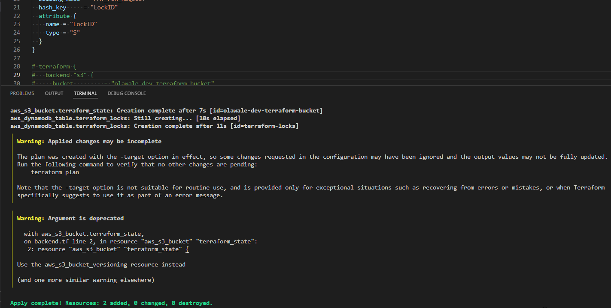
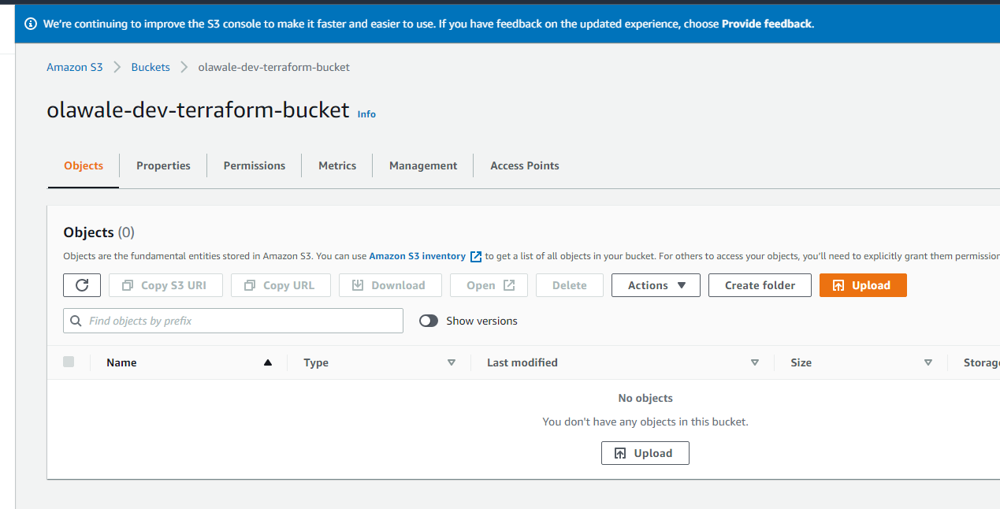
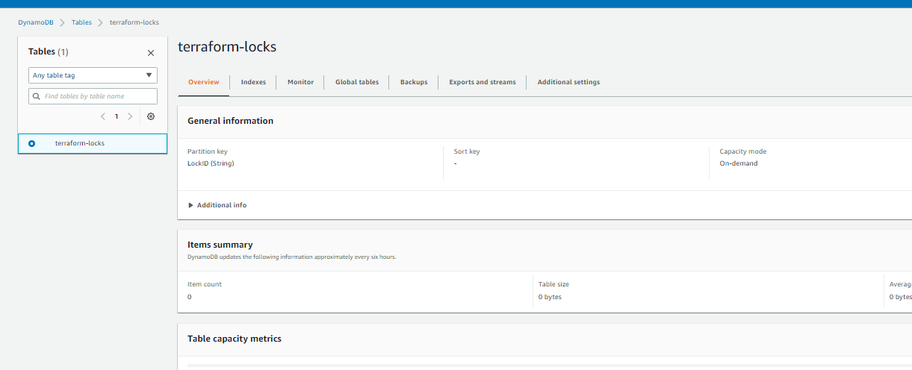
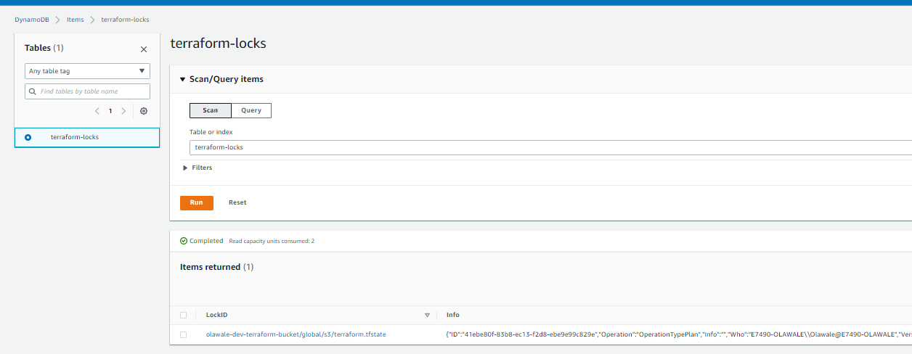
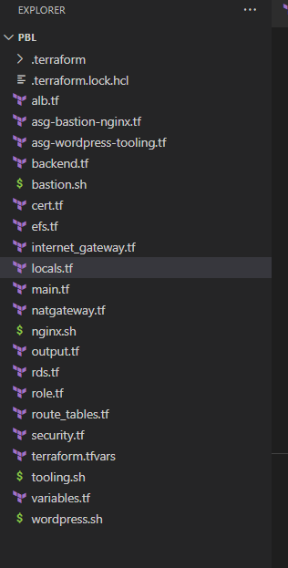
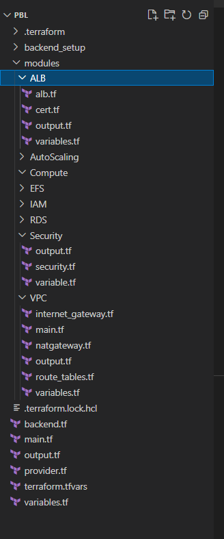

# Project 18

## Automate Infrastructure With Iac Using Terraform Part 3 - Refactoring

This is a continuation of [Project 17](../project_17_files/project_17.md).


### Setup AWS S3 Backend
- Create a backend.tf file to store the s3 backend.
- Ensure that the s3 bucket and a dynamodb table is already created for Terraform to utilize.
- If this has not been created, it's best to create the resources in a separate terraform project or manually done on AWS Console.
- In our case, both the s3 bucket and dynamodb would be created using Terraform project embedded in the same project.

- Create backend_setup folder
  ```
  mkdir backend_setup
  touch main.tf output.tf
  ```
- Create bucket and terraform state in the main.tf
  ```
  # Note: The bucket name may not work for you since buckets are unique globally in AWS, so you must give it a unique name.
  resource "aws_s3_bucket" "terraform_state" {
    bucket = "olawale-dev-terraform-bucket"
    # Enable versioning so we can see the full revision history of our state files
    versioning {
      enabled = true
    }
    # Enable server-side encryption by default
    server_side_encryption_configuration {
      rule {
        apply_server_side_encryption_by_default {
          sse_algorithm = "AES256"
        }
      }
    }
    lifecycle {
      prevent_destroy = true
    }
  }

  resource "aws_dynamodb_table" "terraform_locks" {
    name         = "terraform-locks"
    billing_mode = "PAY_PER_REQUEST"
    hash_key     = "LockID"
    attribute {
      name = "LockID"
      type = "S"
    }
  }

  ```
- Create an output.tf file:
  ```
  output "s3_bucket_arn" {
    value       = aws_s3_bucket.terraform_state.arn
    description = "The ARN of the S3 bucket"
  }
  output "dynamodb_table_name" {
    value       = aws_dynamodb_table.terraform_locks.name
    description = "The name of the DynamoDB table"
  }
  ```

- Run a terraform init, terraform plan and terraform apply
  ```
  terraform init
  terraform plan -target="aws_s3_bucket.terraform_state" -target="aws_dynamodb_table.terraform_locks" 
  terraform apply -target="aws_s3_bucket.terraform_state" -target="aws_dynamodb_table.terraform_locks" 
  ```
  

- Verify that s3 bucket and dynamo tables have been created.
  
  

- Once the backend has been created, change directory to the main project
  ```
  \PBL\backend_setup> cd ..
  \PBL> 
  ```
- Create the backend.tf
  ```
  terraform {
    backend "s3" {
      bucket         = "olawale-dev-terraform-bucket"
      key            = "global/s3/terraform.tfstate"
      region         = "us-east-1"
      dynamodb_table = "terraform-locks"
      encrypt        = true
    }
  }
  ```
- Run ```terraform init``` to initialise backend.

- Run ```terraform plan``` and verify that a lockID was created briefly on the dynamodb:

- Remove previous state files
  ```
  rm terraform.tfstate*
  ```

Note that: It might be required to unlock a locked table during terraform plan/apply if an issue occurs while running the plan forcing the dynamodb not to release the state lock
using ```terraform force-unlock -force LOCK-ID```

i.e: terraform force-unlock -force 36893416-0243-69e2-2025-a1a7fce70647

### Security Groups refactoring with dynamic block
- Use dynamic blocks to refactor the security group resources

- Previous setup
  ```
  # security group for alb, to allow access from any where for HTTP and HTTPS traffic
  resource "aws_security_group" "ext-alb-sg" {
    name        = "ext-alb-sg"
    vpc_id      = aws_vpc.main.id
    description = "Allow TLS inbound traffic"

    ingress {
      description = "HTTP"
      from_port   = 80
      to_port     = 80
      protocol    = "tcp"
      cidr_blocks = ["0.0.0.0/0"]
    }

    ingress {
      description = "HTTPS"
      from_port   = 443
      to_port     = 443
      protocol    = "tcp"
      cidr_blocks = ["0.0.0.0/0"]
    }

    egress {
      from_port   = 0
      to_port     = 0
      protocol    = "-1"
      cidr_blocks = ["0.0.0.0/0"]
    }

    tags = merge(
      var.tags,
      {
        Name = "ext-alb-sg"
      },
    )

  }
  ```
- Current setup

  ```
  locals {
    ingress_rules = [{
      description = "https"
      port        = 443

      },
      {
        description = "http"
        port        = 80
      }
    ]
  }

  security group for alb, to allow access from any where for HTTP and HTTPS traffic
  resource "aws_security_group" "ext-alb-sg" {
    name        = "ext-alb-sg"
    vpc_id      = aws_vpc.main.id
    description = "Allow TLS inbound traffic"
    dynamic "ingress" {
      for_each = local.ingress_rules
      

      content {
        description = ingress.value.description
        from_port   = ingress.value.port
        to_port     = ingress.value.port
        protocol    = "tcp"
        cidr_blocks = ["0.0.0.0/0"]
      }
    }

  ```


### EC2 refactoring with Map and Lookup
- Create a variable of type map for the images
  ```
  variable "images" {
    type = map
    default = {
        "us-east-1" = "ami-0b0af3577fe5e3532",
        "us-west-1" = "ami-054965c6cd7c6e462"
    }
  }
  ```

- Create a locals file and create locals value for the ami
  ```
  locals {
  ami =  "${lookup(var.images, var.region, "ami-0b0af3577fe5e3532")}"
  }
  ```
- Remove the ami variable and replace reference values (var.ami to local.ami)
- Ensure references utilise local.ami

### Conditional Expressions
- Conditional Expression like the sample below can be utilized wherever applicable
  ```
  resource "aws_db_instance" "read_replica" {
    count               = var.create_read_replica == true ? 1 : 0
    replicate_source_db = aws_db_instance.this.id
  }
  ```

### Terraform Modules and best practices to structure your .tf codes
- Modules serve as containers that allow to logically group Terraform codes for similar resources in the same domain (e.g., Compute, Networking, AMI, etc.). One root module can call other child modules and insert their configurations when applying Terraform config. This concept makes your code structure neater, and it allows different team members to work on different parts of configuration at the same time.

- You can refer to existing child modules from your root module by specifying them as a source, like this:
  ```
  module "network" {
    source = "./modules/network"
  }
  ```
- Note that the path to ‘network’ module is set as relative to your working directory.

- Or you can also directly access resource outputs from the modules, like this:
  ```
  resource "aws_elb" "example" {
    # ...

    instances = module.servers.instance_ids
  }
  ```

- Previous setup (without Terraform modules)
  
  

- Current setup (with Terraform modules)
  
  


[Back to top](#)