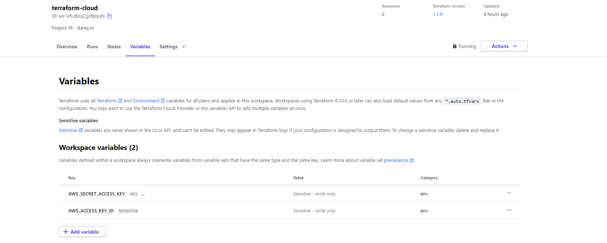
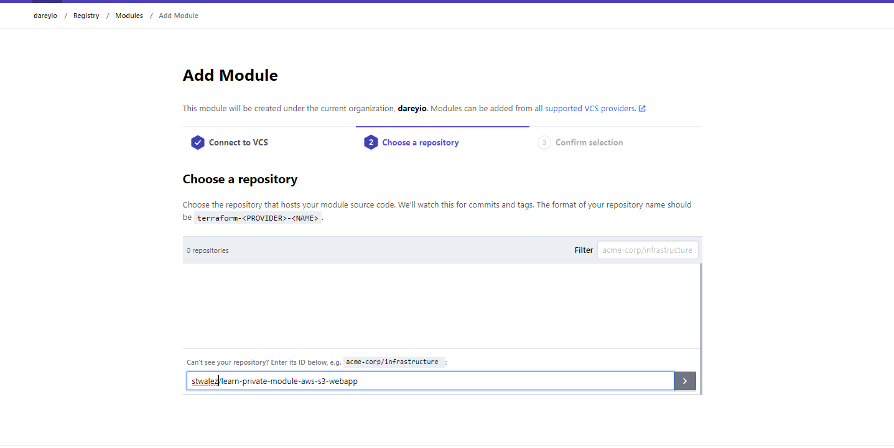

# Project 19

## Automate Infrastructure With Iac Using Terraform Part 4 - Terraform Cloud
---


### What Terraform Cloud is and why use it
---

Terraform Cloud is a managed service that provides you with Terraform CLI to provision infrastructure, either on demand or in response to various events.


### Migrate your .tf codes to Terraform Cloud

---

Let us explore how we can migrate our codes to Terraform Cloud and manage our AWS infrastructure from there:

- Create a Terraform Cloud account
  
- Create an organization

  - Select "Start from scratch", choose a name for your organization and create it.
  
  - Configure a workspace
  
    

- Select VCS and select the project [repo](https://github.com/stwalez/pbl_p19).

  - Ensure that the terraform working directory is set as the repo has a subfolder for Terraform files
    

  - Configure variables
    

### Build the AMI for the servers using Packer

---

- Install Packer and Ansible latest versions on your OS

- Setup aws credentials on the CLI.

- Clone the [repo here](https://github.com/stwalez/pbl_p19) which has the prepared Packer, Ansible and Terraform scripts.

- Navigate to the Packer section and build the packer image

  ```
  cd AMI
  packer build bastion.pkr.hcl
  packer build nginx.pkr.hcl
  packer build web.pkr.hcl
  ```

- Verify that the packer build amis were created from the console

  

- Update the Terraform variables with the ami details

  

- Validate adn format the terraform files
  ```
  terraform validate
  terraform fmt -recursive
  ```

- Push the code to GitHub to trigger Terraform Cloud Hook


- Once the Terraform Cloud has started the Plan, Click to Apply the run.

- Ensure that the following required outputs are generated, they would be required to configure Ansible

  


### Ansible Setup
- Configure your OS to allow SSH-Agent

  ```
  Get-Service ssh-agent | Set-Service -StartupType Manual
  Start-Service ssh-agent

  Get-Service ssh-agent
  ssh-add pbl-projects.pem

  ```
- Connect to the Bastion server generated via terraform in the previous step and ensure you can login

- Verify that the ssh keys are also accessible on the Bastion via the ssh agent
  
  

- Check the ansible folder which is already git cloned during the ami build and update the variables in nginx, wordpress, tooling with the outputs from Terraform

  - nginx ansible role variables
    
    

  - tooling ansible role variables
    
    

  - wordpress ansible role variables
    
    


- Run ```ansible-inventory -i inventory/aws_ec2.yml --graph```  to verify that AWS Instances dynamic IPs are discovered.

  Note: If no input is shown ensure ansible version is updated

- Run ```ansible-playbook -i inventory/aws_ec2.yml playbook/site.yml``` to start the ansible deployments
  


- Verify that the site is accessible:
  

  


### Practice Task No 1

---
- Configure 3 branches in your terraform-cloud repository for dev, test, prod environments
- 
  

- Make necessary configuration to trigger runs automatically only for dev environment
  - Set the VCS branch in the Terraform cloud workspace to the new branch
  
  

  - Push to the Github branch and observe the trigger
  
    

- Create an Email and Slack notifications for certain events (e.g. started plan or errored run) and test it
  - Navigate to Workspace Settings > Notifications and select ```Create a Notification```

    

  - Follow the guidelines to create a Slack Channel and create an incoming webhook

    

  - Insert the notifications to Terraform Slack Destination Notification

    

  - Trigger a Github Push to the test branch and observe the terraform plan run notifications sent to Slack
  
    

- Apply destroy from Terraform Cloud web console


### Practice Task 2 Working with Private repository

---

- Create a simple Terraform repository  that will be your module
  - Fork the repo [here](https://github.com/hashicorp/learn-private-module-aws-s3-webapp)

    

  - Tag the repo
    


- Import the module into your private registry

  - Navigate to Terraform Cloud Organization > Registry > Modules and select ```Add a VCS Provider``` if Github is not already linked to it
    
    

  - Set up modules by connecting to your VCS

     

  - Select the forked repo (ensure it has been tagged in previous step)
   
    

  - Finish the import of the module
    
    


- Create a configuration that uses the module
  - Insert variables required by the module
    
    

  - Download Module config
    
    

- Create a workspace for the configuration
  - Create a [github repo](https://github.com/stwalez/pbl_p19_t2) and input the downloaded module (main.tf file).
  - Add github repo to a new workspace
  - Trigger a plan to see that the module works
    

- Deploy the infrastructure
  - Apply the plan
    

  - View the webapp s3 bucket
    

- Destroy your deployment

[Link to the PBL Github Repository](https://github.com/stwalez/PBL_p19)

[Back to top](#)