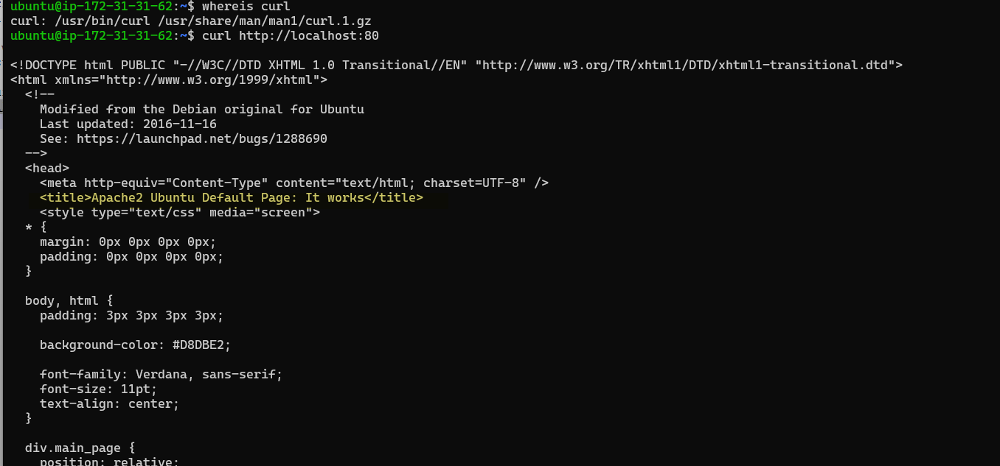
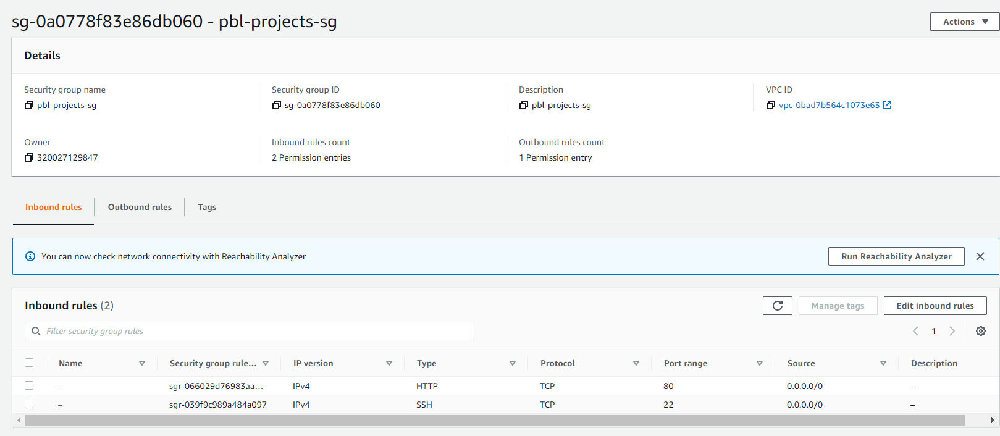
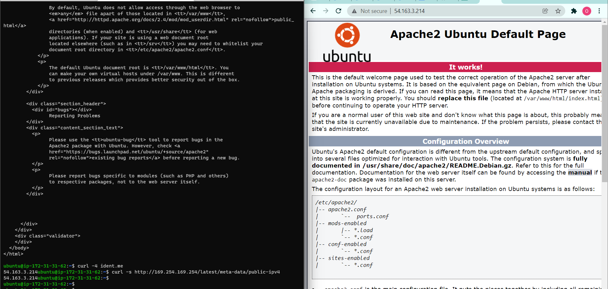
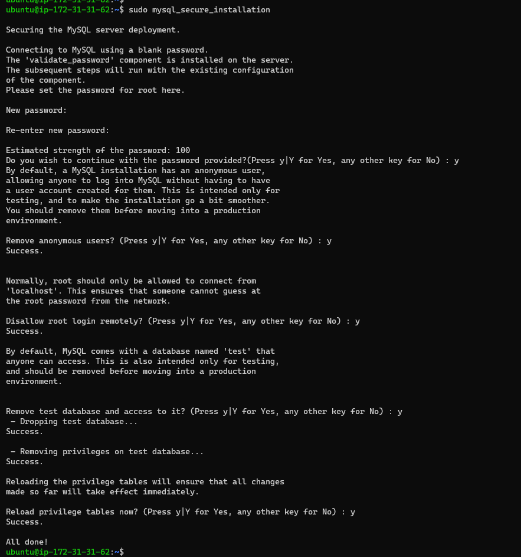
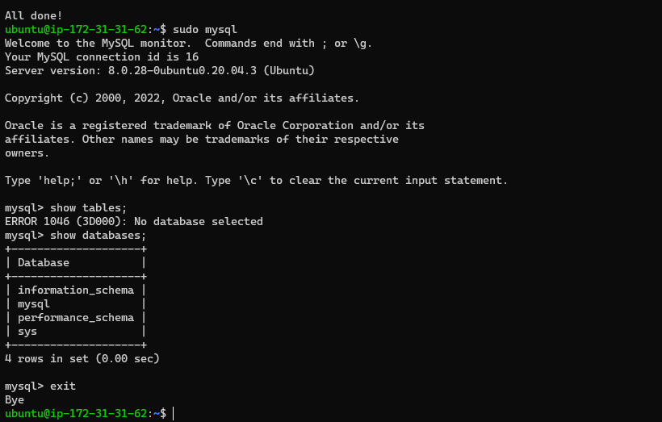
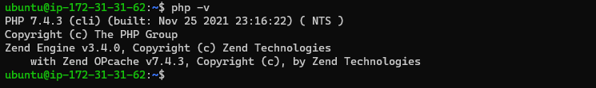
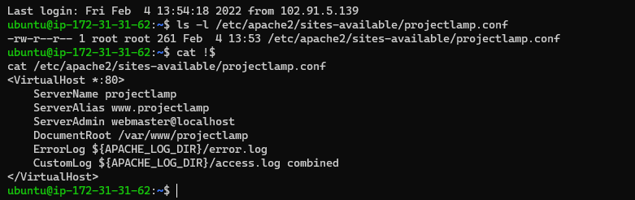
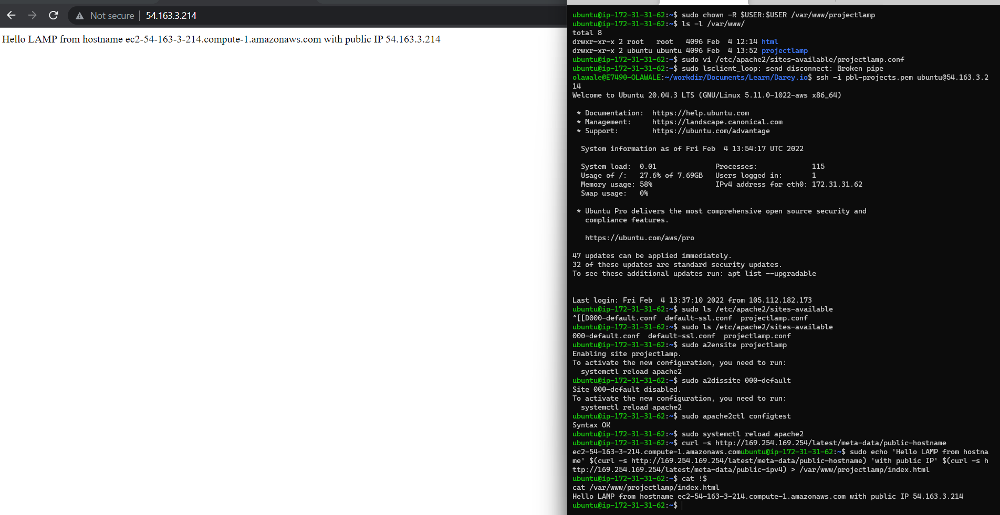
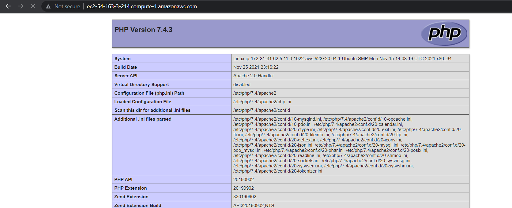

# Project 1

## Lamp Stack Implementation
---
### Step 1 - Installing Apache and Updating Firewall

Update a list of packages in package manager
- `sudo apt update`

Run apache2 package installation
- `sudo apt install apache2 -y`

Verify apache2 was installed successfully
- `sudo systemctl status apache2`

Verify using curl
- `curl http://localhost:80`


Set Security Group:


Curl via Public IP


<!---
 #.
-->

### Step 2 - Install MySql
Install mysql
- `sudo apt install mysql-server -y`
- `sudo mysql_secure_installation`



Access the mysql db
- `sudo mysql`
  


### Step 3 - Install PHP
Install PHP
- `sudo apt -y install php libapache2-mod-php php-mysql`
- `php -v`




### Step 4 - Create a Virtual Host for Apache
Create a Virtual Host


Enable the VirtualHost and update the index.html file with server details




### Step 5 - Enable PHP on Website
Modify Apache precedence for php files
``` 
cat /etc/apache2/mods-enabled/dir.conf

<IfModule mod_dir.c>
        DirectoryIndex index.php index.html index.cgi index.pl index.xhtml index.htm
</IfModule>
```

Create index.php
```
cat /var/www/projectlamp/index.php
<?php
phpinfo();
```
