# Project 20

## Migration to the Cloud with Containerization. Part 1 - Docker & Docker Compose

Remember our Tooling website? It is a PHP-based web solution backed by a MySQL database – all technologies you are already familiar with and which you shall be comfortable using by now.

So, let us migrate the Tooling Web Application from a VM-based solution into a containerized one.

MySQL in container

```
sudo apt install docker.io
sudo usermod -aG docker ubuntu
newgrp docker
```

### Step 1: Pull MySQL Docker Image from Docker Hub Registry
```
docker pull mysql/mysql-server:latest
```


### Step 2: Deploy the MySQL Container to your Docker Engine
```
docker run --name proj20_mysql -e MYSQL_ROOT_PASSWORD=a_secret_p1 -d mysql/mysql-server:latest
```

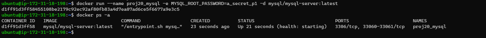

```
docker run --name <container_name> -e MYSQL_ROOT_PASSWORD=<my-secret-pw> -d mysql/mysql-server:latest
```

### Step 3: Connecting to the MySQL Docker Container

#### Approach 1
```
docker exec -it proj20_mysql bash
docker exec -it proj20_mysql mysql -u root -pa_secret_p1
```
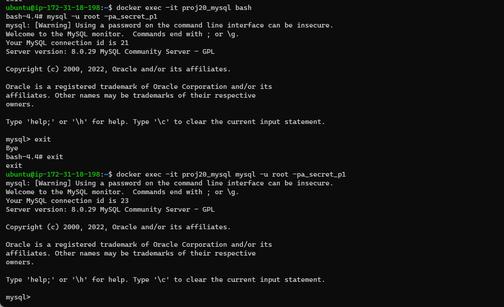


#### Approach 2
At this stage you are now able to create a docker container but we will need to add a network. So, stop and remove the previous mysql docker container.
```
doc`ker ps -a
docker stop proj20_mysql
docker rm proj20_mysql
```
verify that the container is deleted
```
docker ps -a
```

Create a network
```
docker network create --subnet=172.18.0.0/24 tooling_app_network
```
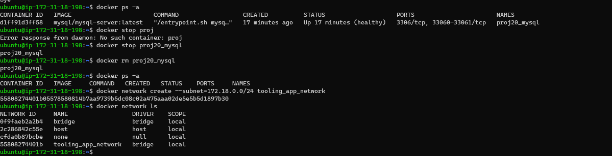

Run docker on the network
```
export MYSQL_PW=a_secret_p1
docker run --network tooling_app_network -h mysqlserverhost --name=mysql-server -e MYSQL_ROOT_PASSWORD=$MYSQL_PW  -d mysql/mysql-server:latest
```

Verify that the container is running
```
docker ps -a 
```

As you already know, it is best practice not to connect to the MySQL server remotely using the root user. Therefore, we will create an SQL script that will create a user we can use to connect remotely.


Create a file and name it create_user.sql and add the below code in the file:
```
CREATE USER 'user'@'%' IDENTIFIED BY 'password'; GRANT ALL PRIVILEGES ON * . * TO 'user'@'%';
```

Run the script:

Ensure you are in the directory create_user.sql file is located or declare a path

```
docker exec -i mysql-server mysql -uroot -p$MYSQL_PW < create_user.sql 
```

### Connecting to the MySQL server from a second container running the MySQL client utility

```
docker run --network tooling_app_network --name mysql-client -it --rm mysql mysql -h mysqlserverhost -u  -p 
```

### Using the Tooling Application to connect to the database
- Prepare the database schema

  ```
  git clone https://github.com/darey-devops/tooling.git
  ```
- On your terminal, export the location of the SQL file
  ```
  export tooling_db_schema=/home/ubuntu/tooling/html/tooling_db_schema.sql
  export MYSQL_PW=a_secret_p1
  docker exec -i mysql-server mysql -u root -p$MYSQL_PW < $tooling_db_schema 
  ```
- Verify that the tooling db was created

  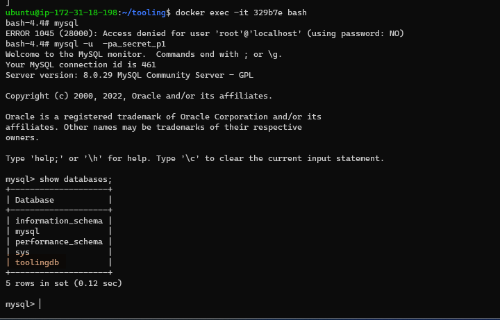


- Update the .env file with connection details to the database

  ```

  cat tooling/html/.env
  # input your environment variables
  MYSQL_IP=mysqlserverhost
  MYSQL_USER=user
  MYSQL_PASS=password
  MYSQL_DBNAME=toolingdb
  ```

- Create the dockerfile

  ```
  FROM php:7-apache
  MAINTAINER Dare dare@zooto.io

  RUN docker-php-ext-install mysqli
  RUN echo "ServerName localhost" >> /etc/apache2/apache2.conf
  RUN curl -sS https://getcomposer.org/installer | php -- --install-dir=/usr/local/bin --filename=composer
  COPY apache-config.conf /etc/apache2/sites-available/000-default.conf
  COPY start-apache /usr/local/bin
  RUN a2enmod rewrite

  # Copy application source
  COPY html /var/www
  RUN chown -R www-data:www-data /var/www

  CMD ["start-apache"]
  ```
  Build the docker image
  ```
  docker build -t tooling:0.0.1 . 
  ```
  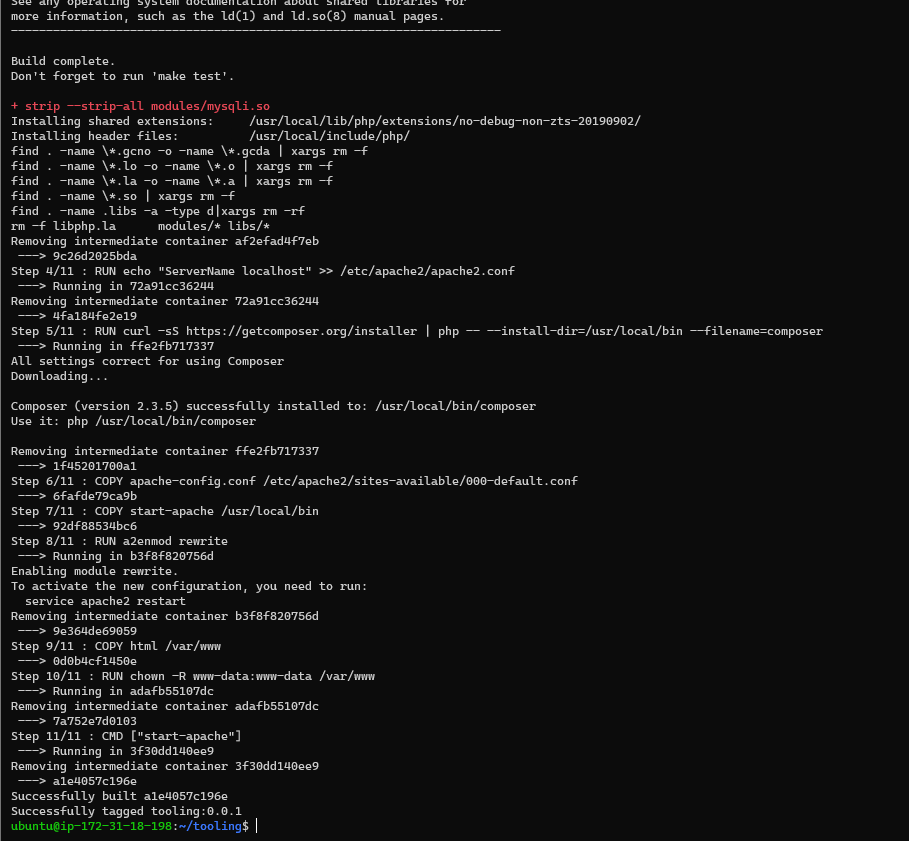


- Run the docker container from the image
  ```
  docker run --network tooling_app_network -p 8085:80 -it -d tooling:0.0.1 
  ```
  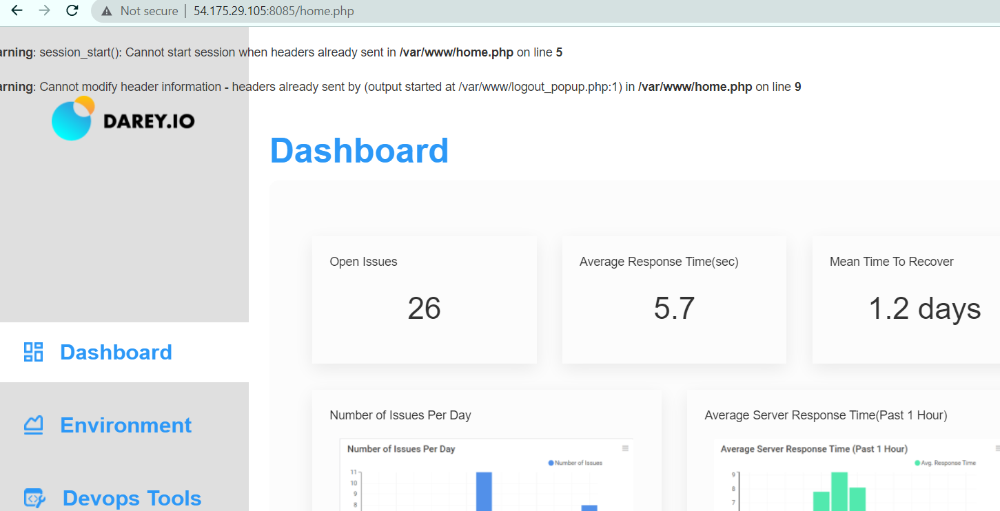


### Practice Task 1
- Write a Dockerfile for the TODO app

  Create the required mysql scripts
  
  ```
  create-database.sql
  CREATE DATABASE homestead;
  ```

  ```
  create_user.sql
  CREATE USER 'homestead'@'%' IDENTIFIED BY 'sePret^i'; GRANT ALL PRIVILEGES ON * . * TO 'homestead'@'%';
  ```

- Create the Dockerfile for mysql image 

  Dockerfile_mysql
  ```
  FROM mysql/mysql-server:latest

  MAINTAINER me

  ENV MYSQL_ROOT_PASSWORD=a_secret_p1

  COPY create_user.sql  /docker-entrypoint-initdb.d/
  COPY create_database.sql /docker-entrypoint-initdb.d/

  EXPOSE 3306
  ```

  Build the dockerfile:
  ```
  docker build -f Dockerfile_php -t mysql-todo:0.0.1 . 
  ```

  Ensure a docker network exists
  ```
  docker network create --subnet=172.18.0.0/24 tooling_app_network
  ```
  Run the mysql image, Ensure the hostname is set 
  ```
  export MYSQL_PW=a_secret_p1
  docker run --network tooling_app_network -h mysqlserverhost --name=mysql-server -d mysql-todo:0.0.1
  docker exec -it mysql-server mysql -u root -p$MYSQL_PW
  ```

  ---
  Create the php todo Docker image, replace DB_HOST with hostname set above

  Dockerfile_php
  ```
  FROM php:7.4-alpine

  RUN apk add git &>/dev/null

  RUN git clone https://github.com/stwalez/php-todo.git $HOME/php-todo &>/dev/null

  COPY --from=mlocati/php-extension-installer /usr/bin/install-php-extensions /usr/local/bin/

  RUN install-php-extensions pdo_mysql &>/dev/null && install-php-extensions @composer &>/dev/null

  ENV DB_HOST=mysqlserverhost

  WORKDIR /root/php-todo

  RUN sed -i -e "s/DB_HOST=127\.0\.0\.1/DB_HOST=${DB_HOST}/" .env.sample && mv .env.sample .env 

  RUN composer install --ignore-platform-reqs &>/dev/null

  COPY ./serve.sh serve.sh

  ENTRYPOINT ["sh", "serve.sh"]
  ```

  .serve.sh
  ```
  #!/bin/sh

  php artisan migrate
  php artisan key:generate
  php artisan db:seed
  php artisan serve --host=0.0.0.0
  ```

  Build the image and run the todo app
  ```
  docker build -f Dockerfile_php -t php-todo:0.0.1 .

  docker run --network tooling_app_network -p 8000:8000 php-todo:0.0.1
  ```
  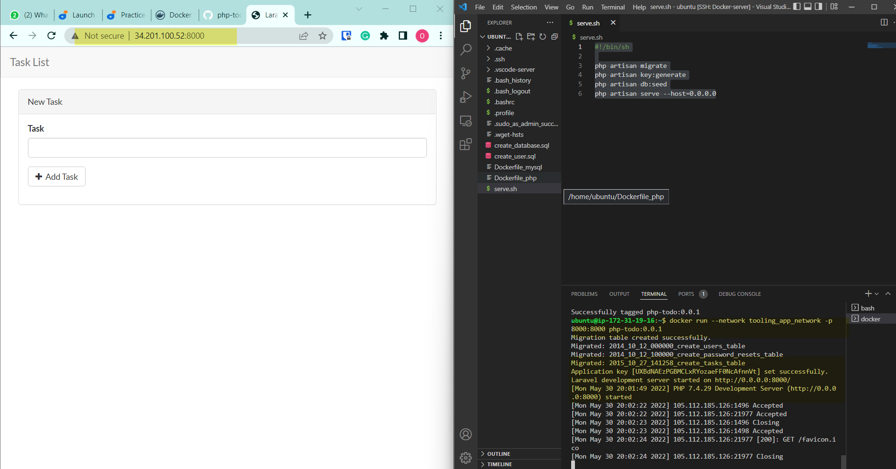
  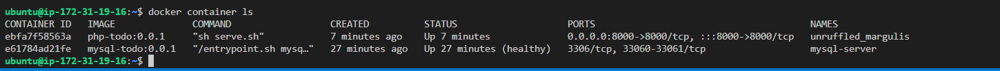


### Practice 2

Create repos on dockerhub
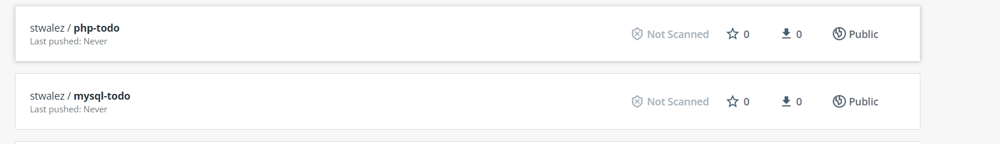

Push the docker images to DockerHub
```
docker login 

docker tag php-todo:0.0.1 stwalez/php-todo:0.0.1 
docker tag mysql-todo:0.0.1 stwalez/mysql-todo:0.0.1 

docker push stwalez/php-todo:0.0.1 
docker push stwalez/mysql-todo:0.0.1 
```
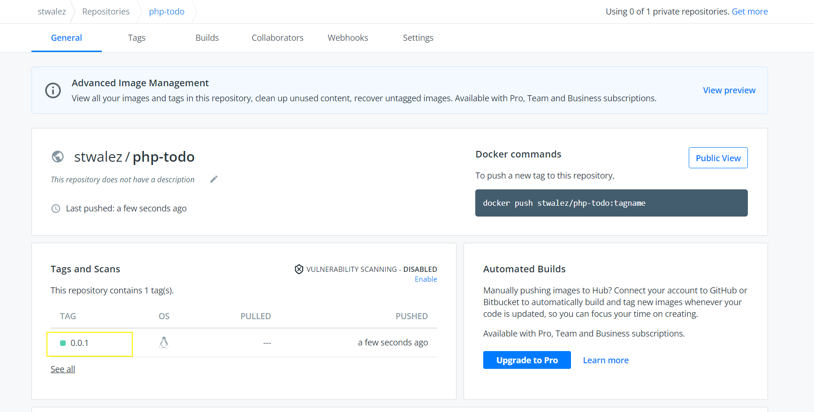


### Practice 3
  Write a Jenkinsfile that will simulate a Docker Build and a Docker Push to the registry with different branches

  Install Jenkins first
  ```
  wget -q -O - https://pkg.jenkins.io/debian-stable/jenkins.io.key | sudo apt-key add -
  sudo sh -c 'echo deb http://pkg.jenkins.io/debian-stable binary/ > /etc/apt/sources.list.d/jenkins.list'
  sudo apt update
  sudo apt install jenkins
  ```

  Provide docker access to jenkins
  ```
  sudo usermod -aG docker jenkins
  sudo systemctl restart jenkins
  ```
  Setup Github webhook for Jenkins
  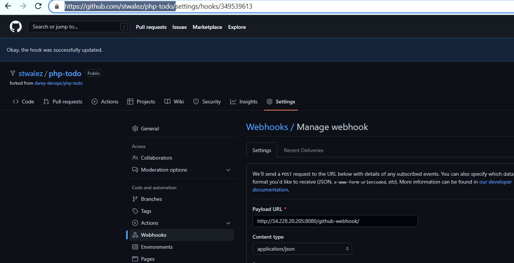


  Ensure Dockerfile, Jenkinsfile, serve.sh is created

  Ensure Docker Pipeline Plugin for Jenkins is installed in Jenkins UI
  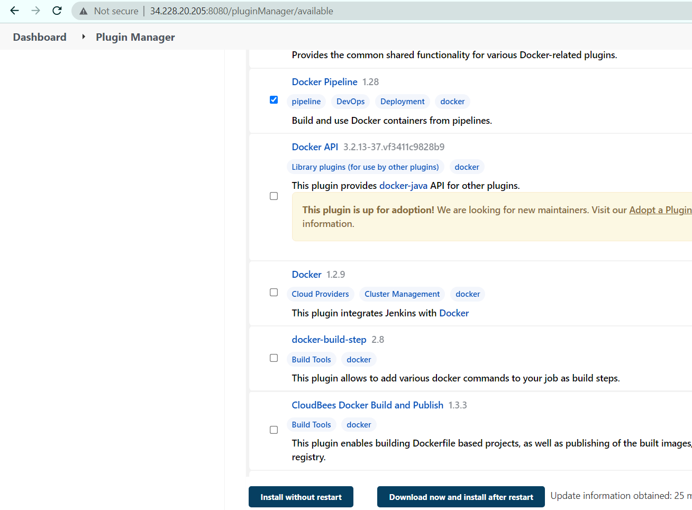

  Include the Docker credential id
  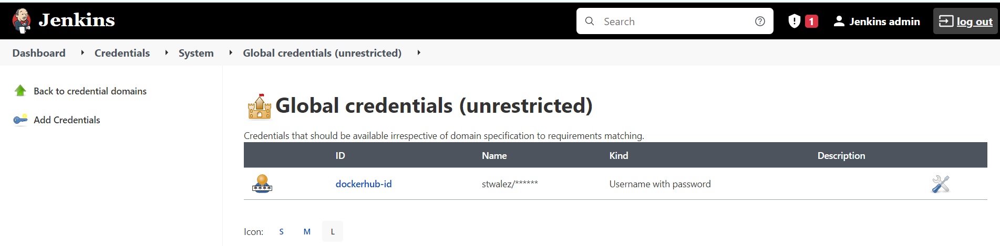

  Create the Jenkinsfile
  ```
  pipeline {

      environment { 
          registry = "stwalez/php-todo" 
          registryCredential = 'dockerhub-id' 
          dockerImage = '' 
      }
      agent any

    stages {

        stage("Initial cleanup") {
            steps {
              dir("${WORKSPACE}") {
                deleteDir()
              }
            }

          }

        stage('Checkout SCM') {
          steps {
                git branch: 'jenkins-main', url: 'https://github.com/stwalez/php-todo.git'
          }
        }

        stage('Building the features branch image') { 
                when { branch pattern: "^jenkins-feature*", comparator: "REGEXP"}
                steps { 
                    script { 
                        sh 'echo building the image'
                        dockerImage = docker.build registry + ":$branch_name-$BUILD_NUMBER" 
                    }
                } 
            }
        stage('Building the jenkins main branch image') { 
                when { branch pattern: "^jenkins-main*", comparator: "REGEXP"}
                steps { 
                    script { 
                        sh 'echo building the image'
                        dockerImage = docker.build registry + ":$branch_name-$BUILD_NUMBER" 
                    }
                } 
            }
        stage('Deploy our image') { 
            steps { 
                script { 
                    docker.withRegistry( '', registryCredential ) { 
                        dockerImage.push() 
                    }
                } 
            }
        } 
        
        stage('Cleaning up') { 
            steps { 
                sh "docker rmi $registry:$branch_name-$BUILD_NUMBER" 
            }
        } 
      }
  }

  ```

  Trigger from the corresponding branches to see the deployment to Dockerhub
  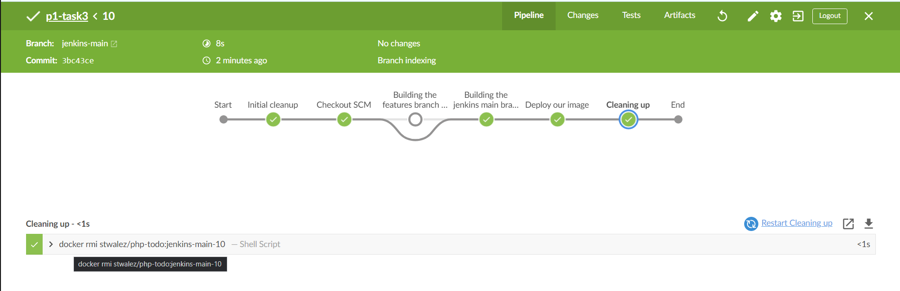
  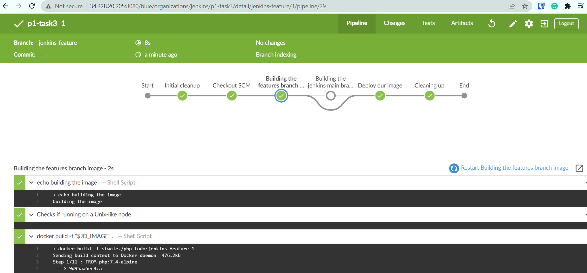


  Check Dockerhub to see the new pushes
  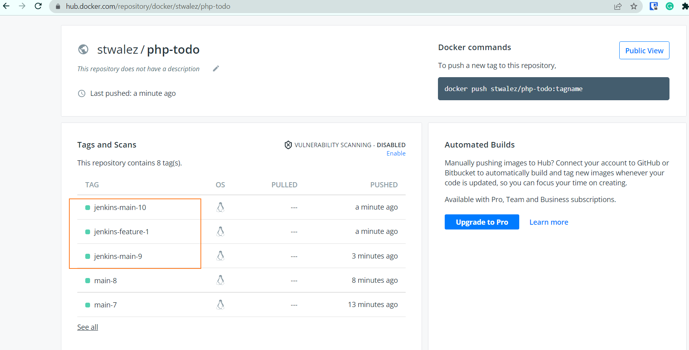


### Deployment with Docker Compose

All we have done until now required quite a lot of effort to create an image and launch an application inside it. We should not have to always run Docker commands on the terminal to get our applications up and running. There are solutions that make it easy to write declarative code in YAML, and get all the applications and dependencies up and running with minimal effort by launching a single command.

In this section, we will refactor the Tooling app POC so that we can leverage the power of Docker Compose.

First, install Docker Compose on your workstation from here
```
sudo curl -L "https://github.com/docker/compose/releases/download/1.29.2/docker-compose-$(uname -s)-$(uname -m)" -o /usr/local/bin/docker-compose
sudo chmod +x /usr/local/bin/docker-compose
docker-compose --version
```

Clone the repo, Create a file, name it tooling.yaml
```
git https://github.com/darey-devops/tooling.git
```
Update the .env file in the path tooling/html/.env
```
# input your environment variables
MYSQL_IP=mysqlserverhost
MYSQL_USER=user
MYSQL_PASS=password
MYSQL_DBNAME=toolingdb
```

Write the docker compose definitions in the tooling.yaml
Ensure hostname and mysql parameters match the tooling/html/.env file in t
```
cd tooling
touch tooling.yaml
```

```
version: "3.9"
services:
  tooling_frontend:
    build: .
    depends_on:
      - db
    ports:
      - "5000:80"
    volumes:
      - tooling_frontend:/var/www/html
    

  db:
    image: mysql:5.7
    hostname: mysqlserverhost
    restart: always
    environment:
      MYSQL_DATABASE: toolingdb
      MYSQL_USER: user
      MYSQL_PASSWORD: password
      MYSQL_ROOT_PASSWORD: a_secret_p1   
    volumes:
      - ./html/tooling_db_schema.sql:/docker-entrypoint-initdb.d/tooling_db_schema.sql

networks:
  default:
    external:
      name: tooling_app_network
  
volumes:
  tooling_frontend:
  db:
```

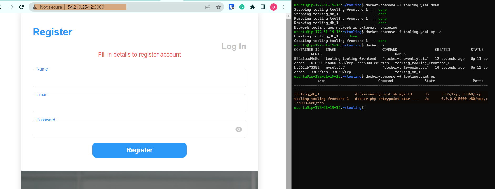


[Back to top](#)