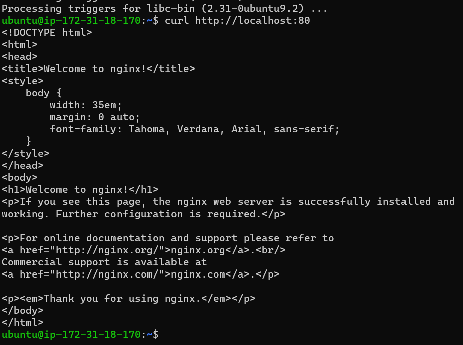
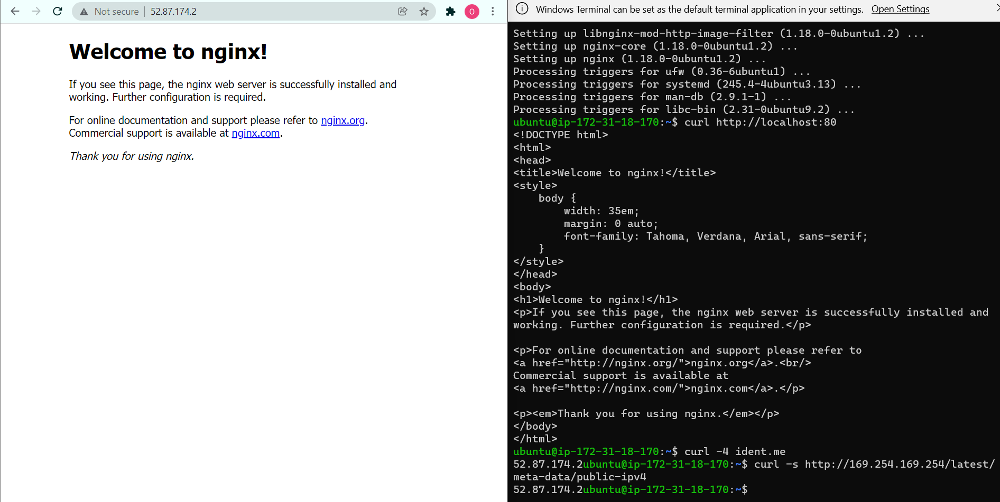
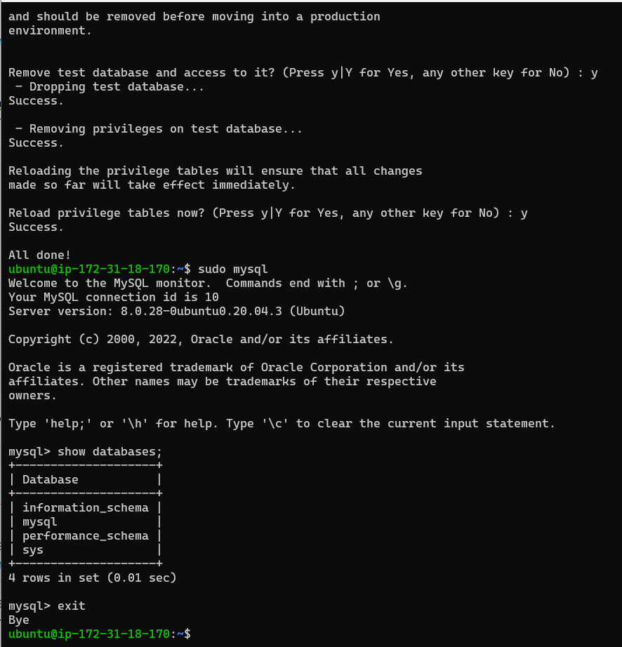
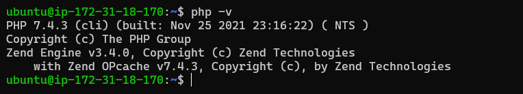
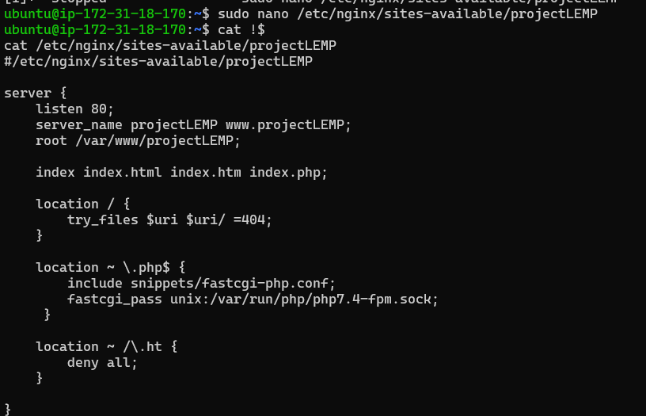
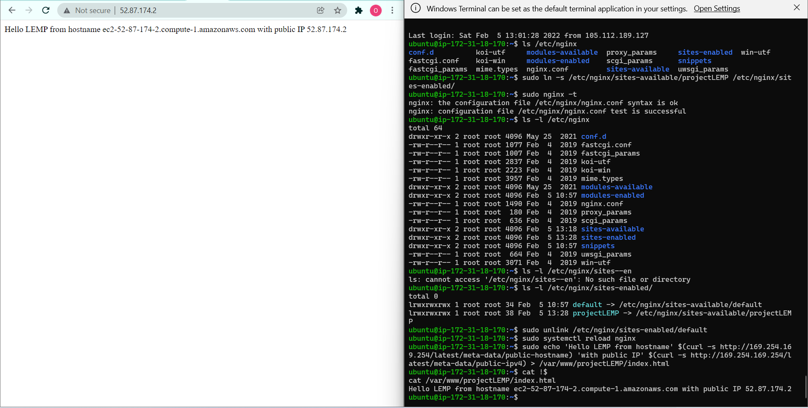
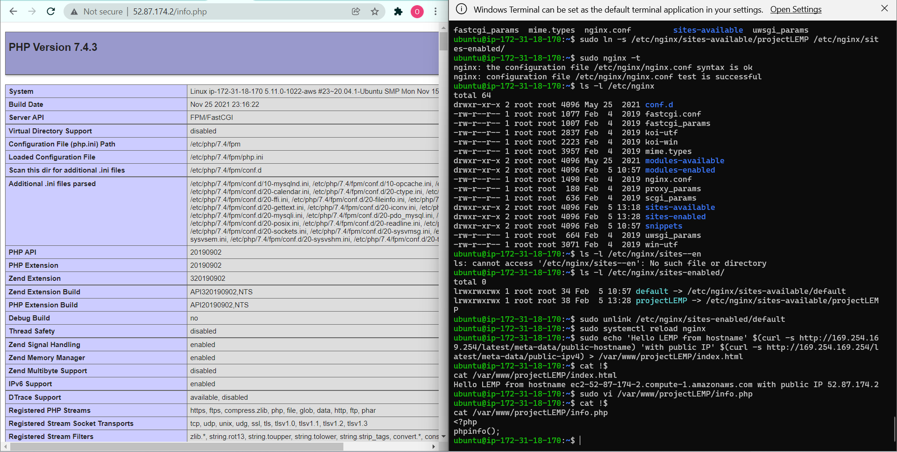
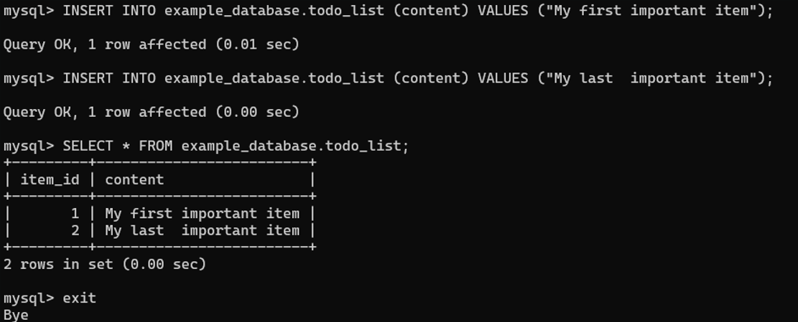
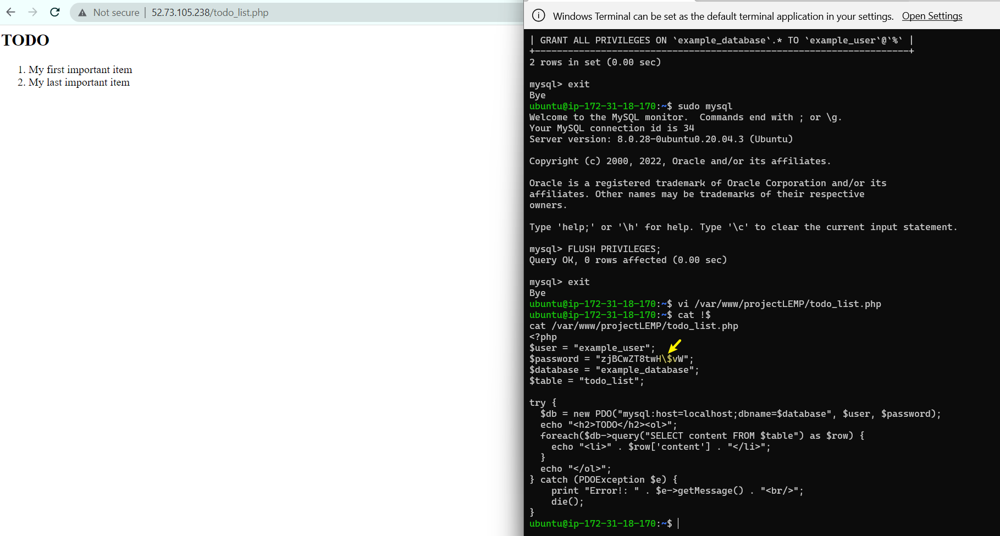

# Project 2

## LEMP Stack Implementation
---
### Step 1 - Installing Nginx

Update a list of packages in package manager
- `sudo apt update`

Run nginx package installation
- `sudo apt install nginx -y`

Verify nginx was installed successfully
- `sudo systemctl status nginx -y`

Verify using curl
- `curl http://localhost:80`



Curl via Public IP


<!---
 #.
-->

### Step 2 - Install MySQL
Install and access mysql
- `sudo apt install mysql-server -y`
- `sudo mysql_secure_installation`



### Step 3 - Install PHP
Install PHP
- `sudo apt install php-fpm php-mysql -y`
- `php -v`




### Step 4 - Configure Nginx to use PHP Processor
Create root web directory for the domain:

- `sudo mkdir /var/www/projectLEMP`               
- `sudo chown -R $USER:$USER /var/www/projectLEMP`
- `sudo nano /etc/nginx/sites-available/projectLEMP`



Enable the VirtualHost and update the index.html file with server details

- `sudo ln -s /etc/nginx/sites-available/projectLEMP /etc/nginx/sites-enabled/`

- `sudo nginx -t`

```
nginx: the configuration file /etc/nginx/nginx.conf syntax is ok
nginx: configuration file /etc/nginx/nginx.conf test is successful
```

Disable default Nginx host that is currently configured to listen on port 80
- `sudo unlink /etc/nginx/sites-enabled/default`
  
Reload the config
- `sudo systemctl reload nginx`              

Access the website

`sudo echo 'Hello LEMP from hostname' $(curl -s http://169.254.169.254/latest/meta-data/public-hostname) 'with public IP' $(curl -s http://169.254.169.254/latest/meta-data/public-ipv4) > /var/www/projectLEMP/index.html`

Access the website via public IP




### Step 5 - Test PHP with Nginx:

```
cat /var/www/projectlamp/info.php
<?php
phpinfo();
```


### Step 6 - Retrieving Data from mysql database with PHP
Create the database
```
sudo mysql

CREATE DATABASE `example_database`;
CREATE USER 'example_user'@'%' IDENTIFIED WITH mysql_native_password BY 'zjBCwZT8twH$vW';
GRANT ALL ON example_database.* TO 'example_user'@'%';
exit
```

Verify user creation
```
SELECT user, host FROM mysql.user;
SHOW GRANTS FOR 'example_user'@'%';
```

Create Table on the previously created database
```
CREATE TABLE example_database.todo_list (  
    item_id INT AUTO_INCREMENT, 
    content VARCHAR(255), 
    PRIMARY KEY(item_id) 
);
```

Insert data into the table


Create a PHP script that connects to the Database and test:
Note that special characters in passwords must be escaped with a backslash

