# Project 3

## MERN Stack Implementation
---
### Step 1 - Backend Configuration

Update and Upgrade Ubuntu
- `sudo apt update`
- `sudo apt upgrade`
- `sudo apt-get install -y nodejs`
- `curl -sL https://deb.nodesource.com/setup_12.x | sudo -E bash -`
- `node -v`
- `npm -v`

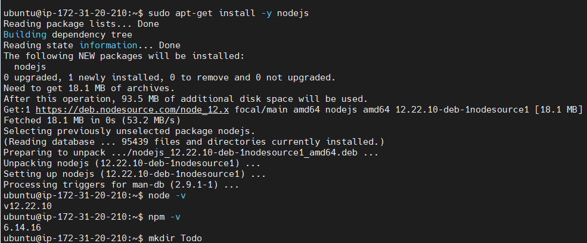

We would later need to update the node version to 16 to install the create react app using npx


### Create the Todo node.js app
```
mkdir Todo
ls
cd Todo
npm init
```
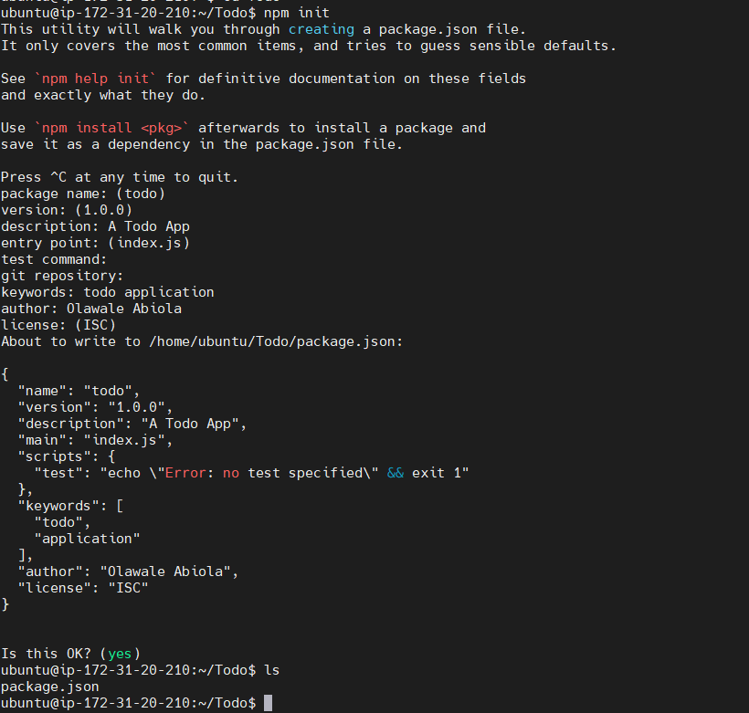


### Install Express JS

npm install express

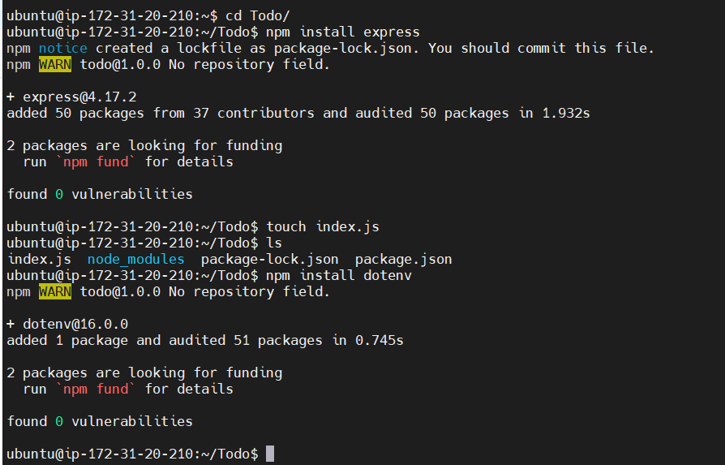

touch index.js

Install the dotenv to use the environment variable and update the index.js file

```
npm install dotenv
vim index.js
```
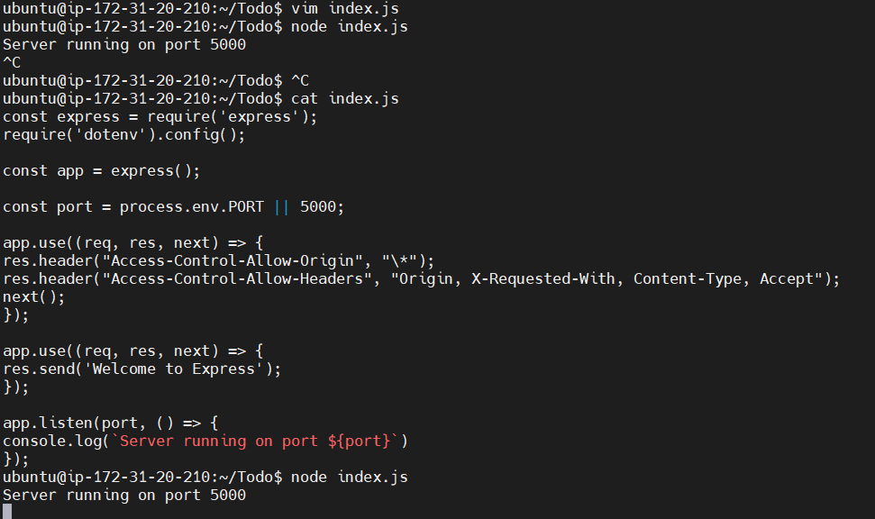

Verify that site is wrapped with ExpressJS
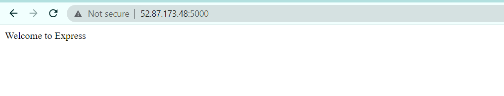

### Create ExpressJS Routes for Todo App
```
mkdir routes
cd routes
touch api.js
vim api.js
```

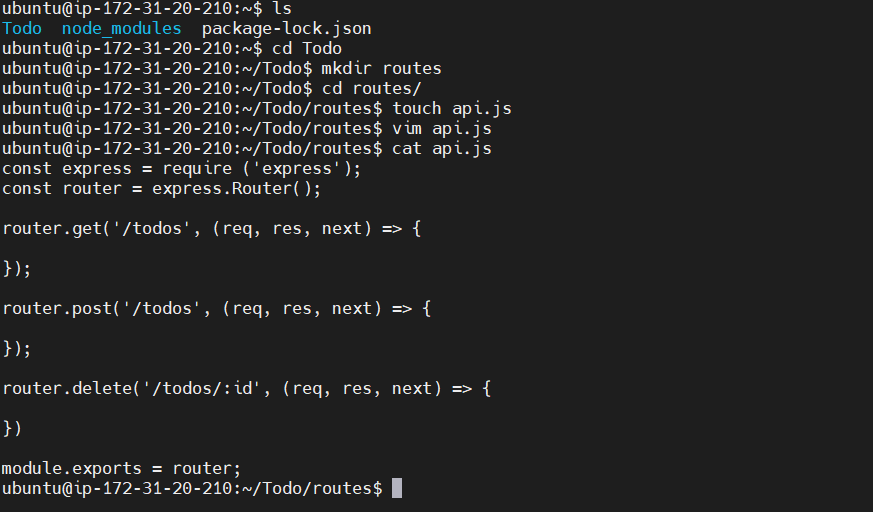


### Create a MongoDB Model
Install Mongoose wrapper for mongodb

```
npm install mongoose
mkdir models
cd models
touch todo.js
vim todo.js
```
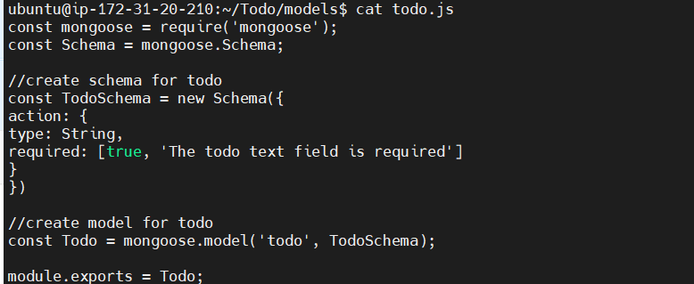

Update the route to include connection to the MongoDB model

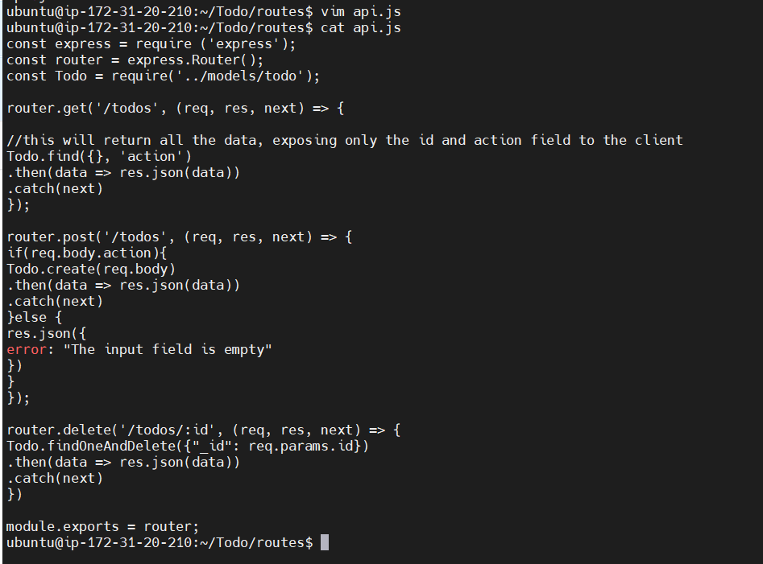


### Setup MongoDB via MongoDB Cloud
Create a MongoDB database and collection
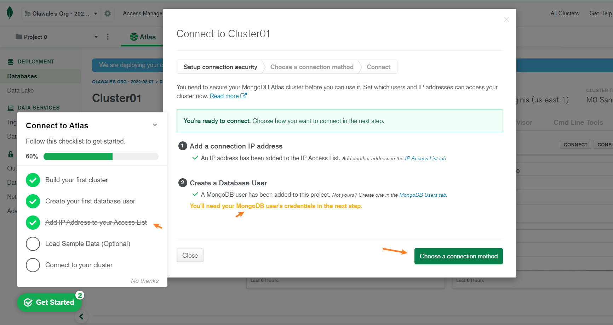


Create an environment variable .env

```
touch .env
vi .env
and include the line below:

DB = 'mongodb+srv://<username>:<password>@<network-address>/<dbname>?retryWrites=true&w=majority'
```
 
Update index.js in Todo App to include configuration for the database

```
const express = require('express');
const bodyParser = require('body-parser');
const mongoose = require('mongoose');
const routes = require('./routes/api');
const path = require('path');
require('dotenv').config();

const app = express();

const port = process.env.PORT || 5000;

//connect to the database
mongoose.connect(process.env.DB, { useNewUrlParser: true, useUnifiedTopology: true })
.then(() => console.log(`Database connected successfully`))
.catch(err => console.log(err));

//since mongoose promise is depreciated, we overide it with node's promise
mongoose.Promise = global.Promise;

app.use((req, res, next) => {
res.header("Access-Control-Allow-Origin", "\*");
res.header("Access-Control-Allow-Headers", "Origin, X-Requested-With, Content-Type, Accept");
next();
});

app.use(bodyParser.json());

app.use('/api', routes);

app.use((err, req, res, next) => {
console.log(err);
next();
});

app.listen(port, () => {
console.log(`Server running on port ${port}`)
});
```
Ensure existing nodejs processes are terminated to avoid errors and then run node index.js
You should see a "Database connected successfully" info
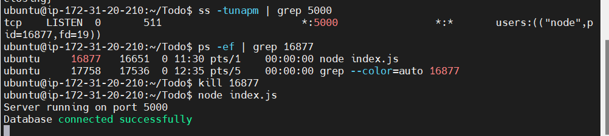

### Testing Backend Code without Frontend using RESTful API
Create a POST request via POSTMAN
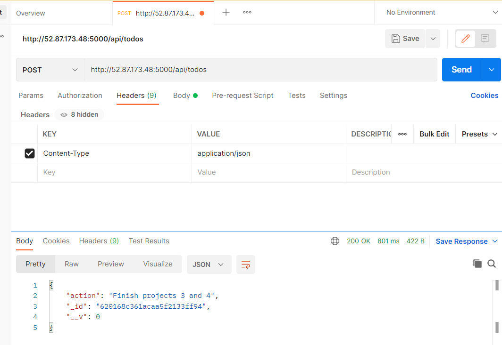


Create a GET request via POSTMAN
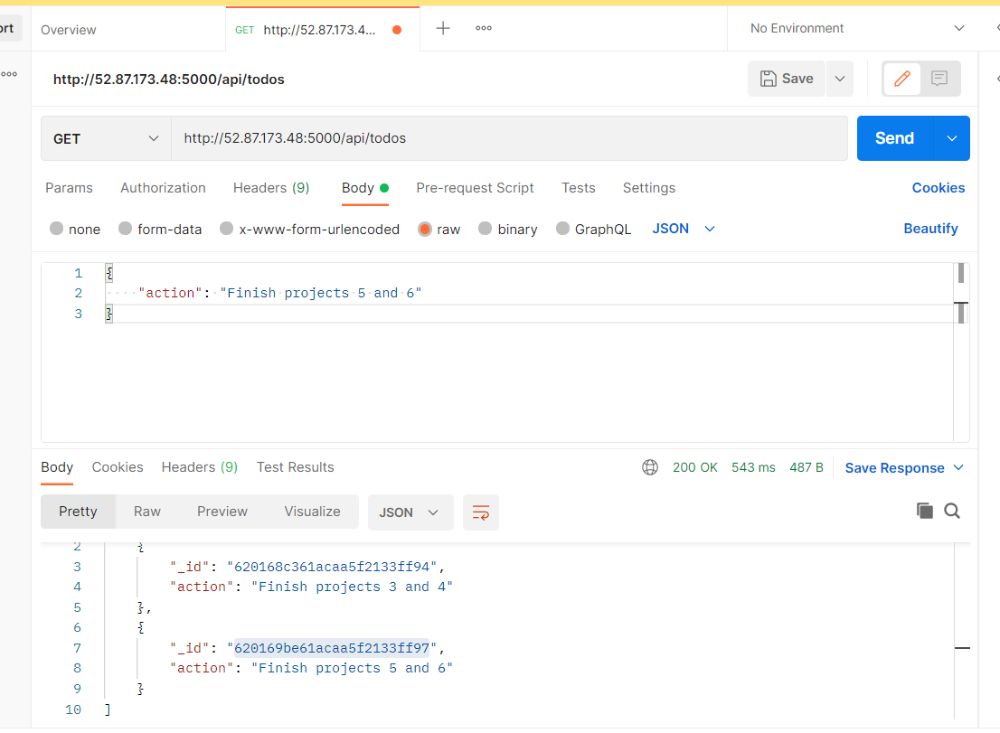


Create a Delete request and verify with a GET request
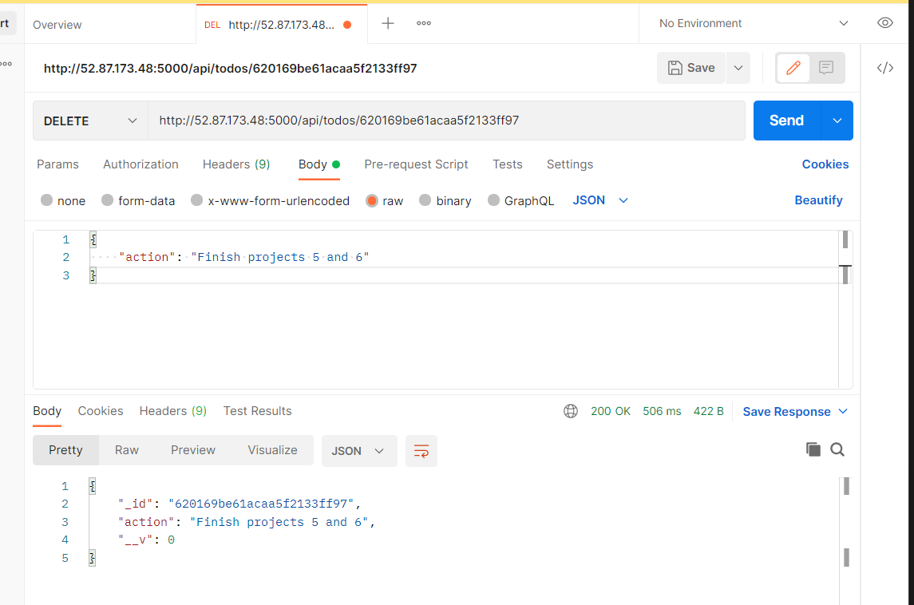

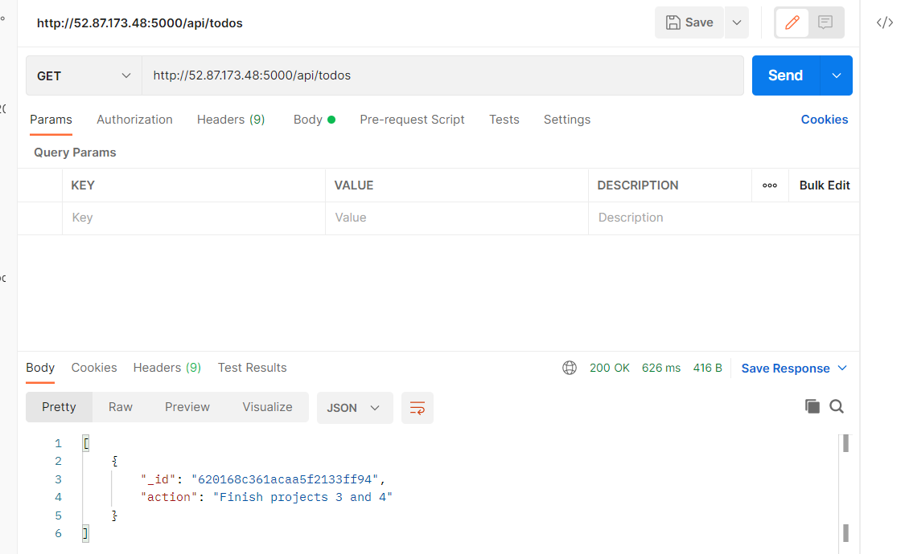


### FrontEnd creation using ReactJS

```
npx create-react-app client
npm install concurrently --save-dev
npm install nodemon --save-dev
```

Edit the Todo > package.json > scripts section
```
"scripts": {
"start": "node index.js",
"start-watch": "nodemon index.js",
"dev": "concurrently \"npm run start-watch\" \"cd client && npm start\""
}
```


Configure Proxy in package.json for the React JS app

```
cd client
vi package.json
```
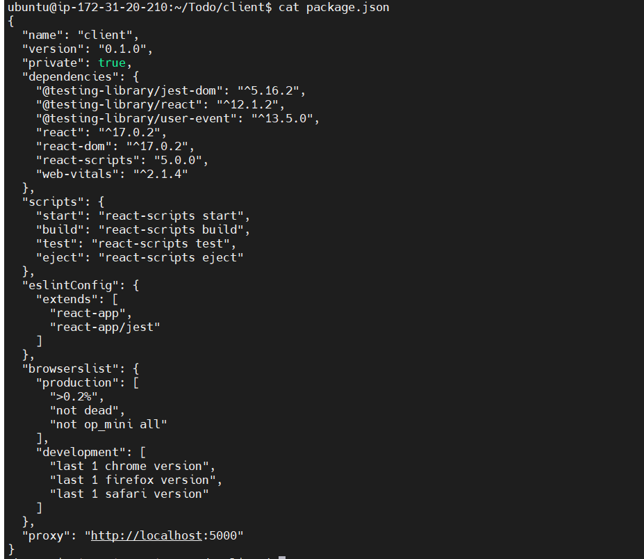

```
npm run dev
```

Allow Port 3000 on AWS Security Group
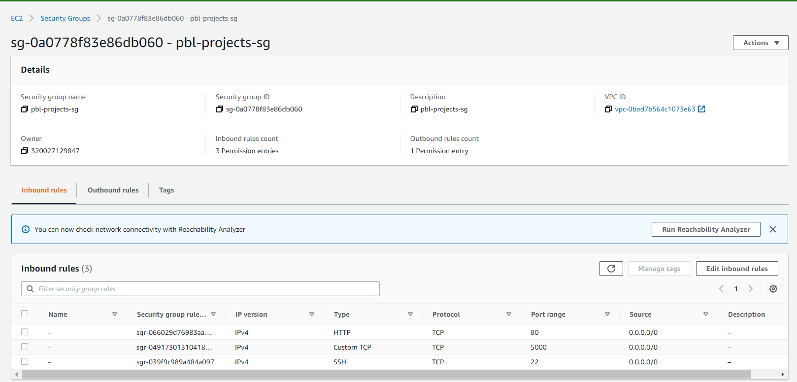

### Create the FrontEnd React Code 

```
cd client
cd src
mkdir components
cd components
```


```
touch Input.js ListTodo.js Todo.js
```

```
vi Input.js

import React, { Component } from 'react';
import axios from 'axios';

class Input extends Component {

state = {
action: ""
}

addTodo = () => {
const task = {action: this.state.action}

    if(task.action && task.action.length > 0){
      axios.post('/api/todos', task)
        .then(res => {
          if(res.data){
            this.props.getTodos();
            this.setState({action: ""})
          }
        })
        .catch(err => console.log(err))
    }else {
      console.log('input field required')
    }

}

handleChange = (e) => {
this.setState({
action: e.target.value
})
}

render() {
let { action } = this.state;
return (
<div>
<input type="text" onChange={this.handleChange} value={action} />
<button onClick={this.addTodo}>add todo</button>
</div>
)
}
}

export default Input

```
Install Axios
```
cd ../..
npm install axios
cd src/components
```
```
vi ListTodo.js
import React from 'react';

const ListTodo = ({ todos, deleteTodo }) => {

return (
<ul>
{
todos &&
todos.length > 0 ?
(
todos.map(todo => {
return (
<li key={todo._id} onClick={() => deleteTodo(todo._id)}>{todo.action}</li>
)
})
)
:
(
<li>No todo(s) left</li>
)
}
</ul>
)
}

export default ListTodo
```

```
vi Todo.js
import React, {Component} from 'react';
import axios from 'axios';

import Input from './Input';
import ListTodo from './ListTodo';

class Todo extends Component {

state = {
todos: []
}

componentDidMount(){
this.getTodos();
}

getTodos = () => {
axios.get('/api/todos')
.then(res => {
if(res.data){
this.setState({
todos: res.data
})
}
})
.catch(err => console.log(err))
}

deleteTodo = (id) => {

    axios.delete(`/api/todos/${id}`)
      .then(res => {
        if(res.data){
          this.getTodos()
        }
      })
      .catch(err => console.log(err))

}

render() {
let { todos } = this.state;

    return(
      <div>
        <h1>My Todo(s)</h1>
        <Input getTodos={this.getTodos}/>
        <ListTodo todos={todos} deleteTodo={this.deleteTodo}/>
      </div>
    )

}
}

export default Todo;
```
Update the App.js file

```
cd ..

vi App.js
import React from 'react';

import Todo from './components/Todo';
import './App.css';

const App = () => {
return (
<div className="App">
<Todo />
</div>
);
}

export default App;
```

Update App.css 
```
vi App.css

.App {
text-align: center;
font-size: calc(10px + 2vmin);
width: 60%;
margin-left: auto;
margin-right: auto;
}

input {
height: 40px;
width: 50%;
border: none;
border-bottom: 2px #101113 solid;
background: none;
font-size: 1.5rem;
color: #787a80;
}

input:focus {
outline: none;
}

button {
width: 25%;
height: 45px;
border: none;
margin-left: 10px;
font-size: 25px;
background: #101113;
border-radius: 5px;
color: #787a80;
cursor: pointer;
}

button:focus {
outline: none;
}

ul {
list-style: none;
text-align: left;
padding: 15px;
background: #171a1f;
border-radius: 5px;
}

li {
padding: 15px;
font-size: 1.5rem;
margin-bottom: 15px;
background: #282c34;
border-radius: 5px;
overflow-wrap: break-word;
cursor: pointer;
}

@media only screen and (min-width: 300px) {
.App {
width: 80%;
}

input {
width: 100%
}

button {
width: 100%;
margin-top: 15px;
margin-left: 0;
}
}

@media only screen and (min-width: 640px) {
.App {
width: 60%;
}

input {
width: 50%;
}

button {
width: 30%;
margin-left: 10px;
margin-top: 0;
}
}
```
Update the index.css file
```
vim index.css

body {
margin: 0;
padding: 0;
font-family: -apple-system, BlinkMacSystemFont, "Segoe UI", "Roboto", "Oxygen",
"Ubuntu", "Cantarell", "Fira Sans", "Droid Sans", "Helvetica Neue",
sans-serif;
-webkit-font-smoothing: antialiased;
-moz-osx-font-smoothing: grayscale;
box-sizing: border-box;
background-color: #282c34;
color: #787a80;
}

code {
font-family: source-code-pro, Menlo, Monaco, Consolas, "Courier New",
monospace;
}

cd ../..

```
Run the npm file

npm run dev

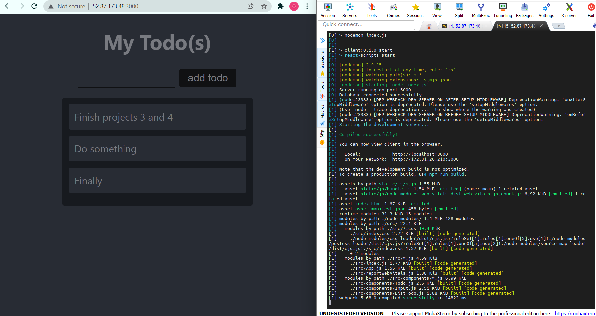
