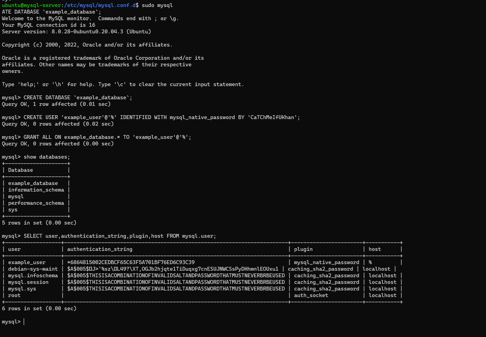

# Project 5

## Client-Server Architecture with MySql
---
### Server

Set hostname, update OS and install mysql
```
sudo hostnamectl set-hostname mysql-server
bash
sudo apt update
sudo apt install mysql-server -y
```

Configure mysql security

This line can be used - `sudo mysql_secure_installation`.

But the alternative approach will be used in the script

Install debconf-utils to edit variables in the mysql package:
```
sudo apt install debconf-utils -y
```

Set a Password for Mysql root.

The password appears to be irrelevant as the authentication type, auth.socket rather than mysql_native_password is the default for root in MySQL 5.7 (and later versions)

```
PASS_MYSQL_ROOT=`openssl rand -base64 12` # Save this password
```

Pre-seed password to mysql-server package with `debconf-set-selections` 
```
sudo debconf-set-selections <<< "mysql-server mysql-server/root_password password ${PASS_MYSQL_ROOT}" # new password for the MySQL root user

sudo debconf-set-selections <<< "mysql-server mysql-server/root_password_again password ${PASS_MYSQL_ROOT}" # repeat password for the MySQL root user
```
Other Code extracted from mysql_secure_installation
```
sudo mysql --user=root --password=${PASS_MYSQL_ROOT} << EOFMYSQLSECURE

DELETE FROM mysql.user WHERE User='root' AND Host NOT IN ('localhost', '127.0.0.1', '::1');

DELETE FROM mysql.user WHERE User='';

DELETE FROM mysql.db WHERE Db='test' OR Db='test_%';

FLUSH PRIVILEGES;

EOFMYSQLSECURE
```
Ensure password is saved
```
echo -e "SUCCESS! MySQL password is: ${PASS_MYSQL_ROOT}"
```

Verify mysql-server status
```
systemctl status mysql
```


Replace the mysql-server bind address from localhost to allow all IP.

This can be further set to the specific IP subnet for extended security.
```
sudo sed -i 's/127.0.0.1/0.0.0.0/g' /etc/mysql/mysql.conf.d/mysqld.cnf
```


Restart mysql-server and check that the binding is active
```
systemctl restart mysql
```


Create a database and database user
```
sudo mysql
CREATE DATABASE `example_database`;
CREATE USER 'example_user'@'%' IDENTIFIED WITH mysql_native_password BY 'CaTChMeIfUKhan';
GRANT ALL ON example_database.* TO 'example_user'@'%';
```



Set Security Group to allow incoming connections to the mysql server from the subnet


### Client
Set hostname, update OS and install mysql-client

```
sudo hostnamectl set-hostname mysql-client 
bash
sudo apt update
sudo apt install -y mysql-client
```

Add mysql-server IP to the hostfile and test connectivity
```
sudo bash -c 'echo "172.31.16.179 mysql-server" >> /etc/hosts'

telnet mysql-server 3306
```


Connect to the mysql server with the specified username and password

```
mysql -u example_user -p -h mysql-server
show databases;
```


