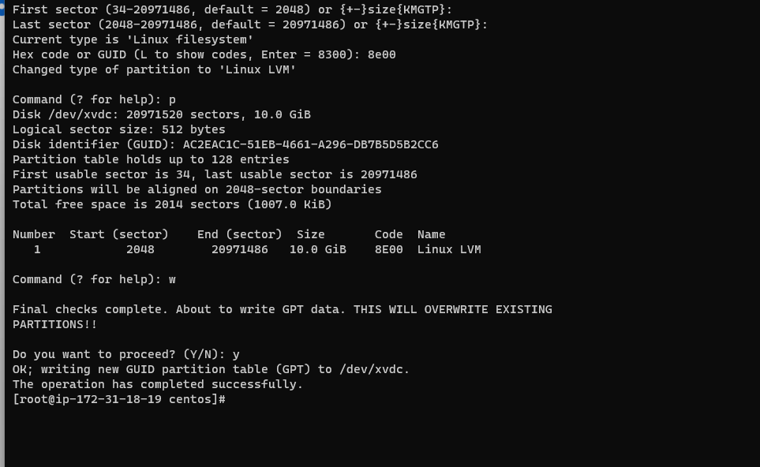
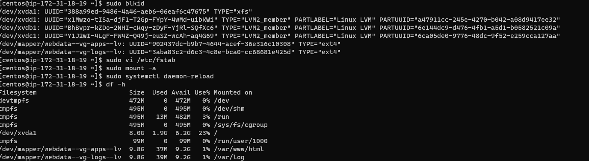
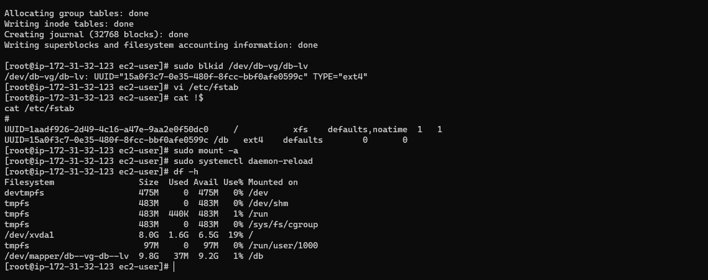
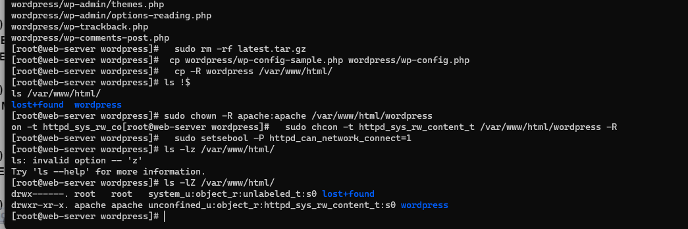
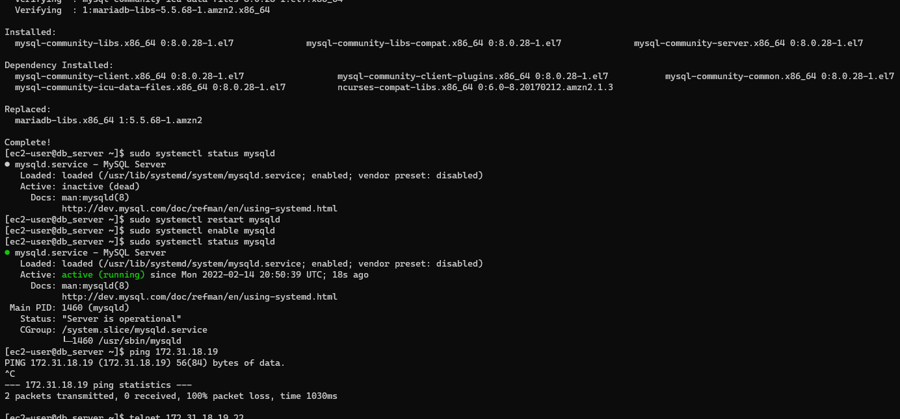
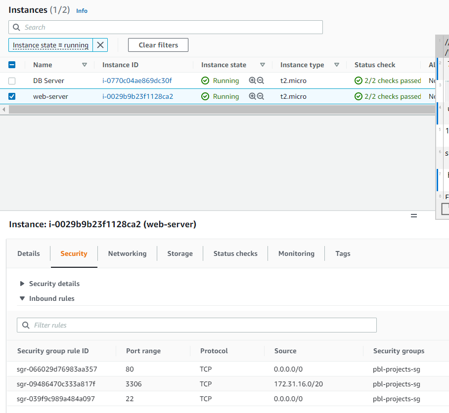
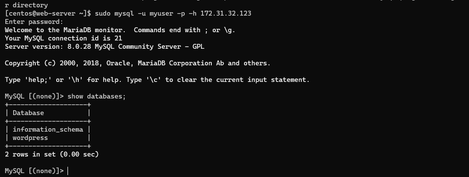
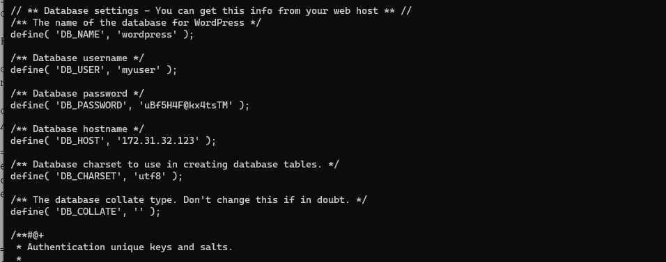
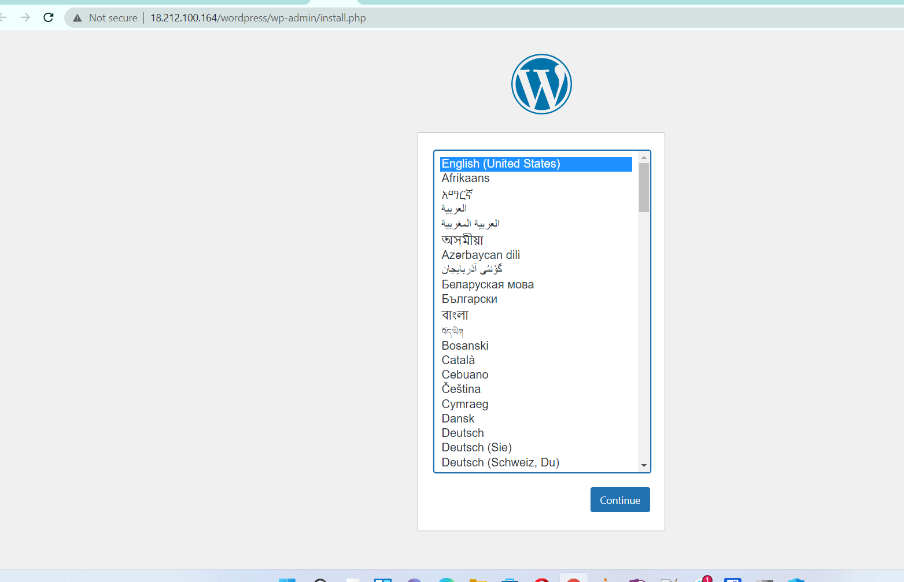
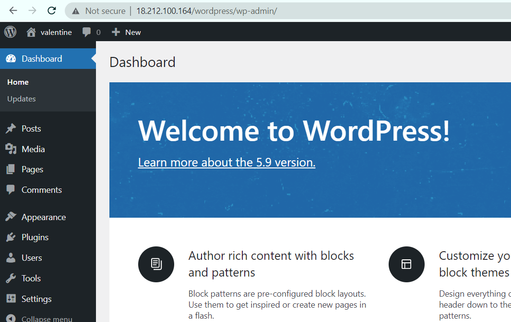

# Project 6

## Web Solution with Wordpress
---
### Step 1 - Prepare a Web server

Update the server
```
sudo yum update -y
```

Install the gdisk partition system and partition the disks
```
sudo yum install gdisk -y
sudo gdisk /dev/xvdb1
```



Create a volume group
```
sudo vgcreate webdata-vg /dev/xvdb1 /dev/xvdc1 /dev/xvdd1
```

Create logical volumes
```
sudo yum -y install lvm2
sudo lvmdiskscan
sudo lvcreate -n apps-lv -L 10G webdata-vg
sudo lvcreate -n logs-lv -L 10G webdata-vg
```
View the created logical volume, volume group and block devices
```
sudo lvs
sudo vgdisplay -v 
sudo lsblk 
```

Format the file systems of the logical volumes
```
sudo mkfs -t ext4 /dev/webdata-vg/apps-lv
sudo mkfs -t ext4 /dev/webdata-vg/logs-lv
```

Create the required folders, mount the logical volumes and synchronise the log directory

```
sudo mkdir -p /var/www/html
sudo mkdir -p /home/recovery/logs
sudo mount /dev/webdata-vg/apps-lv /var/www/html/
sudo rsync -av /var/log/. /home/recovery/logs/
sudo mount /dev/webdata-vg/logs-lv /var/log
sudo rsync -av /home/recovery/logs/. /var/log
```

Add the UUID of the file system to mount at startup
```
sudo blkid
sudo vi /etc/fstab
sudo mount -a
sudo systemctl daemon-reload
```



### Step 2 - Prepare a DB server

Update the db server packages
```
sudo yum update -y
sudo su
```

Create the partitions
```
lsblk
gdisk /dev/xvdb
gdisk /dev/xvdc
gdisk /dev/xvdd
```

Create the volume group, logical volume and format the filesystem
```
sudo vgcreate db-vg /dev/xvdb1 /dev/xvdc1 /dev/xvdd1
sudo lvcreate -n db-lv -L 10G db-vg
sudo mkfs -t ext4 /dev/db-vg/db-lv

sudo lvcreate -n logs-lv -L 10G db-vg
sudo mkfs -t ext4 /dev/db-vg/logs-lv

sudo mkdir -p /home/recovery/logs
sudo rsync -av /var/log/. /home/recovery/logs/
sudo mount /dev/db-vg/logs-lv /var/log
sudo rsync -av /home/recovery/logs/. /var/log

```
Configure the partition to startup automatically
```
sudo vi /etc/fstab
sudo mount -a
df -h
```



### Step 3 - Install a web service on the web server
```
sudo yum -y update
sudo yum -y install wget httpd php php-mysqlnd php-fpm php-json
sudo systemctl enable httpd
sudo systemctl start httpd
```
Install PHP and dependencies

##### Based on the OS Centos distro, the epel release used here was version 7 and installation is slightly different

```
wget https://dl.fedoraproject.org/pub/epel/epel-release-latest-7.noarch.rpm
wget https://rpms.remirepo.net/enterprise/remi-release-7.rpm
rpm -Uvh remi-release-7.rpm epel-release-latest-7.noarch.rpm
sudo yum -y install php php-opcache php-gd php-curl php-mysqlnd
yum-config-manager --enable remi-php74
sudo yum install php php-opcache php-gd php-curl php-mysqlnd
sudo systemctl start php-fpm
sudo systemctl enable php-fpm
setsebool -P httpd_execmem 1
```

Install wordpress
```
mkdir wordpress
cd wordpress
sudo wget http://wordpress.org/latest.tar.gz
sudo tar xzvf latest.tar.gz
sudo rm -rf latest.tar.gz
cp wordpress/wp-config-sample.php wordpress/wp-config.php
cp -R wordpress /var/www/html/
```

Configure SELinux for the wordpress installation
```
sudo chown -R apache:apache /var/www/html/wordpress
sudo chcon -t httpd_sys_rw_content_t /var/www/html/wordpress -R
sudo setsebool -P httpd_can_network_connect=1
```



### Step 4 - Install MySql 8 on the DB server
```
sudo yum -y install https://dev.mysql.com/get/mysql80-community-release-el7-3.noarch.rpm
sudo amazon-linux-extras install epel -y
rpm --import https://repo.mysql.com/RPM-GPG-KEY-mysql-2022
sudo yum -y install mysql-community-server
sudo systemctl enable --now mysqld
sudo systemctl status mysqld
```



Configure MySql Security
```
sudo grep 'temporary password' /var/log/mysqld.log
2wwt>5#S6-2s

sudo mysql_secure_installation -p'2wwt>5#S6-2s'
```

Create the Database

```
mysql -u root -p
CREATE DATABASE wordpress;
CREATE USER `myuser`@`172.31.18.19`IDENTIFIED WITH mysql_native_password BY 'uBf5H4F@kx4tsTM';
GRANT ALL ON wordpress.* TO 'myuser'@'172.31.18.19';
FLUSH PRIVILEGES;
SHOW DATABASES;
exit
```

### Step 5 - Install MySql Client on the Web server
```
sudo yum -y install mysql
```
Set security group for connection to DBServer from WebServer



Verify connectivity to the DB Server
```
sudo mysql -u admin -p -h 172.31.32.123
show databases;
```


### Step 6 - Configure WordPress Installation

Edit the cat /var/www/html/wordpress/wp-config.php and configure the wordpress to use the mysql database
```
vi /var/www/html/wordpress/wp-config.php

// ** Database settings - You can get this info from your web host ** //
/** The name of the database for WordPress */
define( 'DB_NAME', 'wordpress' );

/** Database username */
define( 'DB_USER', 'myuser' );

/** Database password */
define( 'DB_PASSWORD', 'uBf5H4F@kx4tsTM' );

/** Database hostname */
define( 'DB_HOST', '172.31.32.123' );

/** Database charset to use in creating database tables. */
define( 'DB_CHARSET', 'utf8' );

/** The database collate type. Don't change this if in doubt. */
define( 'DB_COLLATE', '' );
```


Navigate to the web browser to complete the wordpress installation


