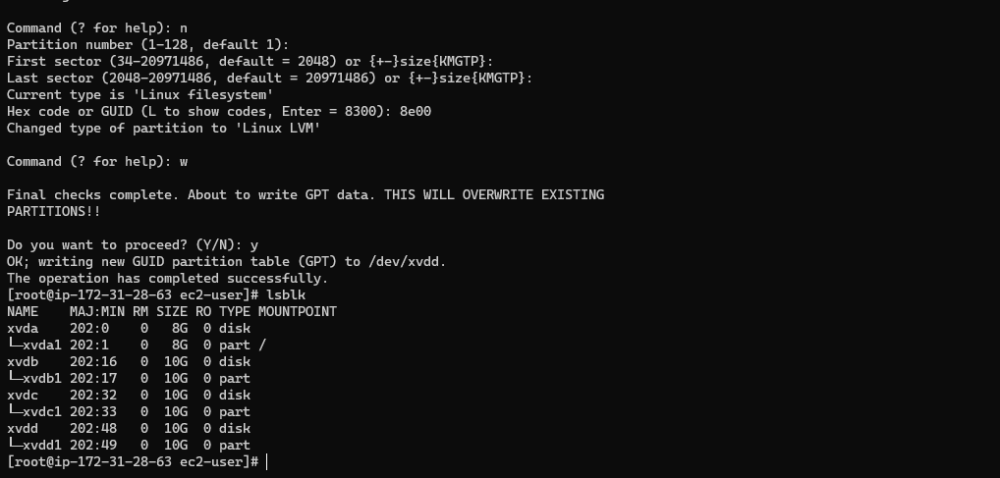
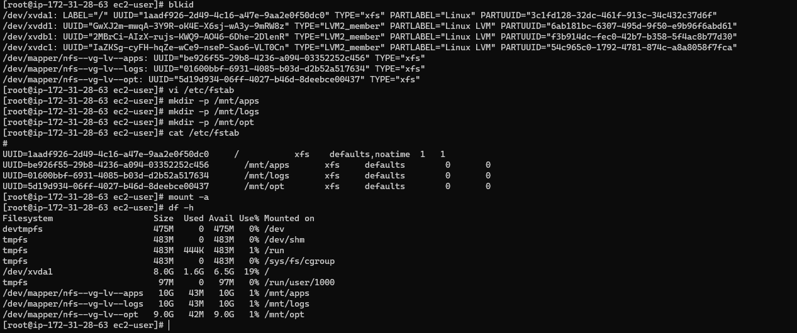
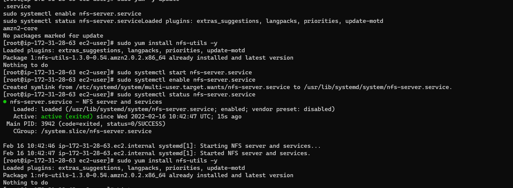
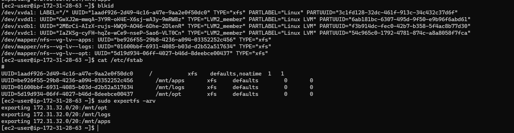
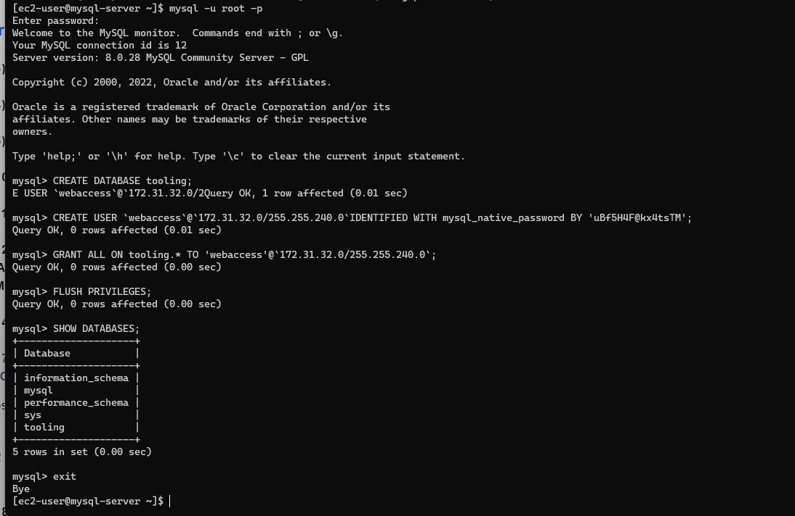
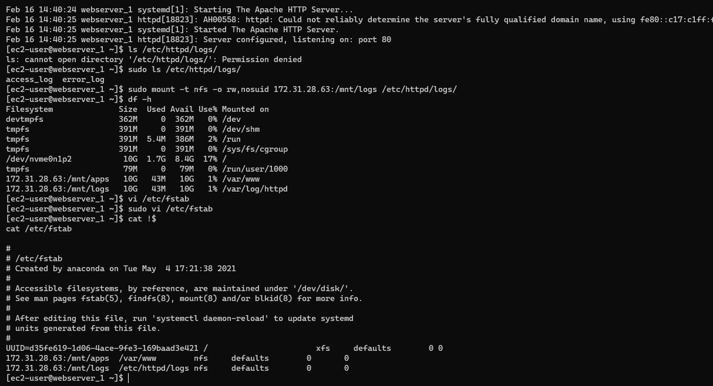
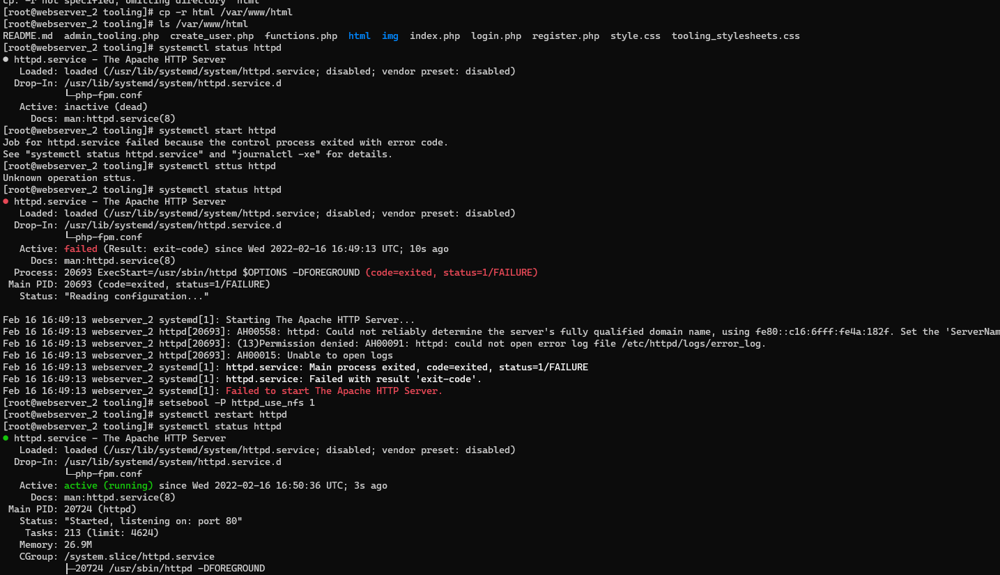
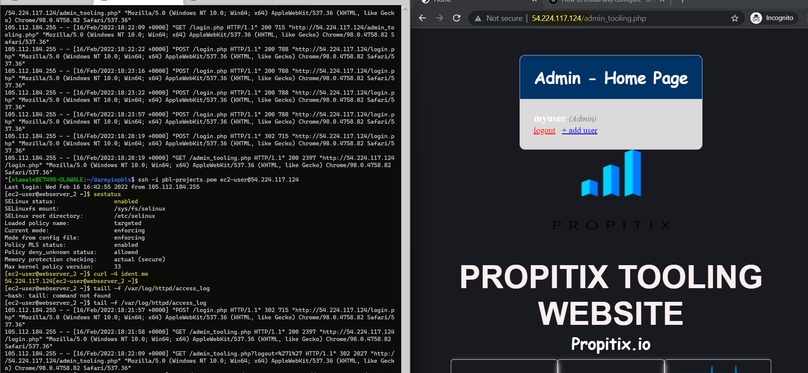

# Project 7

## Devops Tooling Website Solution

In this project the following tiers were utilized for the servers 

```
DBServer Tier-  172.31.0.0/20
NFS Server Tier- 172.31.16.0/20
WebServer Tier- 172.31.32.0/20
```
### Step 1 - Prepare a Web server

Create LVM on the NFS server disk

```
sudo yum update -y
lsblk
gdisk /dev/xvdb
gdisk /dev/xvdc
gdisk /dev/xvdd

vgcreate nfs-vg /dev/xvdb1 /dev/xvdc1 /dev/xvdd1
lvcreate -n lv-apps -L 10G nfs-vg
lvcreate -n lv-logs -L 10G nfs-vg
lvcreate -n lv-opt -L 9G nfs-vg
df -h
```


Format the filesystem for the lvm volumes
```
mkfs -t xfs /dev/nfs-vg/lv-apps
mkfs -t xfs /dev/nfs-vg/lv-logs
mkfs -t xfs /dev/nfs-vg/lv-opt
blkid
```


Set the file system to automount on startup
```
vi /etc/fstab
mkdir -p /mnt/apps
mkdir -p /mnt/logs
mkdir -p /mnt/opt
cat /etc/fstab
mount -a
df -h
```



Install NFS on the server
```
sudo yum -y update
sudo yum install nfs-utils -y
sudo systemctl start nfs-server.service
sudo systemctl enable nfs-server.service
sudo systemctl status nfs-server.service
sudo yum install nfs-utils -y
```


Set up the file exports to allow access from the web server subnet (172.31.32.0/20)
```
vi /etc/exports
/mnt/apps 172.31.32.0/20(rw,sync,no_all_squash,no_root_squash)
/mnt/logs 172.31.32.0/20(rw,sync,no_all_squash,no_root_squash)
/mnt/opt 172.31.32.0/20(rw,sync,no_all_squash,no_root_squash)
sudo exportfs -arv
```


### Step 2 - Install Mysql on DB Server

Install MySql service
```
sudo hostnamectl set-hostname mysql-server
bash
sudo yum -y install https://dev.mysql.com/get/mysql80-community-release-el7-3.noarch.rpm
sudo amazon-linux-extras install epel -y
sudo rpm --import https://repo.mysql.com/RPM-GPG-KEY-mysql-2022
sudo yum -y install mysql-community-server
sudo systemctl enable --now mysqld
sudo systemctl status mysqld
```

Configure and Secure MySql Service
```
sudo grep 'temporary password' /var/log/mysqld.log
sudo mysql_secure_installation -p'id%F4y*1aDGZ'
```
Create the database
```
mysql -u root -p
CREATE DATABASE tooling;
CREATE USER `webaccess`@`172.31.32.0/255.255.240.0`IDENTIFIED WITH mysql_native_password BY 'uBf5H4F@kx4tsTM';
GRANT ALL ON tooling.* TO 'webaccess'@`172.31.32.0/255.255.240.0`;
FLUSH PRIVILEGES;
SHOW DATABASES;
exit
```



### Step 3 -Launch and Install the Web Servers

Install the nfs utils to connect to the nfs server
```
sudo hostnamectl set-hostname webserver_3
bash
sudo yum install nfs-utils nfs4-acl-tools -y
```

Verify connectivity to the NFS Server
```
rpcinfo -p 172.31.28.63 | grep nfs
```

Create the mount point for the nfs server
```
sudo mkdir /var/www
sudo mount -t nfs -o rw,nosuid 172.31.28.63:/mnt/apps /var/www
sudo vi /etc/fstab
    172.31.28.63:/mnt/apps /var/www nfs defaults 0 0
    172.31.28.63:/mnt/logs /var/log/httpd nfs defaults 0 0
```


Install httpd on the webserver
```
sudo yum install httpd -y
sudo dnf install https://dl.fedoraproject.org/pub/epel/epel-release-latest-8.noarch.rpm -y
sudo dnf install dnf-utils http://rpms.remirepo.net/enterprise/remi-release-8.rpm -y
sudo dnf module reset php -y
sudo dnf module enable php:remi-7.4 -y
sudo dnf install php php-opcache php-gd php-curl php-mysqlnd -y
sudo systemctl start php-fpm
sudo systemctl enable php-fpm
sudo setsebool -P httpd_execmem 1
```

Clone the required repository and copy the html folder
```
yum install git -y
git clone https://github.com/stwalez/tooling.git
cd tooling /
cp -r html /var/www/html
```

Edit the mysql connection details in the php file - /var/www/html/functions.php 
```
$db = mysqli_connect('172.31.15.131', 'webaccess', 'uBf5H4F@kx4tsTM', 'tooling','3306');
```

Configure SELinux to permit httpd to use NFS 
```
setsebool -P httpd_use_nfs 1
```

Configure SELinux to permit httpd to connect to /usr/sbin/php-fpm from name_connect

```
setsebool -P httpd_can_network_connect_db 1
```




Add a new user to the tooling database

```
yum install mysql -y
mysql -h 172.31.15.131  -u webaccess -p tooling < tooling-db.sql

INSERT INTO users (id, username, password, email, user_type, status)
VALUES (2, "myuser", "5f4dcc3b5aa765d61d8327deb882cf99", "user@mail.com", "admin", "1");
```

Verify that you can access the webpage
