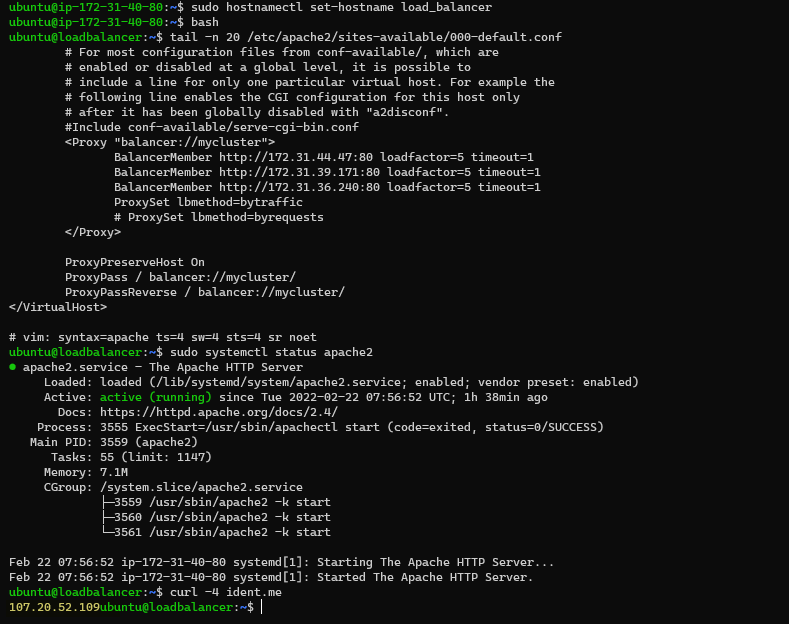
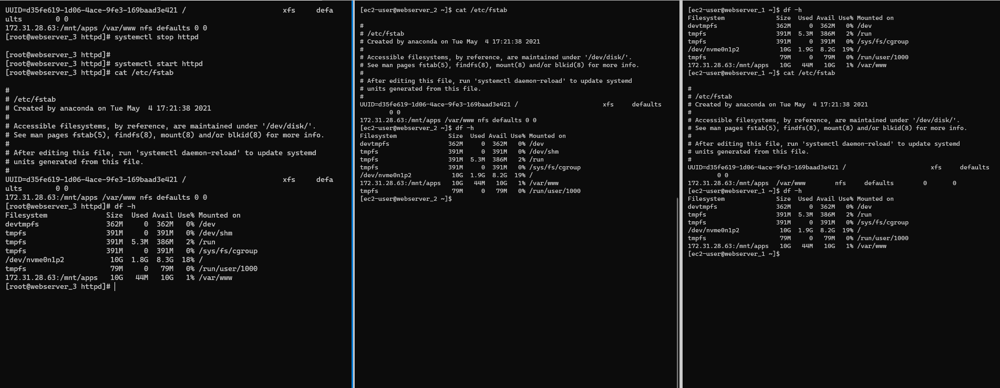
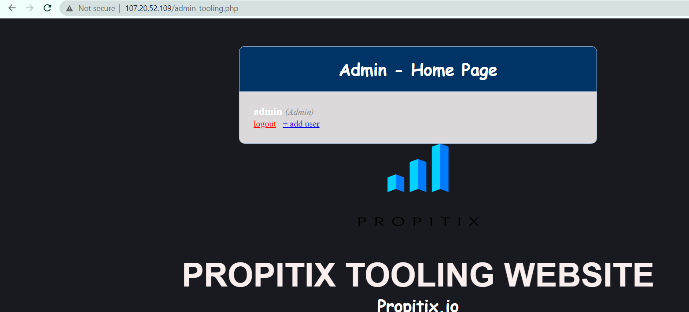
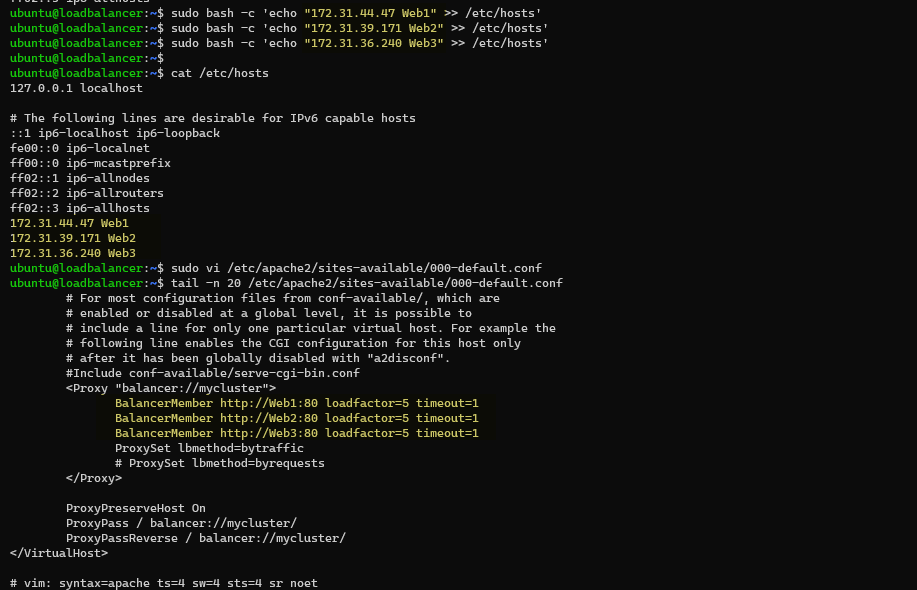
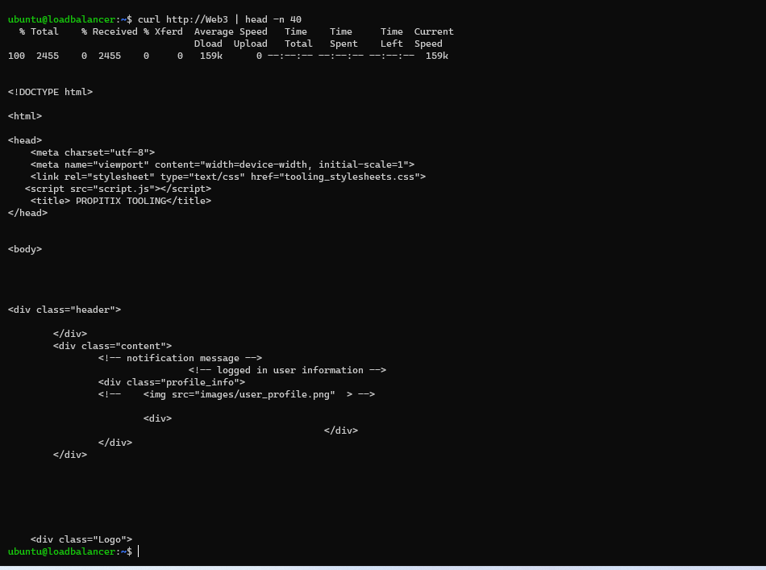

# Project 8

## Load Balancer Solution With Apache

In this project, we are utilizing the servers implemented in [Project_7](../project_7_files/project_7.md) and including a load balancer solution using Apache

### Step 1 - Install Apache on the load balancing Instance
Launch a new ec2 instance and install apache
```
sudo apt update
sudo apt install apache2 -y
sudo apt-get install libxml2-dev -y
```

Enable following  apache modules to configure load balancer:
```
sudo a2enmod rewrite
sudo a2enmod proxy
sudo a2enmod proxy_balancer
sudo a2enmod proxy_http
sudo a2enmod headers
sudo a2enmod lbmethod_bytraffic
```

Restart apache2 service
```
sudo systemctl restart apache2
```

Include the Proxy configuration in the site configuration section <VirtualHost *:80>  </VirtualHost>

```
sudo vi /etc/apache2/sites-available/000-default.conf

		<Proxy "balancer://mycluster">
			   BalancerMember http://<WebServer1-Private-IP-Address>:80 loadfactor=5 timeout=1
			   BalancerMember http://<WebServer2-Private-IP-Address>:80 loadfactor=5 timeout=1
			   ProxySet lbmethod=bytraffic
			   # ProxySet lbmethod=byrequests
		</Proxy>

		ProxyPreserveHost On
		ProxyPass / balancer://mycluster/
		ProxyPassReverse / balancer://mycluster/
```


Unmount the log directory from the webservers to ensure their logs can be read individually in case of troubleshooting.


Remove /var/log/httpd line from /etc/fstab and confirm its not mounted
```
sudo umount -a
sudo mount -a
```



Verify that load balancing works by accessing the load balancer site




### Optional - Local DNS Resolution
Add the IP addresses of the Web server to the host file to configure load DNS Name Resolution
```
sudo bash -c 'echo "172.31.44.47 Web1" >> /etc/hosts'
sudo bash -c 'echo "172.31.39.171 Web2" >> /etc/hosts'
sudo bash -c 'echo "172.31.36.240 Web3" >> /etc/hosts'
```

Update the site configuration with the DNS Name



Verify that Local DNS works



Restart apache2 service
```
sudo systemctl restart apache2
```