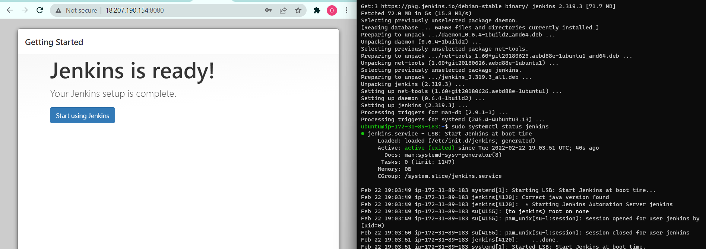
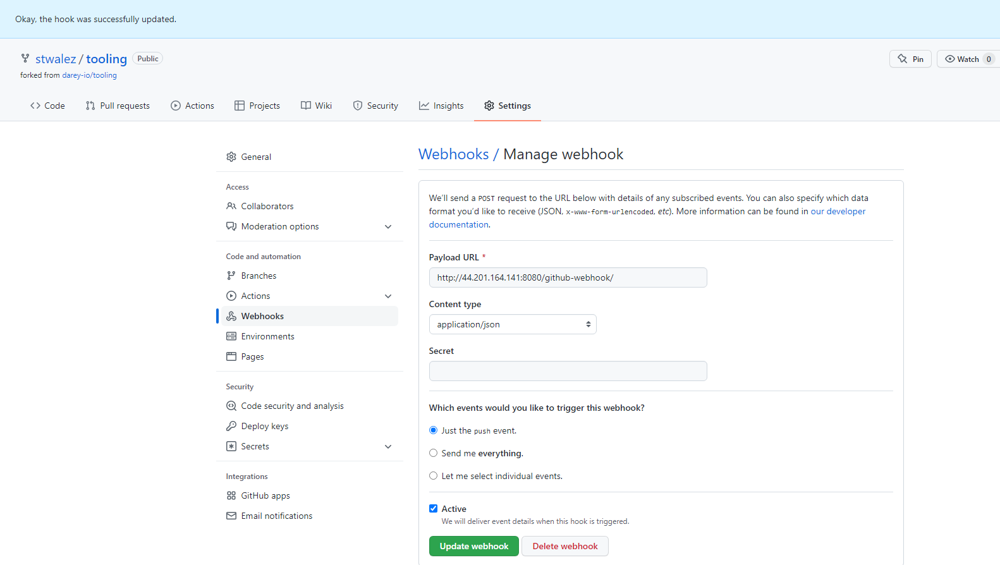
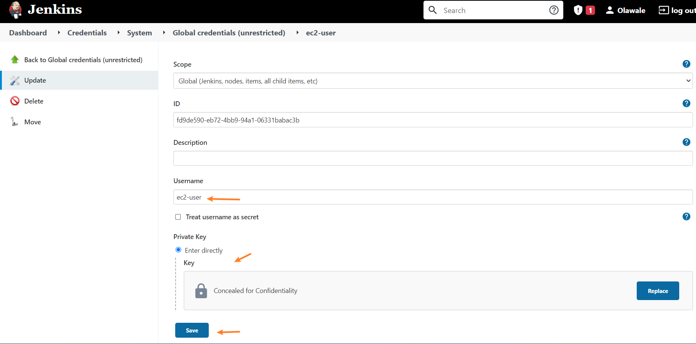

# Project 9

## Continuous Integration Pipeline for Tooling Website
In this project, we are utilizing the NFS server implemented in [Project 7](../project_7_files/project_7.md) and configuring a CI Pipeline to trigger a Jenkins build when changes are observed on the github repository.


### Step 1 - Install the Jenkins Server
```
sudo apt update
sudo apt install default-jdk-headless -y

# Install Jenkins
wget -q -O - https://pkg.jenkins.io/debian-stable/jenkins.io.key | sudo apt-key add -
sudo sh -c 'echo deb https://pkg.jenkins.io/debian-stable binary/ > \
    /etc/apt/sources.list.d/jenkins.list'
sudo apt update
sudo apt-get install jenkins -y

# Check if Jenkins is running
sudo systemctl status jenkins
```

Complete the Initial Jenkins setup



### Step 2 – Configure Jenkins to retrieve source codes from GitHub using Webhooks
Note that Public IP used for Jenkins server is not an elastic IP hence the IP addresses vary.


### Step 3 – Create a Jenkins FreeStyle Project


Archive the build artifacts of the Github files


Run a Jenkins job to test:


Trigger Jenkins to poll Github using webhook configured earlier


### Step 4 – Configure Jenkins to copy files to NFS server via SSH
Due to the deprecation of the "Publish Over SSH" Plugin, an alternative approach to transfer the files to NFS using rsync was implemented. See [here](https://community.jenkins.io/t/publish-over-ssh-alternative/1356)

Install Credentials and Credentials Bindings Plugin


Install Post Build Action Plugin


Navigate to ```Manage Jenkins > Manage Credentials > Jenkins > Global Credentials > Add Credentials``` to add credentials for SSH Username and Private Key of the NFS Server


Navigate to the Freestyle Job Build Configuration and update the Build Environment with the Credential Bindings environment variables.

Here KEY variable and ssh_username was used to represent the SSH Private key and SSH username respectively.

Include the script below in the ```Build Execute shell script``` with commands below:

```
echo "Encoding the Pem key for file upload to nfs"
cat $KEY | base64 > /tmp/temp_key_enc
echo Moving to PostBuild Task
```

The command copies the private key file from the variable and encodes it.


Include the script below in the ```Post Build Actions > Post Build Task script```

```
cat /tmp/temp_key_enc | base64 -d > /tmp/temp_key_dec

chmod 600 /tmp/temp_key_dec

rsync -avzO --no-p --delete -e 'ssh -o StrictHostKeyChecking=no -i /tmp/temp_key_dec' ../../jobs/$JOB_NAME/builds/$BUILD_NUMBER/archive/ $ssh_username@172.31.28.63:/mnt/apps/

echo Successfully transferred

rm -f /tmp/temp_key*
```
The key file is decoded because [credential bindings variables cannot currently be passed to the Post Build Task](https://issues.jenkins.io/browse/JENKINS-32283
), the build artefacts are transferred to the nfs server. 

Hostchecks that may involve interactivity was disabled in the ssh script. 
After a successful transfer, the key files are deleted


### Step 5 - Make a change to the github repo to trigger a Jenkins Build
An update to the ReadMe file triggered the jenkins build


and the artefacts were delivered to the NFS server
